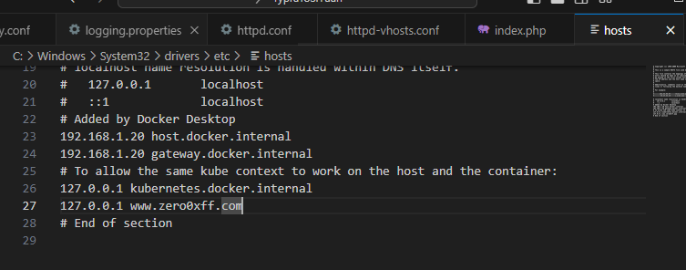
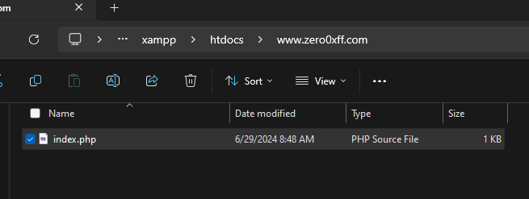
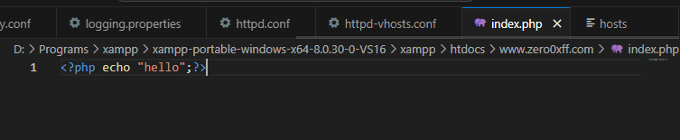
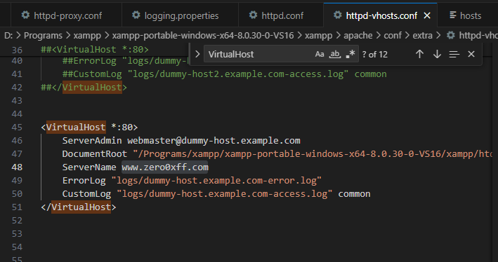
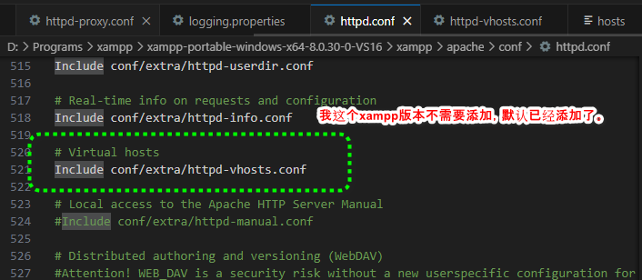
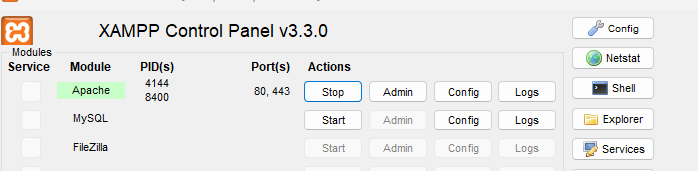
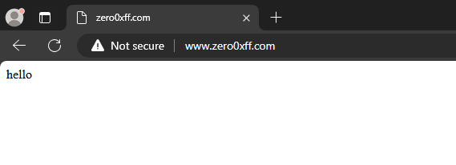

# Apache-Virtualhost

[TOC]

#### WIndows环境准备

1. 修改hosts文件，添加www.zero0xff.com。
2. 在xampp目录下的htdocs新建www.zero0xff.com网页根目录
3. 在www.zero0xff.com根目录下，新建index.php







## 添加VirtualHost

1. 打开目录 {Apache2 安装目录}\conf\extra\, 找到 httpd-vhosts.conf 文件。

2. 仿照例子, 添加一段代码来指定www.zero0xff.com域名的网站。

   ```
   #
   # DocumentRoot 是网站文件存放的根目录
   # ServerName 是网站域名, 需要跟 DNS 指向的域名一致
   #
   <VirtualHost *:80>
       ServerAdmin webmaster@dummy-host.example.com
       DocumentRoot "/Programs/xampp/xampp-portable-windows-x64-8.0.30-0-VS16/xampp/htdocs/www.zero0xff.com"
       ServerName www.zero0xff.com
       ErrorLog "logs/dummy-host.example.com-error.log"
       CustomLog "logs/dummy-host.example.com-access.log" common
   </VirtualHost>
   ```

   

3. 打开 httpd.conf 文件, 添加如下语句。

   ```
   # Virtual hosts
   Include conf/extra/httpd-vhosts.conf
   ```

   

4. 重启 Apache 服务, 激活虚拟主机。

   

5. 访问http://www.zero0xff.com，验证是否成功。

​	
