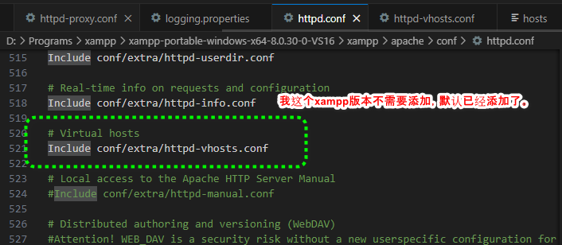

# Apache反向代理实验

[TOC]

## 实验描述

Apache默认监听的端口是80,Tomcat默认监听端口8080。实验通过访问Apache的80

端口（Apache开启反向代理）达到实际访问Tomcat8080段口的目的。

## 环境准备

1. 下载Xampp，我这里使用的xampp-portable-windows-x64-8.0.30-0-VS16
2. 启动xampp-control.exe
3. 启动Apache
4. 启动Tomcat

注意，对于xampp-portable第一启动应该首先运行setup_xampp.bat，然后在启动xampp-control.exe。


## 修改Apache配置实现转发

修改Apache核心配置文件httpd.conf。在windows下对应

### 添加必要模块

```
LoadModule proxy_module modules/mod_proxy.so
LoadModule proxy_connect_module modules/mod_proxy_connect.so
LoadModule proxy_http_module modules/mod_proxy_http.so
```


### 添加VirtualHost

1. 打开目录 {Apache2 安装目录}\conf\extra\, 找到 httpd-vhosts.conf 文件。
2. 仿照例子, 添加一段代码来指定某一域名的网站。

```xml
<VirtualHost *:80>
    ServerName www.zero0xff.com

    # 启用代理和反向代理
    ProxyPreserveHost On
    ProxyRequests Off

    <Proxy *>
        Require all granted
    </Proxy>

    # 配置反向代理规则
    ProxyPass / http://localhost:8080/
    ProxyPassReverse / http://localhost:8080/

    # 日志配置（可选）
    ErrorLog ${APACHE_LOG_DIR}/error.log
    CustomLog ${APACHE_LOG_DIR}/access.log combined
</VirtualHost>

```

3. 打开 httpd.conf 文件, 添加如下语句。

   ```
   # Virtual hosts
   Include conf/extra/httpd-vhosts.conf
   ```

   

4. 重启 Apache 服务, 激活虚拟主机。

5. 访问80端口验证是否成功。

   
