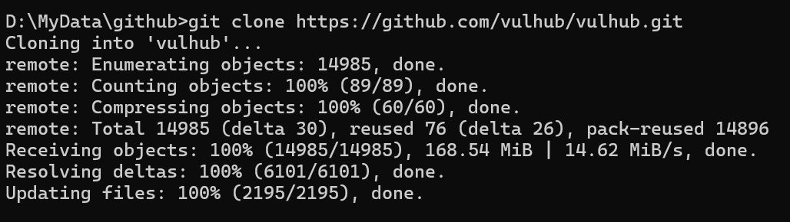
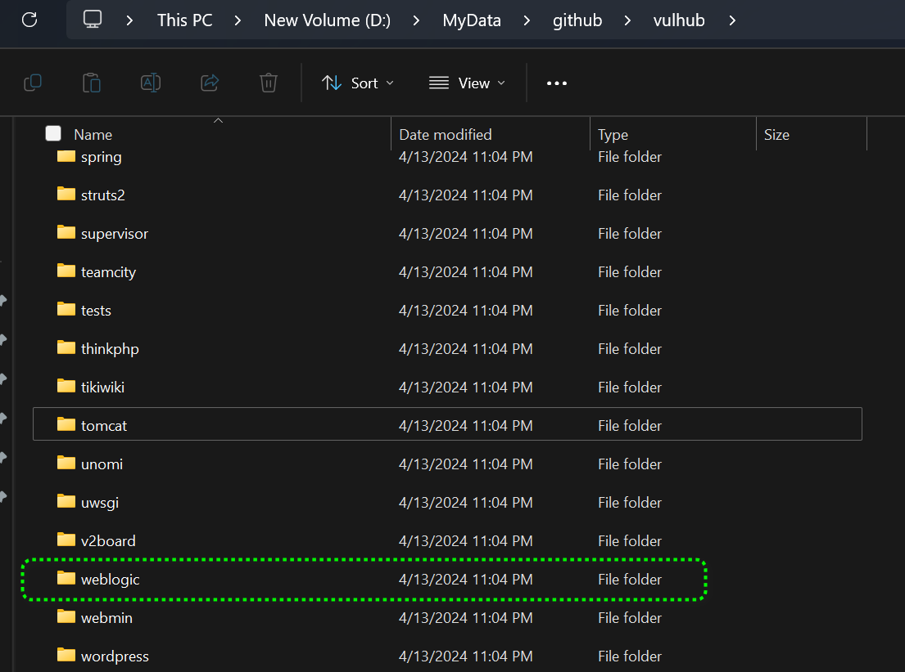
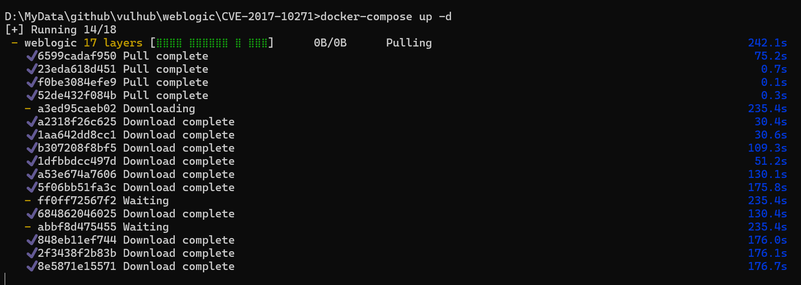

# Vulhub漏洞环境搭建

[toc]

## Vulhub简介

Vulhub 是一个面向靶场的 Docker 环境，提供了一系列的漏洞环境，旨在帮助安全研究人员和爱好者学习和测试各种网络安全漏洞。通过 Vulhub，用户可以轻松地搭建和管理各种漏洞环境，包括但不限于 Web 漏洞、系统漏洞、渗透测试环境等。

### Vulhub 的特点：

1. **易于使用**：Vulhub 提供了简单的 Docker 命令来启动和管理不同的漏洞环境，使用户可以快速地搭建和销毁测试环境。
2. **多样的漏洞环境**：Vulhub 包含了多种类型的漏洞环境，如常见的 Web 漏洞（如 SQL 注入、XSS、文件上传漏洞等）、系统漏洞（如 Linux 提权、Windows 提权等）以及其他各种渗透测试环境。
3. **教育目的**：Vulhub 主要是为了教育和研究目的而创建的，它提供了一个安全的环境供用户学习和测试，避免在生产环境中不当操作导致的风险。

### 使用 Vulhub：

使用 Vulhub 非常简单，通常只需按照以下步骤操作：

1. **安装 Docker**：如果你的系统还没有安装 Docker，首先需要安装 Docker。

2. **拉取 Vulhub 仓库**：使用 Git 克隆 Vulhub 仓库或直接下载 Zip 文件。

   ```
   git clone https://github.com/vulhub/vulhub.git
   ```

   

   

3. **进入相应的漏洞目录**：根据你想要学习或测试的漏洞类型，进入相应的目录。例如我们想学习weblo漏洞。



1. **启动漏洞环境**：使用 Docker 启动漏洞环境。

   命令会根据docker-compose.yml的定义将相应的镜像拉取到本地，并且会自动启动容器，映射相应的端口。

   ```
   docker-compose up -d
   ```

   

2. **访问漏洞环境**：打开浏览器或使用其他工具访问漏洞环境进行测试。

### 总结

Vulhub 是一个非常有用的工具，特别是对于网络安全学习者和安全研究人员。它提供了一个安全、便捷的环境，使用户可以实践各种漏洞攻击和防御技术，从而提高自己的网络安全技能。然而，使用 Vulhub 时应始终在合法、道德和授权的环境中进行，避免在未经授权的系统或网络上进行非法测试。

