# Docker安装以及使用

[toc]

## Download Docker Desktop

[Docker Desktop: The #1 Containerization Tool for Developers | Docker](https://www.docker.com/products/docker-desktop/)

Docker**只能安装到C盘**,我目前没找到比较好的解决方法。我试过命令行安装，但是最终会报错。网上也没有不错的解决方案。

```
"Docker Desktop Installer.exe" install --installation-dir=D:\Programs\Docker
```

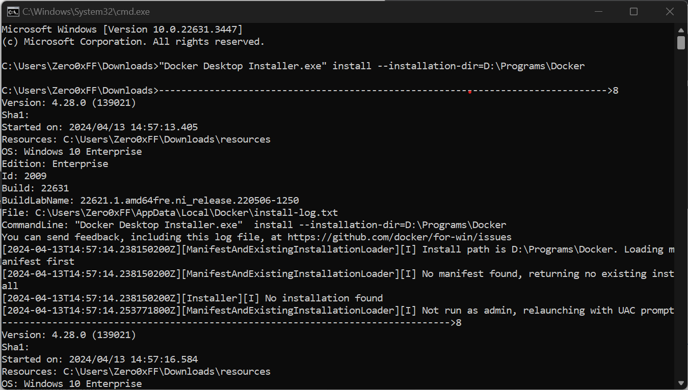

## 更改Docker配置

### 修改docker hub源

修改Docker配置文件，用来更改docker镜像源。（只更新163就够了）

```
"registry-mirrors": [
    "https://registry.docker-cn.com",
    "https://docker.mirrors.ustc.edu.cn",
    "http://hub-mirror.c.163.com"
  ]
```


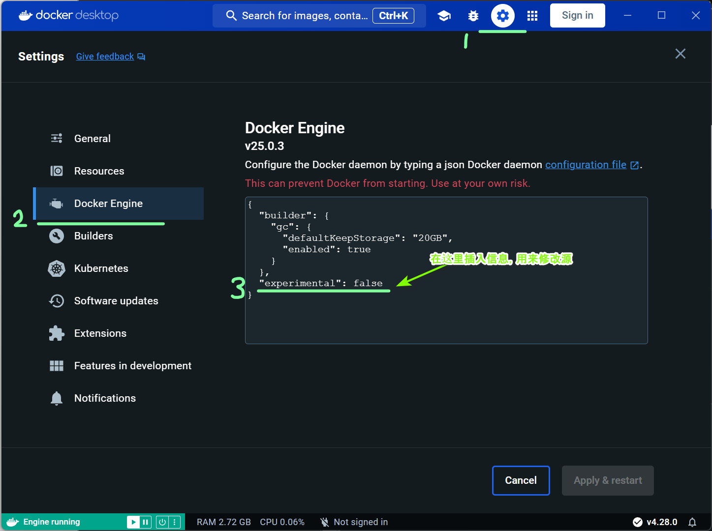

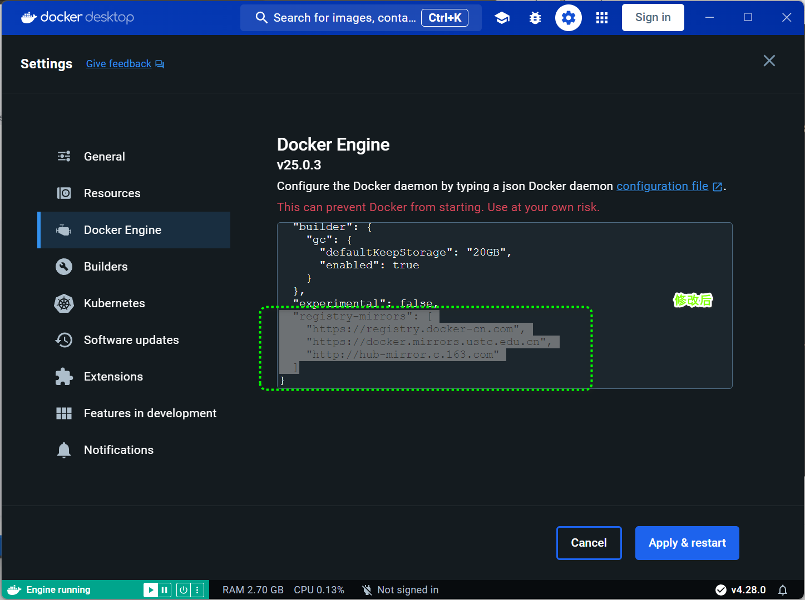

### 修改Disk image location

Docker 的 "Disk image location" 指的是 Docker 镜像在磁盘上的存储位置。Docker 镜像是用于构建容器的模板，包含了运行应用程序所需的所有内容，比如代码、运行时环境、库和依赖项等。当你从 Docker Hub 或其他地方下载或构建一个 Docker 镜像时，它会被存储在你的计算机上的特定位置。

理解 Docker 的 "Disk image location" 对于管理和维护 Docker 镜像以及有效利用磁盘空间都非常重要。通过了解镜像存储位置，你可以更好地管理你的镜像库，清理不再需要的镜像，或者将镜像存储在特定的磁盘分区以实现更好的性能或可用性。

Disk image location默认路径如图

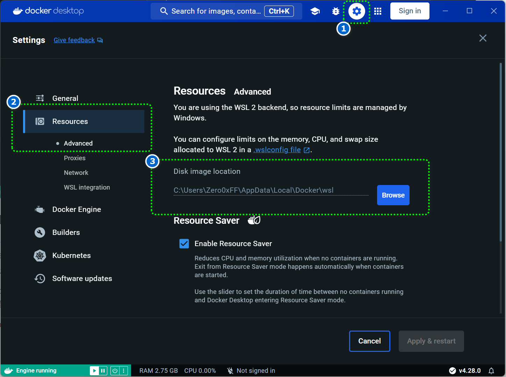

修改后如图

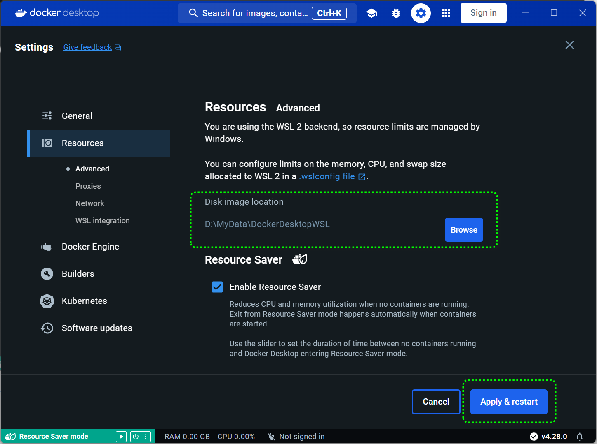

## 检查是否安成功

打开cmd输入如下命令。

```bat
docker run ubuntu echo "hello world"
```

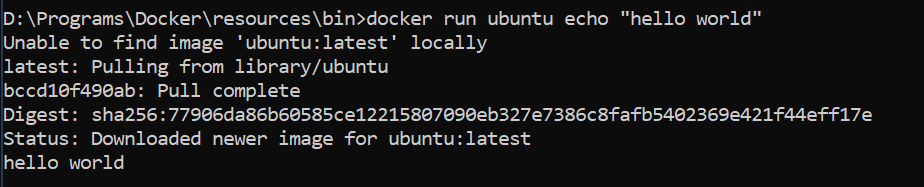

### Docker基本使用

### 搜索镜像

要搜索 Docker Hub 上的镜像，你可以使用 `docker search` 命令，后面跟着你想要搜索的镜像名称。例如：

```bat
docker search ubuntu
```

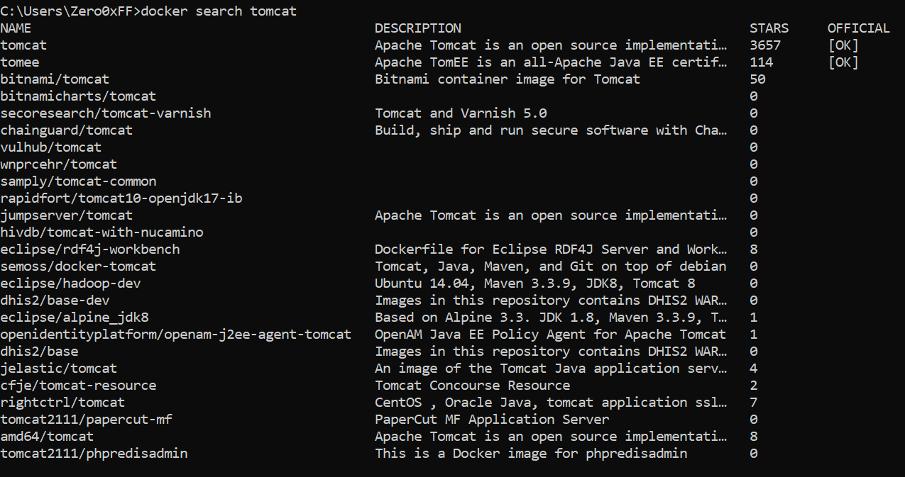

这将在 Docker Hub 上搜索名为 "ubuntu" 的镜像，并列出与该名称相关的镜像及其描述。

### 拉取镜像

要拉取 Docker Hub 上的镜像，你可以使用 `docker pull` 命令，后面跟着你要拉取的镜像名称。例如，要拉取 Ubuntu 镜像，可以执行以下命令：

```
docker pull dordoka/tomcat
```

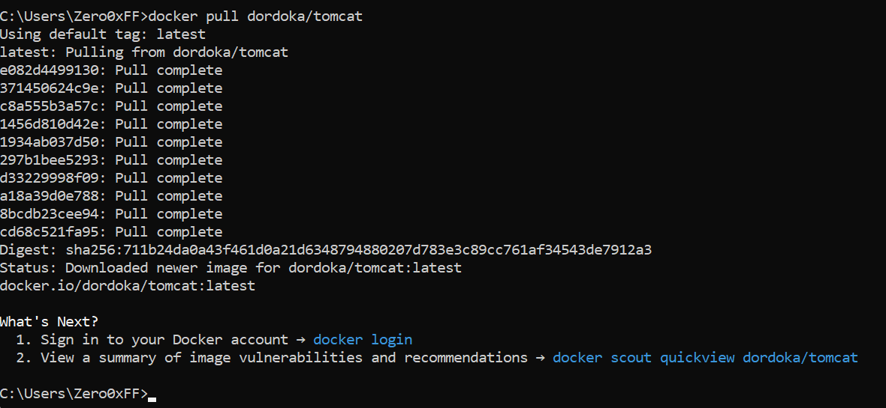这将从 Docker Hub 下载 Ubuntu 镜像到你的本地 Docker 环境中。

你也可以通过指定标签来拉取特定版本的镜像。例如，要拉取 Ubuntu 20.04 版本的镜像，可以执行以下命令：

```
docker pull ubuntu:20.04
```

在这个例子中，`ubuntu` 是镜像名称，`20.04` 是标签，代表 Ubuntu 的版本。

拉取完成后，你就可以在本地的 Docker 环境中使用这个镜像了。

### 查看镜像

`docker images` 用于列出本地系统上**已经下载的 **Docker 镜像。Docker 镜像是一个只读的模板，它包含了运行 Docker 容器所需的文件系统、应用程序和其他配置。当你运行 `docker images` 命令时，它会显示一个列表，包括每个镜像的以下信息：

1. **Repository**：镜像的仓库名。
2. **Tag**：镜像的标签，用于标识镜像的版本。
3. **Image ID**：镜像的唯一标识符。
4. **Created**：镜像创建的时间。
5. **Size**：镜像的大小。

这个命令有助于你了解哪些 Docker 镜像已经下载到你的系统，以及它们的大小和版本信息。

```
docker images
```

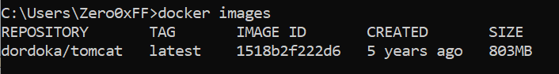

Repositroy相同,Tag不同的镜像视为不同镜像。

### 删除镜像

docker rmi -f [container_id]

1. 在删除镜像时要先停止以镜像为模板的容器，然后才可以通过-f参数强制删除镜像。通过-f删除镜像以后，原来容器依然可用。

### 生成容器

`docker run` [-p/-P] [-it] [-d] <container_id/container_name>

| 参数 |            作用            |
| :--: | :------------------------: |
|  -p  | 容器内部端口映射到主机端口 |
|  -P  |        容器内部端口        |
|  -t  |        提供终端输入        |
|  -i  |          提供交互          |
|  -d  |       容器在后台运行       |

经过测试在运行`docker run -it dordoka/tomcat`并没有生成交互式shell。但是测试`docker run -it ubuntu:20.04`成功。因此推出-it命令有时还与镜像有一定关系。

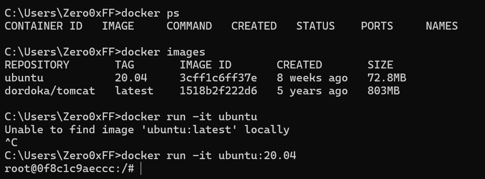

#### 注意事项

- 使用 `docker attach` 附加到容器后，你进入的是容器的主进程，通常是一个 shell。如果容器的主进程不是一个 shell（例如，是一个后台服务如 Tomcat），附加到容器后你可能看不到交互式命令提示符。这也就是`docker run -it dordoka/tomcat`并没有生成交互式shell的原因。
- 如果你想在容器内部执行特定命令而不是附加到交互式终端，建议使用 `docker exec` 命令。例如：`docker exec -it 04 /bin/bash`

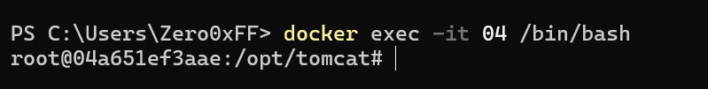

### 查看容器

`docker ps`命令可以用来查看容器。

`docker ps` 用来查看容器，显示容器id，容器名，容器镜像，容器端口，与容器状态

`docker ps -a`可以列出仍在运行的和已经推出的容器。

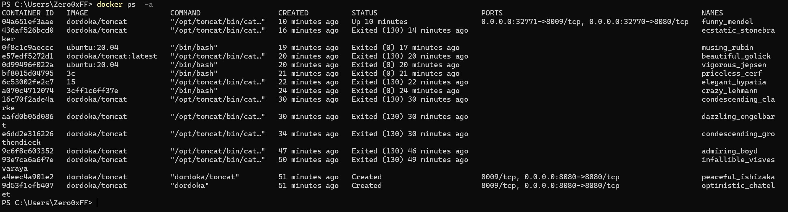

`docker ps -q`只列出容器id，可以与-a命令组合-aq命令。

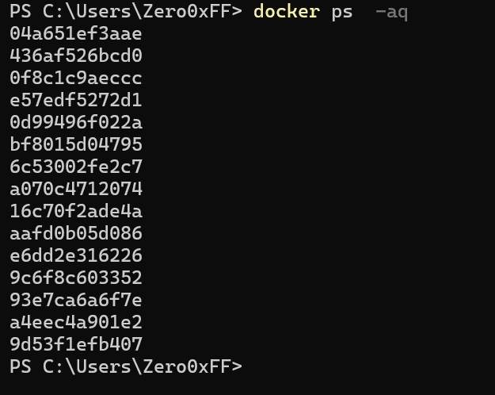

### 停止容器

`docker stop [id]`可以用来停止容器，不需要完全输入全部id，可以只输入部分。

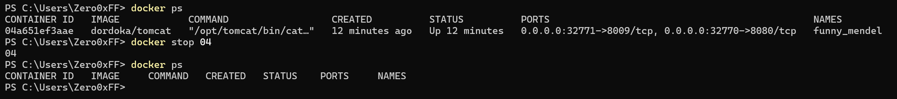

### 进入容器

`docker exec <id> <command>`用于在容器内部执行命令。但是可以与-it和/bin/bash参数结合开启一个bash shell。


### 删除容器

`docker rm [id...]`可以用来删除容器。不过在删除容器之前要先**停止容器**。

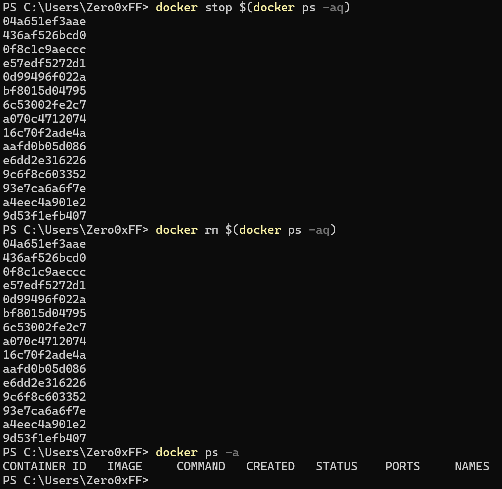
