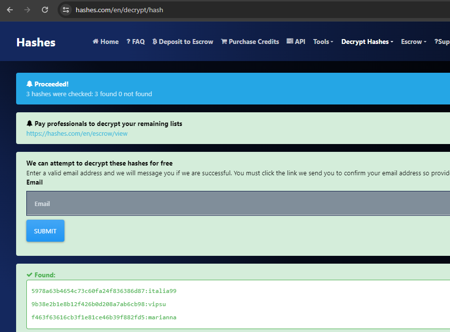
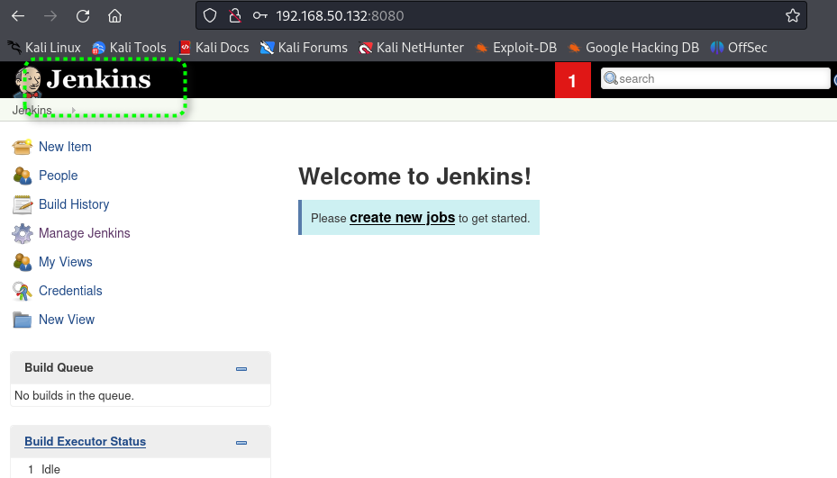

# Jarbas靶场记录

[TOC]

## 扫描开放端口

```
┌──(kali㉿kali)-[~/Documents/Jarbas]
└─$ sudo nmap -sT --min-rate 10000 -p- 192.168.50.132 -oA ports  
[sudo] password for kali: 
Starting Nmap 7.94SVN ( https://nmap.org ) at 2024-06-06 23:19 EDT
mass_dns: warning: Unable to determine any DNS servers. Reverse DNS is disabled. Try using --system-dns or specify valid servers with --dns-servers
Nmap scan report for 192.168.50.132
Host is up (0.00051s latency).
Not shown: 65531 closed tcp ports (conn-refused)
PORT     STATE SERVICE
22/tcp   open  ssh
80/tcp   open  http
3306/tcp open  mysql
8080/tcp open  http-proxy
MAC Address: 00:0C:29:A3:85:A9 (VMware)

Nmap done: 1 IP address (1 host up) scanned in 4.97 seconds
```


### 端口详情扫描

```
┌──(kali㉿kali)-[~/Documents/Jarbas]
└─$ sudo nmap -sT -sV -sC -O -p22,80,3306,8080 192.168.50.132 -oA detail
Starting Nmap 7.94SVN ( https://nmap.org ) at 2024-06-06 23:22 EDT
mass_dns: warning: Unable to determine any DNS servers. Reverse DNS is disabled. Try using --system-dns or specify valid servers with --dns-servers
Nmap scan report for 192.168.50.132
Host is up (0.00065s latency).

PORT     STATE SERVICE VERSION
22/tcp   open  ssh     OpenSSH 7.4 (protocol 2.0)
| ssh-hostkey: 
|   2048 28:bc:49:3c:6c:43:29:57:3c:b8:85:9a:6d:3c:16:3f (RSA)
|   256 a0:1b:90:2c:da:79:eb:8f:3b:14:de:bb:3f:d2:e7:3f (ECDSA)
|_  256 57:72:08:54:b7:56:ff:c3:e6:16:6f:97:cf:ae:7f:76 (ED25519)
80/tcp   open  http    Apache httpd 2.4.6 ((CentOS) PHP/5.4.16)
| http-methods: 
|_  Potentially risky methods: TRACE
|_http-server-header: Apache/2.4.6 (CentOS) PHP/5.4.16
|_http-title: Jarbas - O Seu Mordomo Virtual!
3306/tcp open  mysql   MariaDB (unauthorized)
8080/tcp open  http    Jetty 9.4.z-SNAPSHOT
|_http-title: Site doesn't have a title (text/html;charset=utf-8).
|_http-server-header: Jetty(9.4.z-SNAPSHOT)
| http-robots.txt: 1 disallowed entry 
|_/
MAC Address: 00:0C:29:A3:85:A9 (VMware)
Warning: OSScan results may be unreliable because we could not find at least 1 open and 1 closed port
Device type: general purpose
Running: Linux 3.X|4.X
OS CPE: cpe:/o:linux:linux_kernel:3 cpe:/o:linux:linux_kernel:4
OS details: Linux 3.2 - 4.9
Network Distance: 1 hop

OS and Service detection performed. Please report any incorrect results at https://nmap.org/submit/ .
Nmap done: 1 IP address (1 host up) scanned in 8.55 seconds

```


## 脚本扫描

```
┌──(kali㉿kali)-[~/Documents/Jarbas]
└─$ sudo nmap --script=vuln -p22,80,3306,8080 192.168.50.132 -oA vuln
Starting Nmap 7.94SVN ( https://nmap.org ) at 2024-06-06 23:26 EDT
mass_dns: warning: Unable to determine any DNS servers. Reverse DNS is disabled. Try using --system-dns or specify valid servers with --dns-servers
Nmap scan report for 192.168.50.132
Host is up (0.00060s latency).

PORT     STATE SERVICE
22/tcp   open  ssh
80/tcp   open  http
| http-csrf: 
| Spidering limited to: maxdepth=3; maxpagecount=20; withinhost=192.168.50.132
|   Found the following possible CSRF vulnerabilities: 
|     
|     Path: http://192.168.50.132:80/
|     Form id: wmtb
|     Form action: /web/submit
|     
|     Path: http://192.168.50.132:80/
|     Form id: 
|     Form action: /web/20020720170457/http://jarbas.com.br:80/user.php
|     
|     Path: http://192.168.50.132:80/
|     Form id: 
|_    Form action: /web/20020720170457/http://jarbas.com.br:80/busca/
|_http-trace: TRACE is enabled
| http-sql-injection: 
|   Possible sqli for queries:
|     http://192.168.50.132:80/index_arquivos/?C=S%3BO%3DA%27%20OR%20sqlspider
|     http://192.168.50.132:80/index_arquivos/?C=D%3BO%3DA%27%20OR%20sqlspider
|     http://192.168.50.132:80/index_arquivos/?C=M%3BO%3DA%27%20OR%20sqlspider
|     http://192.168.50.132:80/index_arquivos/?C=N%3BO%3DD%27%20OR%20sqlspider
|     http://192.168.50.132:80/index_arquivos/?C=S%3BO%3DD%27%20OR%20sqlspider
|     http://192.168.50.132:80/index_arquivos/?C=D%3BO%3DA%27%20OR%20sqlspider
|     http://192.168.50.132:80/index_arquivos/?C=M%3BO%3DA%27%20OR%20sqlspider
|     http://192.168.50.132:80/index_arquivos/?C=N%3BO%3DA%27%20OR%20sqlspider
|     http://192.168.50.132:80/index_arquivos/njarb_data/?C=D%3BO%3DA%27%20OR%20sqlspider
|     http://192.168.50.132:80/index_arquivos/njarb_data/?C=S%3BO%3DA%27%20OR%20sqlspider
|     http://192.168.50.132:80/index_arquivos/njarb_data/?C=N%3BO%3DD%27%20OR%20sqlspider
|_    http://192.168.50.132:80/index_arquivos/njarb_data/?C=M%3BO%3DA%27%20OR%20sqlspider
|_http-stored-xss: Couldn't find any stored XSS vulnerabilities.
|_http-dombased-xss: Couldn't find any DOM based XSS.
| http-enum: 
|_  /icons/: Potentially interesting folder w/ directory listing
3306/tcp open  mysql
8080/tcp open  http-proxy
| http-enum: 
|_  /robots.txt: Robots file
MAC Address: 00:0C:29:A3:85:A9 (VMware)

Nmap done: 1 IP address (1 host up) scanned in 42.83 seconds

```


## 路径爆破

开始从80web服务寻找突破口。

```
sudo dirb http://192.168.50.132
```


··

安装暴力破解工具`sudo apt install seclists`

```
sudo gobuster dir -u http://192.168.50.132 -w /usr/share/seclists/Discovery/Web-Content/raft-large-directories.txt -x html,php
```


## Hash破解

https://hashes.com/en/decrypt/hash




## Jekins漏洞利用

经过尝试，用破解出的密码尝试登录后台。

```
eder
vipsu
```




### 利用步骤

1. New Item

   

2. 创建一个自由项目

   

3. 添加脚本shell执行

   

​					


4. 点击Build执行脚本

   

​	

5. 清理痕迹

   这里省略清理痕迹的步骤

## Linux权限提升

思路利用Linux自动(计划)任务提升权限。检查/etc/corntab文件。


