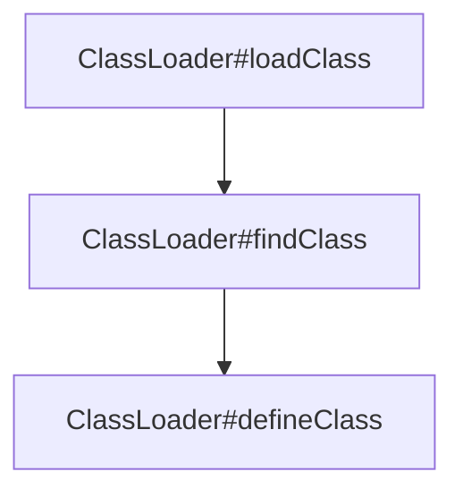

[TOC]

# JAVA加载字节码方法总结

## URLClassLoader加载远程class文件

参考Demo工程poj/JAVA_URLClassLoader

```java
package org.example;

import java.net.MalformedURLException;
import java.net.URL;
import java.net.URLClassLoader;

/*
 * 在运行程序前请先执行
 * JAVA_URLClassLoader\net\org\example>javac Hello.java
 * JAVA_URLClassLoader\net>python -m http.server 80
 */
public class Main {
    public static void main(String[] args) throws Exception {
        URL[] urls = new URL[] { new URL("http://localhost:80/")};
        URLClassLoader loader = new URLClassLoader(urls);
        Class c = loader.loadClass("org.example.Hello");
        c.newInstance();
    }
}
```

### 小知识

URLClassLoader 实际上是我们平时默认使用的 AppClassLoader 的父类，所以，我们解释 URLClassLoader 的工作过程实际上就是在解释默认的Java类加载器的工作流程。

## 利用ClassLoader#defineClass直接加载字节码

### .jar与.call载流程

上一节中我们认识到了如何利用URLClassLoader加载远程class文件，也就是字节码。其实，不管是加载远程class文件，还是本地的class或jar文件，Java都经历的是下面这三个方法调用：



* loadClass的作用是从已加载的类缓存、父加载器等位置寻找类（这里实际上是双亲委派机制），在前面没有找到的情况下，执行findClass
* findClass的作用是根据基础URL指定的方式来加载类的字节码，就像上一节中说到的，可能会在本地文件系统、jar包或远程http服务器上读取字节码，然后交给defineClass
* defineClass的作用是处理前面传入的字节码，将其处理成真正的Java类

所以可见，真正核心的部分其实是defineClass，他决定了如何将一段字节流转变成一个Java类，Java默认的ClassLoader#defineClass是一个native方法，逻辑在JVM的C语言代码中。

下面的例子演示如何让系统的defineClass来直接加载字节码。详细可以参考Demo工程poj/JAVA_DefineClass。

```java
package org.example;

import java.lang.reflect.Method;
import java.util.Base64;

public class HelloDefineClass {
    public static void main(String[] args) throws Exception {
        Method defineClass =
                ClassLoader.class.getDeclaredMethod("defineClass", String.class,
                        byte[].class, int.class, int.class);
        defineClass.setAccessible(true);
        byte[] code = Base64.getDecoder().decode("yv66vgAAADQAGwoABgANCQAOAA8IABAKABEAEgcAEwcAFAEA"
                        +"Bjxpbml0PgEAAygpVgEABENvZGUBAA9MaW5lTnVtYmVyVGFibGUBAApTb3VyY2VGaWxlAQAKSGVs"
                        +"bG8uamF2YQwABwAIBwAVDAAWABcBAAtIZWxsbyBXb3JsZAcAGAwAGQAaAQAFSGVsbG8BABBqYXZh"
                        +"L2xhbmcvT2JqZWN0AQAQamF2YS9sYW5nL1N5c3RlbQEAA291dAEAFUxqYXZhL2lvL1ByaW50U3Ry"
                        +"ZWFtOwEAE2phdmEvaW8vUHJpbnRTdHJlYW0BAAdwcmludGxuAQAVKExqYXZhL2xhbmcvU3RyaW5n"
                        +"OylWACEABQAGAAAAAAABAAEABwAIAAEACQAAAC0AAgABAAAADSq3AAGyAAISA7YABLEAAAABAAoA"
                        +"AAAOAAMAAAACAAQABAAMAAUAAQALAAAAAgAM");
        /*
        * 注意一点，在defineClass被调用的时候，类对象是不会被初始化的，只有这个对象显式地调用其构造函数，初始化代码才能被执行。
        * 而且，即使我们将初始化代码放在类的static块中（在本系列文章第一篇中进行过说明），在defineClass时也无法被直接调用到。
        * 所以，如果我们要使用defineClass在目标机器上执行任意代码，需要想办法调用构造函数。*/
        Class hello = (Class)defineClass.invoke(ClassLoader.getSystemClassLoader(), "Hello", code, 0, code.length);
        hello.newInstance();
    }
}
```


## 利用TemplatesImpl加载字节码

com.sun.org.apache.xalan.internal.xsltc.trax.TemplatesImpl这个类中定义了一个内部类TransletClassLoader：

## 利用BCEL ClassLoader加载字节码