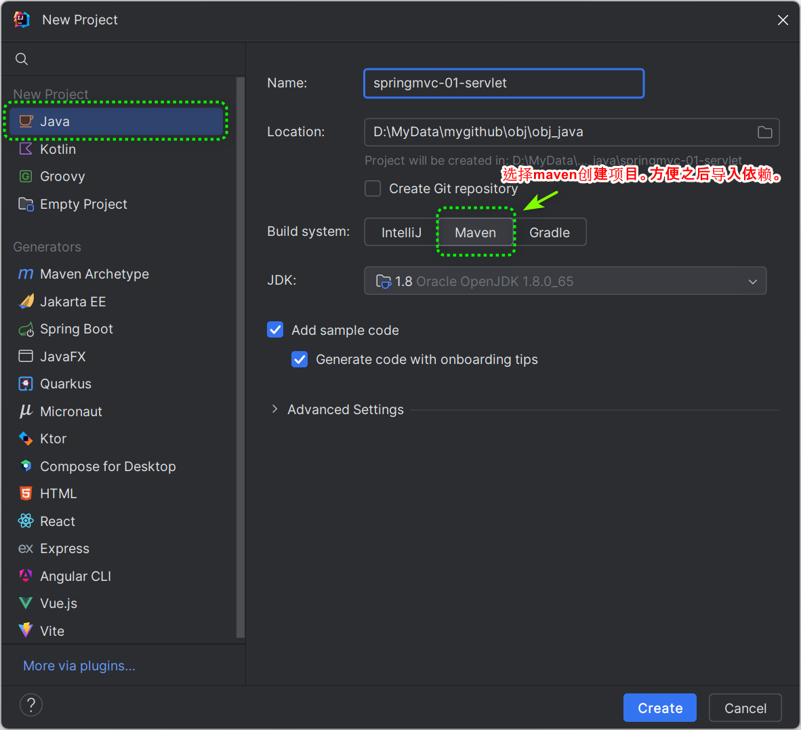
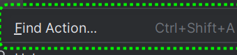
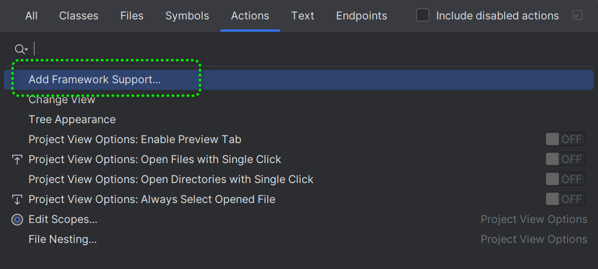
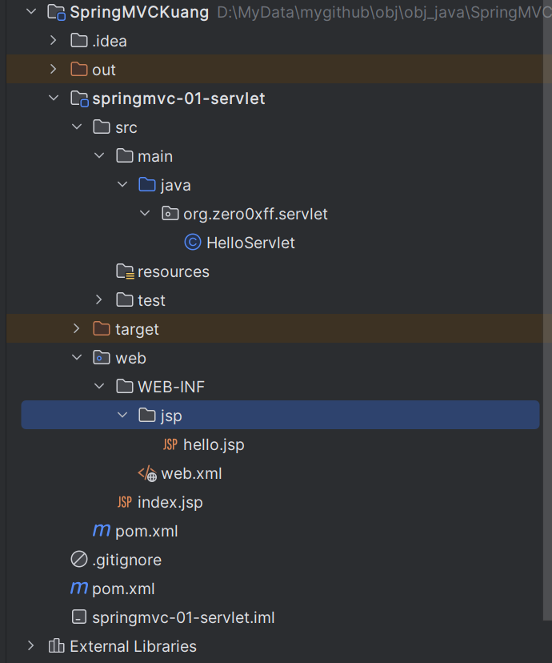
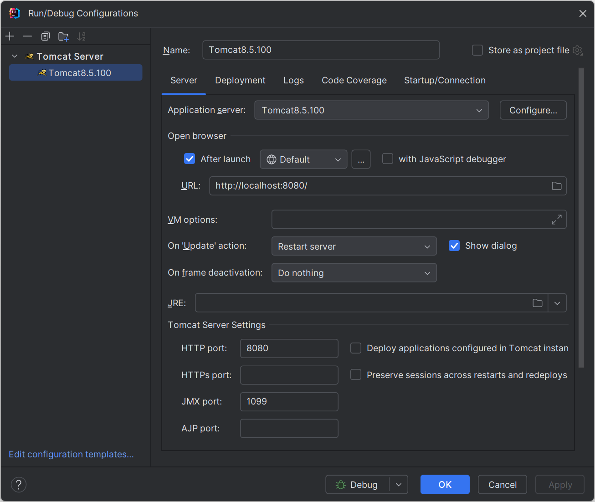
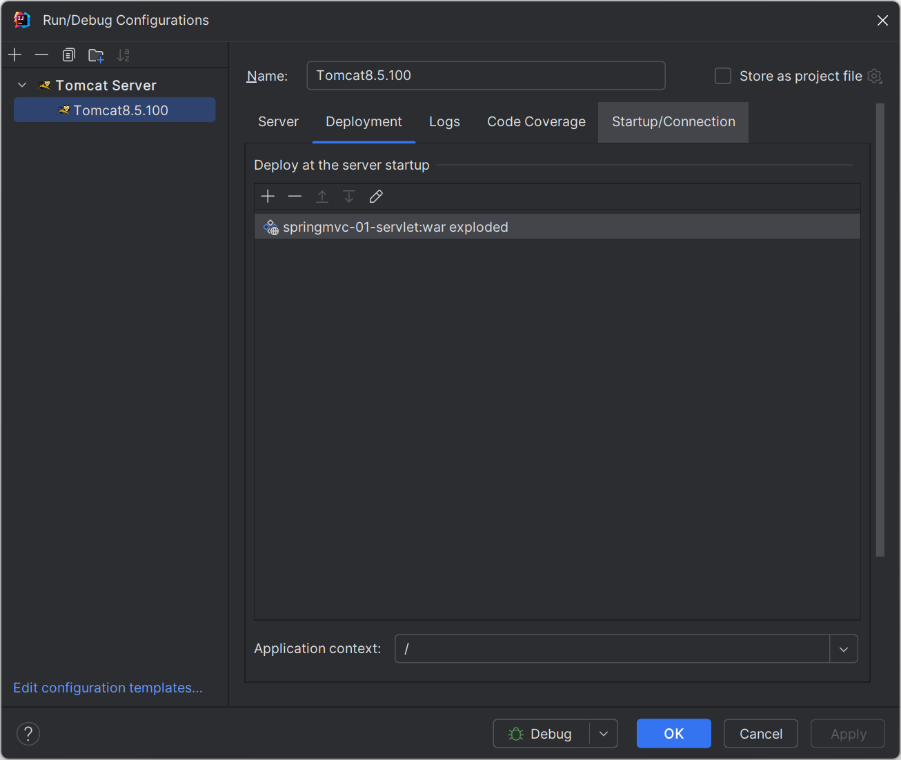
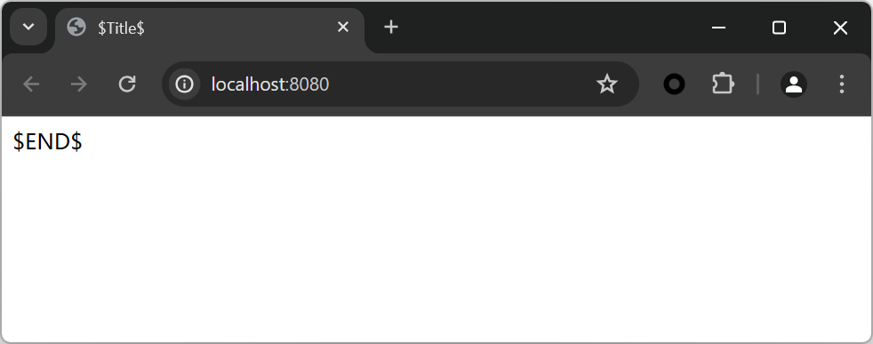
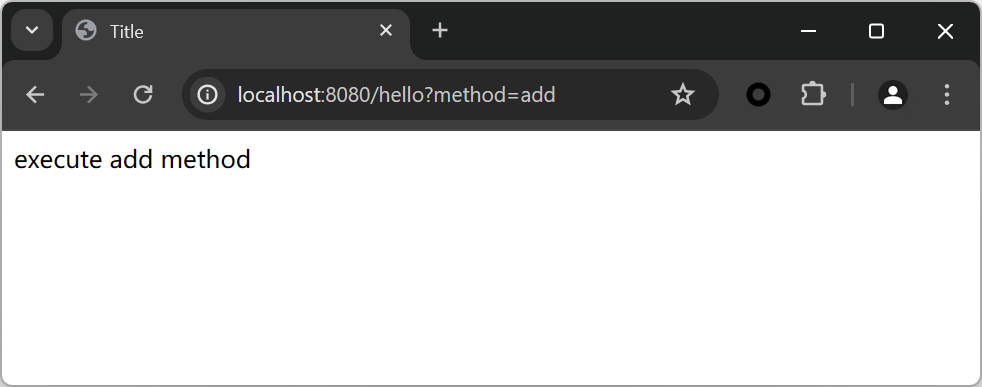

# Servlet

[TOC]

Servlet 是 Java 平台的一个组件，主要用于在 Web 服务器上处理客户端请求并生成动态内容。Servlet 技术允许开发者创建可以响应客户端请求的服务器端程序，通常用于构建 Web 应用程序。是对请求以及请求处理方法的抽象。

Servlet 是在服务器端运行的 Java 类，它们用于处理客户端的请求并生成响应。Servlet 的本质是一个 Java 类，它实现了 Servlet 接口或者扩展了 GenericServlet 或 HttpServlet 类。

实现了 Servlet 接口的 Java 类就是一个 Servlet，因为它们都能够处理客户端的请求并生成响应。通常情况下，我们称这样的类为 Servlet，不管它们实现了 Servlet 接口还是继承了 HttpServlet 类

## 创建JAVA WEB Servlet

以Maven方式构建系统。



通过Help搜索Action添加web框架支持。





编辑pom.xml倒入依赖。这里使用的maven版本为9.8.8。针对不同版本的maven，依赖库的版本可能会有所不同。举个例子，在参考例子中所给出的依赖库版本如下。与此同时，我没有使用IDEA自带的maven，而是使用了自己下载的maven。因为我使用IDEA自带的maven始终没法导入成功导入依赖。

```xml
<dependency>
   <groupId>javax.servlet</groupId>
   <artifactId>servlet-api</artifactId>
   <version>2.5</version>
</dependency>
<dependency>
   <groupId>javax.servlet.jsp</groupId>
   <artifactId>jsp-api</artifactId>
   <version>2.2</version>
</dependency>
```

而我实际使用的依赖库版本如下。

```xml
    <dependency>
        <groupId>javax.servlet</groupId>
        <artifactId>javax.servlet-api</artifactId>
        <version>3.1.0</version>
    </dependency>
    <dependency>
        <groupId>javax.servlet.jsp</groupId>
        <artifactId>javax.servlet.jsp-api</artifactId>
        <version>2.3.1</version>
    </dependency>
```

编写HelloServlet类处理用户请求。

```java
package org.zero0xff.servlet;

import javax.servlet.ServletException;
import javax.servlet.http.HttpServlet;
import javax.servlet.http.HttpServletRequest;
import javax.servlet.http.HttpServletResponse;
import java.io.IOException;

public class HelloServlet extends HttpServlet {
    @Override
    protected void doGet(HttpServletRequest req, HttpServletResponse resp) throws ServletException, IOException {
        String method = req.getParameter("method");
        if(method.equals("add")) {
            req.getSession().setAttribute("msg", "execute add method");
        }
        if(method.equals("delete")) {
            req.getSession().setAttribute("msg", "execute delete method");
        }

        req.getRequestDispatcher("/WEB-INF/jsp/hello.jsp").forward(req, resp);
    }

    @Override
    protected void doPost(HttpServletRequest req, HttpServletResponse resp) throws ServletException, IOException {
        super.doPost(req, resp);
    }
}

```

编写hello.jsp，在WEB-INF目录下建一个jsp文件夹，新建hello.jsp

```jsp
<%@ page contentType="text/html;charset=UTF-8" language="java" %>
<html>
    <head>
       <title>Kuangshen</title>
    </head>
    <body>
        ${msg}
    </body>
</html>
```

在web.xml中注册Servlet

```xml
<?xml version="1.0" encoding="UTF-8"?>
<web-app xmlns="http://xmlns.jcp.org/xml/ns/javaee"
         xmlns:xsi="http://www.w3.org/2001/XMLSchema-instance"
         xsi:schemaLocation="http://xmlns.jcp.org/xml/ns/javaee http://xmlns.jcp.org/xml/ns/javaee/web-app_4_0.xsd"
         version="4.0">

    <servlet>
        <servlet-name>Hello</servlet-name>
        <servlet-class>org.zero0xff.servlet.HelloServlet</servlet-class>
    </servlet>
    <servlet-mapping>
        <servlet-name>Hello</servlet-name>
        <url-pattern>/hello</url-pattern>
    </servlet-mapping>
    
    <welcome-file-list>
        <welcome-file>index.jsp</welcome-file>
    </welcome-file-list>
</web-app>
```

最终目录结构。



配置tomcat。这里省略步骤只截图，因为之前已经有文档讲了如何配置tomcat。





运行最终效果如图所示。





