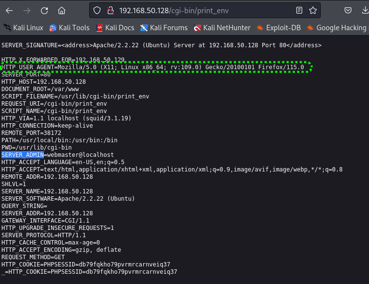
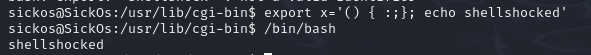

# ShellShock与CGI

[TOC]

## CGI

### 概念

CGI（Common Gateway Interface，通用网关接口）是一种用于Web服务器与外部程序（通常是脚本）进行交互的标准接口。

我的理解是CGI是一个协议。协议约定了Web服务如何根据用户请求调用相应的外部程序。

### http请求与环境变量

当Web服务器接收到HTTP请求时，它会检查请求的URL是否与已配置的CGI脚本路径匹配。如果匹配成功，服务器会启动一个新的进程来执行该脚本，并将HTTP请求的参数以环境变量的形式传递给脚本。脚本执行完毕后，将结果发送回Web服务器，然后服务器将结果返回给客户端。

## Apache cgi实验

### 环境

在Apache配置文件中`/etc/apache2/sites-available/default`中有如下内容

```
        ScriptAlias /cgi-bin/ /usr/lib/cgi-bin/
        <Directory "/usr/lib/cgi-bin">
                AllowOverride None
                Options +ExecCGI -MultiViews +SymLinksIfOwnerMatch
                Order allow,deny
                Allow from all
        </Directory>

```

这表示真实的cgi目录应该是 /usr/lib/cgi-bin/。

### 实验步骤

1. 在 /usr/lib/cgi-bin/创建print_env.sh文件，文件输出环境变量。
2. 尝试通过/cgi-bin/print_env.sh访问，获取输出。

```shell
#!/bin/bash

echo "Content-Type: text/plain";
echo ""

for var in $(env | cut -d= -f1); do
    echo "$var=${!var}"
done
```




### 实验总结

 该实验验证了，当Apache服务器接收到HTTP CGI请求时，会将HTTP请求的参数以环境变量的形式传递给脚本。

接下来需要重点关注绿色框部分，因为接下来的漏洞利原理需要对这里有理解。

## Shellshock

## 检测

```
env x='() { :;}; echo shellshocked' bash –c “no shellshock”
```

### 犯过的错误

* 没有检查`'`的是否是半角
* `()`和`{}`之间需要要有一个空格
* `{`和`:之间需要要有一个空格`

出错的本质是对shell脚本语法不熟悉，不清楚如何定义函数。


## 实验

网上实验一大把，理解原理设计出自己的实验，说明才理解了漏洞。

1. 用export命令倒入环境变量，`export x='() { :;}; echo shellshocked'`

2. 调用/bin/bash触发

   

## 本质

* 在 Bash 中，环境变量可以包含函数定义。当一个 Bash shell 启动时，它会从环境变量中导入函数定义，并将这些定义转换为内部的函数表示。
* Bash 在解析这些环境变量时存在一个缺陷。具体来说，如果环境变量的值以一个函数定义开始，然后紧跟着的是任意的字符串，Bash 会继续解析并执行这些字符串。这个行为导致了代码注入的可能性。

