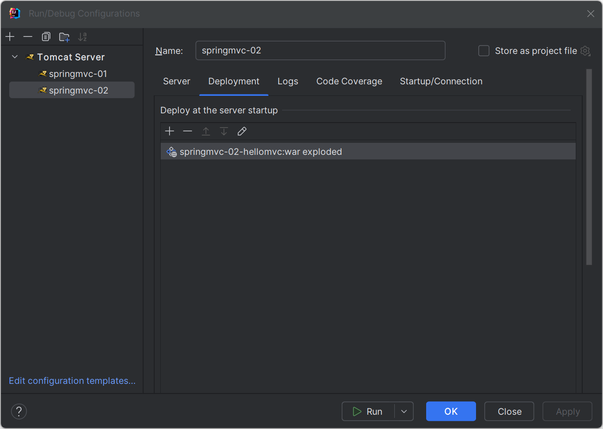
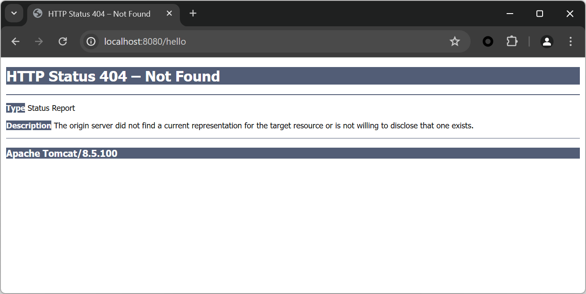
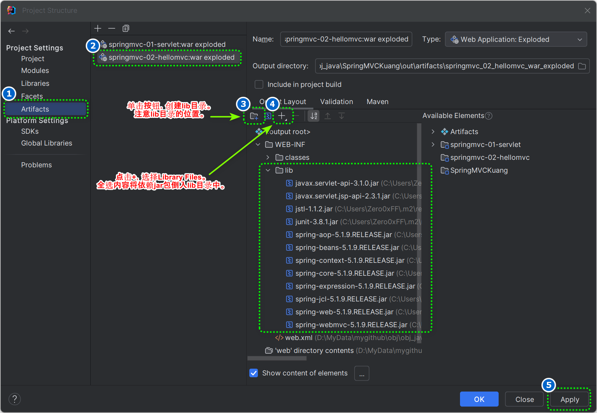
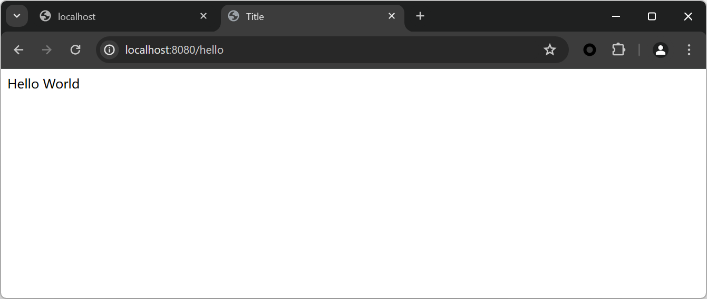

# SpringMVC

[TOC]

## SpringMVCHello

新建普通Java项目。添加web框架支持。具体步骤可以参考servlet.md hello创建JAVA WEB Servlet的方法。

在web.xml中注册DispatcherServlet。

```xml
<!--1.注册DispatcherServlet-->
    <servlet>
        <servlet-name>springmvc</servlet-name>
        <servlet-class>org.springframework.web.servlet.DispatcherServlet</servlet-class>
        <!--关联一个springmvc的配置文件:[servlet-name]-servlet.xml-->
        <init-param>
            <param-name>contextConfigLocation</param-name>
            <param-value>classpath:springmvc-servlet.xml</param-value>
        </init-param>
        <!--启动级别-1-->
        <load-on-startup>1</load-on-startup>
    </servlet>
    <!--
        在SpringMVC中，    /   /*
        / : 只匹配所有的请求，不会去匹配jsp页面
        /* : 匹配所有的请求，包括jsp页面
    -->
    <servlet-mapping>
        <servlet-name>springmvc</servlet-name>
        <url-pattern>/</url-pattern>
    </servlet-mapping>
```

创建SpringMVC的配置文件，配置文件通常在resources目录下，名称:springmvc-servlet.xml`。官方给出的命名规则为 [servletname]-servlet.xml。

```xml
<?xml version="1.0" encoding="UTF-8"?>
<beans xmlns="http://www.springframework.org/schema/beans"
       xmlns:xsi="http://www.w3.org/2001/XMLSchema-instance"
       xsi:schemaLocation="http://www.springframework.org/schema/beans http://www.springframework.org/schema/beans/spring-beans.xsd">

</beans>
```

根据我们的业务编写controller，这里我实现的事HelloControler实现Controller接口。需要返回一个ModelAndView，装数据，封视图；

```
package org.zero0xff.controller;

import org.springframework.web.servlet.ModelAndView;
import org.springframework.web.servlet.mvc.Controller;

import javax.servlet.http.HttpServletRequest;
import javax.servlet.http.HttpServletResponse;

public class HelloController implements Controller {
    @Override
    public ModelAndView handleRequest(HttpServletRequest httpServletRequest, HttpServletResponse httpServletResponse) throws Exception {
        ModelAndView modelAndView = new ModelAndView();
        modelAndView.addObject("message", "Hello World");
        modelAndView.setViewName("hello");
        return modelAndView;
    }
}

```

注册Controller。将自己的HelloController类注册到spring lc容器，注册为一个bean。具体步骤是向springmvc-servlet.xml，插入一条bean信息。

```
<!--Handler-->
<bean id="/hello" class="org.zero0xff.controller.HelloController"/>
```

编写要跳转的hello.jsp页面。页面功能是显示ModelandView存放的数据，以及我们的正常页面；

```
<%--
  Created by IntelliJ IDEA.
  User: Zero0xFF
  Date: 5/1/2024
  Time: 6:28 AM
  To change this template use File | Settings | File Templates.
--%>
<%@ page contentType="text/html;charset=UTF-8" language="java" %>
<html>
    <head>
        <title>Title</title>
    </head>
    <body>
        $(message)
    </body>
</html>

```

打包运行。注意如图要新建一个运行环境，具体如下图所示。



运行以后出现404问题。可能的原因是我们运行时所打的Artifacts包缺乏运行环境，因此导致tomcat找不到需要的jar包。



解决办法

1. 停止调试/运行
2. 在Project Structrue进行如下操作。



最终运行结果如下。



## Springmvc 注解

1. 创建java module项目

2. Add Framework Supply

3. 编辑pom.xml倒入依赖

   ```
   <dependencies>
           <dependency>
               <groupId>junit</groupId>
               <artifactId>junit</artifactId>
               <version>3.8.1</version>
           </dependency>
           <dependency>
               <groupId>org.springframework</groupId>
               <artifactId>spring-webmvc</artifactId>
               <version>5.1.9.RELEASE</version>
           </dependency>
           <dependency>
               <groupId>javax.servlet</groupId>
               <artifactId>javax.servlet-api</artifactId>
               <version>3.1.0</version>
           </dependency>
           <dependency>
               <groupId>javax.servlet.jsp</groupId>
               <artifactId>javax.servlet.jsp-api</artifactId>
               <version>2.3.1</version>
           </dependency>
           <dependency>
               <groupId>javax.servlet</groupId>
               <artifactId>jstl</artifactId>
               <version>1.1.2</version>
           </dependency>
       </dependencies>
   ```

   

4. 向Artifacts包中添加lib依赖

5. 在web.xml注册DispatchServlet

   ```
       <!--1.注册servlet-->
       <servlet>
           <servlet-name>SpringMVC</servlet-name>
           <servlet-class>org.springframework.web.servlet.DispatcherServlet</servlet-class>
           <!--通过初始化参数指定SpringMVC配置文件的位置，进行关联-->
           <init-param>
               <param-name>contextConfigLocation</param-name>
               <param-value>classpath:springmvc-servlet.xml</param-value>
           </init-param>
          
           <!-- 启动顺序，数字越小，启动越早 -->
           <!-- 在容器启动时就加载这个servlet。--> 
           <!-- 如果不写这句话，servlet会在浏览器第一次访问的时候加载，这时候会导致浏览器第一次访问页面话费较长时间 -->
           <load-on-startup>1</load-on-startup>
       </servlet>
       <!--所有请求都会被springmvc拦截 -->
       <servlet-mapping>
           <servlet-name>SpringMVC</servlet-name>
           <url-pattern>/</url-pattern>
       </servlet-mapping>
   ```

6. 添加MVC配置文件

   ```
   <?xml version="1.0" encoding="UTF-8"?>
   <beans xmlns="http://www.springframework.org/schema/beans"
          xmlns:xsi="http://www.w3.org/2001/XMLSchema-instance"
          xmlns:context="http://www.springframework.org/schema/context"
          xmlns:mvc="http://www.springframework.org/schema/mvc"
          xsi:schemaLocation="http://www.springframework.org/schema/beans
           http://www.springframework.org/schema/beans/spring-beans.xsd
           http://www.springframework.org/schema/context
           https://www.springframework.org/schema/context/spring-context.xsd
           http://www.springframework.org/schema/mvc
           https://www.springframework.org/schema/mvc/spring-mvc.xsd">
       <!-- 自动扫描包，让指定包下的注解生效,由IOC容器统一管理 -->
       <context:component-scan base-package="com.zero0xff.controller"/>
       <!-- 让Spring MVC不处理静态资源 -->
       <mvc:default-servlet-handler />
       <!--
       支持mvc注解驱动
           在spring中一般采用@RequestMapping注解来完成映射关系
           要想使@RequestMapping注解生效
           必须向上下文中注册DefaultAnnotationHandlerMapping
           和一个AnnotationMethodHandlerAdapter实例
           这两个实例分别在类级别和方法级别处理。
           而annotation-driven配置帮助我们自动完成上述两个实例的注入。
        -->
       <mvc:annotation-driven />
       <!-- 视图解析器 -->
       <bean class="org.springframework.web.servlet.view.InternalResourceViewResolver"
             id="internalResourceViewResolver">
           <!-- 前缀 -->
           <property name="prefix" value="/WEB-INF/jsp/" />
           <!-- 后缀 -->
           <property name="suffix" value=".jsp" />
       </bean>
   </beans>
   ```

7. 创建Controler

   ```java
   package org.zero0xff.controller;
   
   import org.springframework.stereotype.Controller;
   import org.springframework.ui.Model;
   import org.springframework.web.bind.annotation.RequestMapping;
   
   @Controller
   @RequestMapping("/HelloController")
   public class HelloController {
   	//真实访问地址 : 项目名/HelloController/hello
       @RequestMapping("/hello")
       public String SayHello(Model model) {
           //向模型中添加属性msg与值，可以在JSP页面中取出并渲染
           model.addAttribute("msg", "Hello World");
           //web-inf/jsp/hello.jsp
           return "hello";
       }
   }
   
   ```

8. 创建视图,在WEB-INF/ jsp目录中创建hello.jsp ， 视图可以直接取出并展示从Controller带回的信息；

   可以通过EL表示取出Model中存放的值，或者对象；

   ```
   <%@ page contentType="text/html;charset=UTF-8" language="java" %>
   <html>
   <head>
       <title>SpringMVC</title>
   </head>
   <body>
       ${msg}
   </body>
   </html>
   ```

9. 访问http://localhost:8080//HelloController/hello

## Controller

1. 实现controller接口
2. 通过annotation实现

具体参考项目springmvc-04-controller

## RestFul风格

Restful就是一个资源定位及资源操作的风格。不是标准也不是协议，只是一种风格。基于这个风格设计的软件可以更简洁，更有层次，更易于实现缓存等机制。

**传统方式操作资源**

通过不同的参数来实现不同的效果！方法单一，post 和 get

```
http://127.0.0.1/item/queryItem.action?id=1 查询,GET

http://127.0.0.1/item/saveItem.action 新增,POST

http://127.0.0.1/item/updateItem.action 更新,POST

http://127.0.0.1/item/deleteItem.action?id=1 删除,GET或POST
```

**使用RestFul操作资源**

 可以通过不同的请求方式来实现不同的效果！如下：请求地址一样，但是功能可以不同！

```
http://127.0.0.1/item/1 查询,GET
http://127.0.0.1/item 新增,POST
http://127.0.0.1/item 更新,PUT
http://127.0.0.1/item/1 删除,DELETE
```

```
//frome springmvc-04-controller
package org.zero0xff.controller;

import org.springframework.stereotype.Controller;
import org.springframework.ui.Model;
import org.springframework.web.bind.annotation.PathVariable;
import org.springframework.web.bind.annotation.RequestMapping;
import org.springframework.web.bind.annotation.RequestMethod;

@Controller
public class ControllerRestFul {

    @RequestMapping(value = "/add/{a}/{b}", method = RequestMethod.GET)
    public String add(@PathVariable int a, @PathVariable int b, Model model) {
        model.addAttribute("msg", a + " + " + b + " = " + (a + b));
        return "show_controller";
    }
}

```

## 结果跳转方式

### ModeAndView

页面 : {视图解析器前缀} + viewName +{视图解析器后缀}，springmvc-04-controller中org.zero0xff.controller.ControllerMAV

```
<bean class="org.springframework.web.servlet.view.InternalResourceViewResolver" id="internalResourceViewResolver">
        <property name="prefix" value="/WEB-INF/jsp/"/>
        <property name="suffix" value=".jsp"/>
    </bean>
```

```
package org.zero0xff.controller;

import org.springframework.web.servlet.ModelAndView;
import org.springframework.web.servlet.mvc.Controller;

import javax.servlet.http.HttpServletRequest;
import javax.servlet.http.HttpServletResponse;

public class ControllerMAV implements Controller {
    @Override
    public ModelAndView handleRequest(HttpServletRequest httpServletRequest, HttpServletResponse httpServletResponse) throws Exception {
        ModelAndView modelAndView = new ModelAndView();
        modelAndView.addObject("msg","build controller return Modle And View");
        modelAndView.setViewName("show_controller");
        return modelAndView;
    }
}

```

### Servlet API

springmvc-04-controller中org.zero0xff.controller.ControllerServletApi

```
package org.zero0xff.controller;

import org.springframework.stereotype.Controller;
import org.springframework.web.bind.annotation.RequestMapping;
import org.springframework.web.context.support.HttpRequestHandlerServlet;

import javax.servlet.ServletException;
import javax.servlet.http.HttpServletRequest;
import javax.servlet.http.HttpServletResponse;
import java.io.IOException;

@Controller
public class ControllerServletApi {
    @RequestMapping("/api01")
    public void test1(HttpServletRequest req, HttpServletResponse resp) throws IOException {
        resp.getWriter().println("Hello,Spring BY servlet API");
    }

    @RequestMapping("/api02")
    public void test2(HttpServletRequest req, HttpServletResponse resp) throws IOException {
        resp.sendRedirect("/index.jsp");
    }

    @RequestMapping("/api03")
    public void test3(HttpServletRequest req, HttpServletResponse resp) throws IOException, ServletException {
        req.setAttribute("msg","/api03");
        req.getRequestDispatcher("/WEB-INF/jsp/show_controller.jsp").forward(req, resp);
    }
}
```

### 通过SpringMVC实现重定向转发

无视图解析器

```
@Controller
public class ResultSpringMVC {
    @RequestMapping("/m1/t1")
    public String test(Model model){
        //转发
        model.addAttribute("msg","ModelTest");
        return "/WEB-INF/jsp/test.jsp";
    }
    @RequestMapping("/m1/t2")
    public String test2(Model model){
        //转发二
        model.addAttribute("msg","ModelTest");
        return "forward:/WEB-INF/jsp/test.jsp";
    }
    @RequestMapping("/m1/t3")
    public String test3(Model model){
        //重定向
        return "redirect:/WEB-INF/jsp/test.jsp";
    }
}
```

有视图解析器

```
@Controller
public class ResultSpringMVC2 {
    @RequestMapping("/rsm2/t1")
    public String test1(){
        //转发
        return "test";
    }
    @RequestMapping("/rsm2/t2")
    public String test2(){
        //重定向
        return "redirect:/index.jsp";
        //return "redirect:hello.do"; //hello.do为另一个请求/
    }
}
```


## 处理提交数据

1. 提交的变量名和处理方法参数名一致。

   ```
   // http://localhost:8080/hello?name=Zero0xff
   @RequestMapping("/hello")
   public String hello(String name){
       System.out.println(name);
       return "hello";
   }
   ```

2. 提交的变量名和处理方法参数名不一致。

   ```
   // http://localhost:8080/hello?username=Zero0xff
   // @RequestParam("username") : username提交的域的名称 .
   @RequestMapping("/hello")
   public String hello(@RequestParam("username") String name){
       System.out.println(name);
       return "hello";
   }
   ```

3. 提交一个对象。

   ```
   // 实体类
   public class User {
       private int id;
       private String name;
       private int age;
       //构造
       //get/set
       //tostring()
   }
   ```

   ```
   // 处理方法
   // 提交的数据为 http://localhost:8080/mvc04/user?name=Zero0xff&id=1&age=15
   // 要求提交的表单域和对象的属性名一致 , 参数使用对象即可
   @RequestMapping("/user")
   public String user(User user){
       System.out.println(user);
       return "hello";
   }
   ```

   
