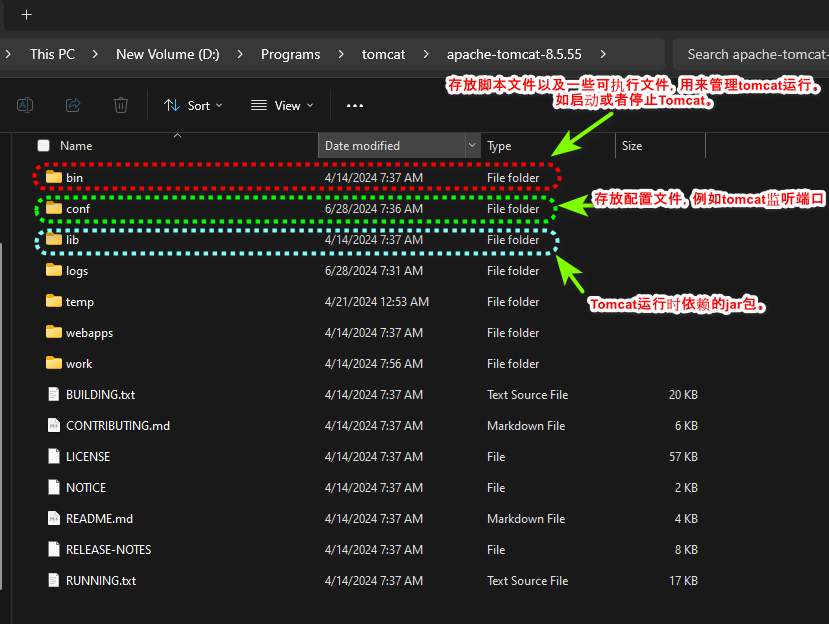
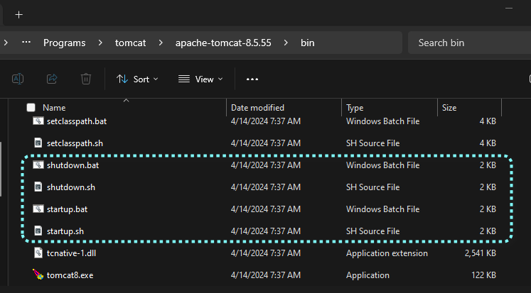
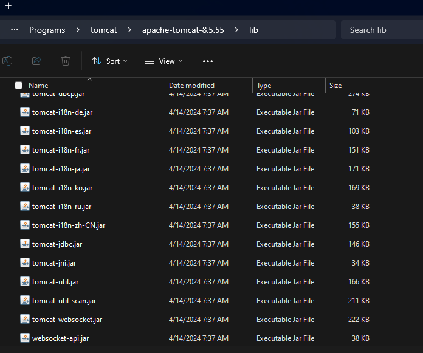
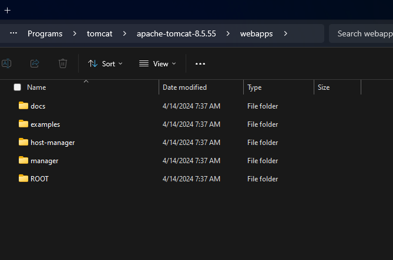
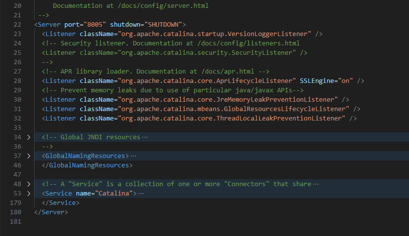
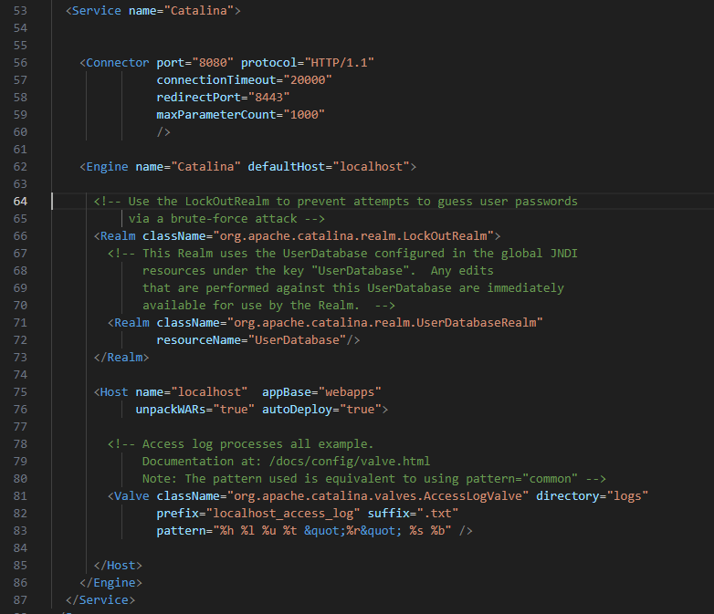
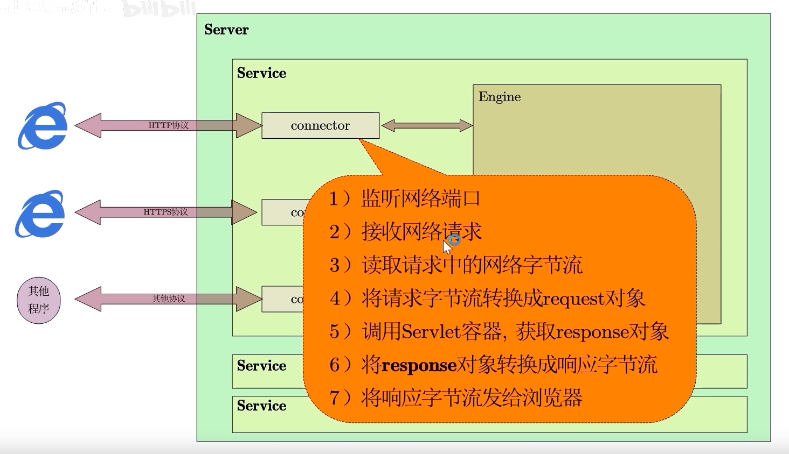
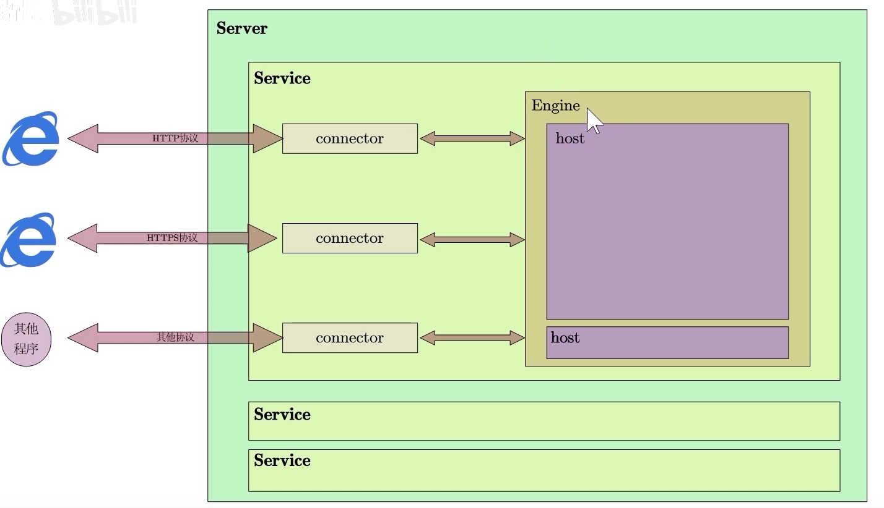
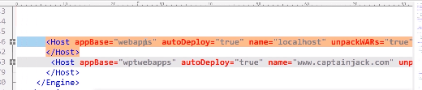
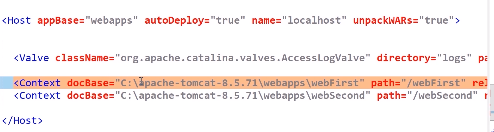

# Tomcat基本架构

[TOC]

## 目录组织结构

### bin目录

bin目录，包含了不同操作系统下的脚本以及可执行文件，用来管理tomca的t运行。

### conf目录

包含了与tomcat有关的重要配置文件，其中最为常用的是server.xml。

### lib目录

包含tomcat运行时的依赖库。

### webapp

存放虚拟主机的网站内容。虚拟主机是tomcat定义的一种抽象概念，访问网页的域名就是虚拟主机名。虚拟主机内部存放有web应用。Tomcat通过虚拟主机概念隔离web应用。

这样做的目的是，在一台真实的主机上，只运行的一个tomcat，tomcat只监听一个端口，就可以通过虚拟主机这一概念管理多个个网站。

## Server.xml

### Server组件

从server.xml中可知，最外部跟节点为Server。

#### 概念

Server节点概念上表示的就是tomcat进程本身，是唯一的。我的理解是是同一时刻，同一台电脑上根据同一个server.xml启动的tomcat只能有一个。

### Service节点

从图片中不难看出，Server节点下包含一个名为Catalina的Service节点。虽然Server节点下可以有多个Service组件，但是通常情况下只有一个。

因此这里不做过多讨论。

#### 概念

Service节点概念上就是对外提供服务的组件或者说是对象。

为了对外提服务，就需要建立链接，处理请求。所以Service节点内部还需要一个Connector节点用来建立连接，需要Engine节点处理请求。

#### Connector节点

## Engin节点

Engin节点本质是一个容器，其内部可以包含多个Host对象。Host对象即是对之前提到过的虚拟主机的逻辑抽象，其对应的节点在server.xml文件是Host节点。

## Host节点

Host组件即是虚拟主机对象的抽象。其实虚拟主机本质也是一个容器。

#### Example

如下图所示，Engin容器内部，有两台虚拟主机。一台名为localhost，一台名为www.captainjack.com。于此同时虚拟主机对应的存储目录分别是webapps和wptwebapps。

## Content对象

一个虚拟主机下可以有多个web应用。因此对web应用的抽象通过Content对象实现。即在Host节点下，可能会有多个Content节点，这些Content节点都分别对应不同的web应用。

#### Example

如下图在localhost虚拟主机下，有两个web应用。web应用存储目录是docBase所指向的目录。path指向的目录表示的是在url请求中所使用的目录。

