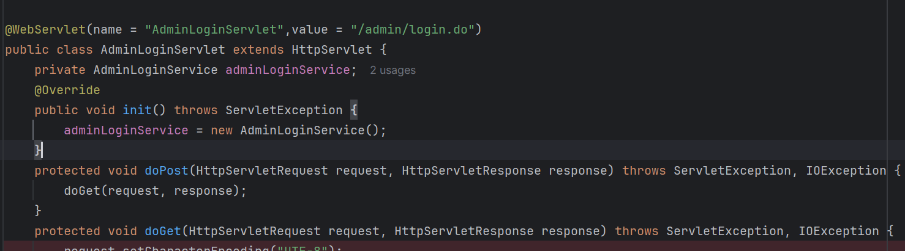

# Typpsc1项目分析

项目保存位置`D:\MyData\mygithub\obj\obj_java\typpsc1`

## web.xml

`web.xml` 是 Java Web 应用程序中使用的部署描述符文件。它是一个配置文件，定义了 Web 应用程序的结构和配置，包括 Servlet、过滤器、监听器以及其他设置。

```xml
<?xml version="1.0" encoding="UTF-8"?>
<web-app xmlns:xsi="http://www.w3.org/2001/XMLSchema-instance" xmlns="http://xmlns.jcp.org/xml/ns/javaee" xsi:schemaLocation="http://xmlns.jcp.org/xml/ns/javaee http://xmlns.jcp.org/xml/ns/javaee/web-app_3_1.xsd" id="WebApp_ID" version="3.1">
  <display-name>TiYu</display-name>
  <welcome-file-list>
    <welcome-file>default.jsp</welcome-file>
  </welcome-file-list>
</web-app>
```

## welcome-file-list标签

`<welcome-file-list>`：指定了欢迎文件列表，当用户访问根目录时，服务器会查找这些文件以作为默认页面。

`<welcome-file>default.jsp</welcome-file>`：指定了一个欢迎文件，即 `default.jsp`，它将作为默认页面提供给用户。

## default.jsp

```jsp
<%
String path = request.getContextPath();
String basePath = request.getScheme()+"://"+request.getServerName()+":"+request.getServerPort()+path+"/";
%>

<!DOCTYPE HTML PUBLIC "-//W3C//DTD HTML 4.01 Transitional//EN">
<html>
  <head>
	<meta http-equiv="pragma" content="no-cache">
	<meta http-equiv="cache-control" content="no-cache">
	<meta http-equiv="expires" content="0">    
	<meta http-equiv="keywords" content="keyword1,keyword2,keyword3">
	<meta http-equiv="description" content="This is my page">
  </head>
  
  <body>
        <script type="text/javascript">
            var url="/typpsc1/index.do"
            window.location.href=url;
        </script>
  </body>
</html>
```

通过分析`script`标签，发现最终浏览器会跳转到`/typpsc1/index.do`。表明在severlet中一定有一个叫index.do的方法。

### 分析URL:/admin/login.do

请求发现存在url`/admin/login.do`，所以推测在severlet中一定存在一个用/admin/login.do的注解修饰的severlet。



### 修复新增分类Bug

catelog_id配置中`DEFAULT '0'`导致第二次插入时id=0，因此PRIMARY KEY冲突。因此需要配置catelog_id自动增加。


bug 代码

```
CREATE TABLE `t_catelog` (
  `catelog_id` int(11) NOT NULL DEFAULT '0',
  `catelog_name` varchar(600) DEFAULT '',
  `catelog_miaoshu` varchar(600) DEFAULT '',
  `catelog_del` varchar(600) DEFAULT '',
  PRIMARY KEY (`catelog_id`)
) ENGINE=InnoDB DEFAULT CHARSET=utf8;
```

修复后代码，用AUTO_INCREMENT替换DEFAULT ‘0’。

```
CREATE TABLE `t_catelog` (
  `catelog_id` int(11) NOT NULL AUTO_INCREMENT,
  `catelog_name` varchar(600) DEFAULT '',
  `catelog_miaoshu` varchar(600) DEFAULT '',
  `catelog_del` varchar(600) DEFAULT '',
  PRIMARY KEY (`catelog_id`)
) ENGINE=InnoDB DEFAULT CHARSET=utf8;
```

