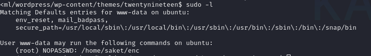
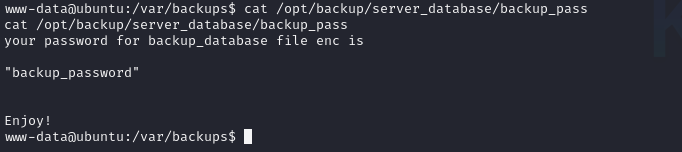
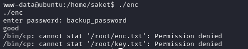
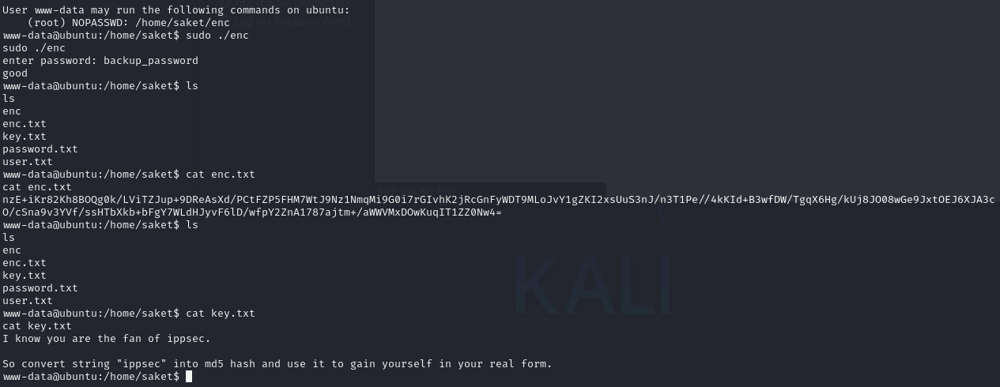
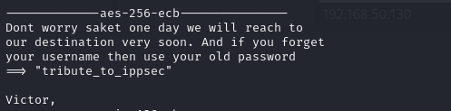
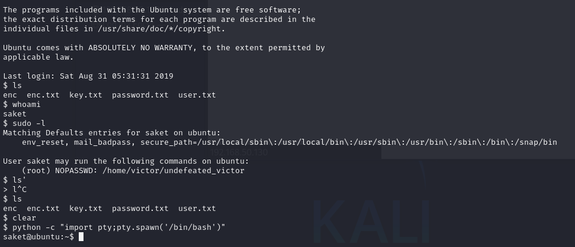
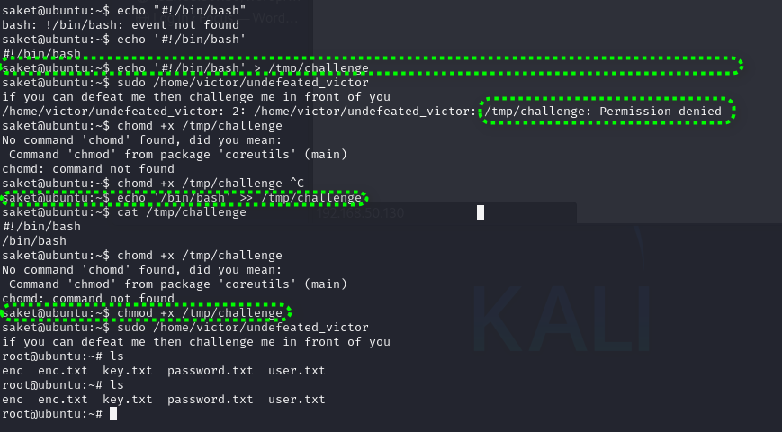

#  靶场记录Prime1.2

接着上回直接从上传php一句话木马开始

[TOC]

## 前情提要

上传php一句话木马后，查看passwd发现重点关注/home/saket/目录下有一个enc可以执行文件，sudo -l也提示运行enc时不需要root密码。然而我们一运行发现程序本身需要密码。这时可以猜测，操作系统内部存在密码备份，可以用find命令搜索。



## find搜索

```
find / -name "*passwd*" 2>/dev/null
find / -name "*password*" 2>/dev/null
find / -name "*passwd.bak*" 2>/dev/null
find / -name "*passwd.bak" 2>/dev/null
find / -name "*.bak" 2>/dev/null
find / -name "*backup*" 2>/dev/null
```

`find / -name "*passwd*" 2>/dev/null`命中目标`/var/backups/passwd.bak`一看发现没权限继续。

最终`find / -name "*backup*" 2>/dev/null`命中目标`/opt/backup/server_database/backup_pass`。



这里我直接选择在目标机器上运行，这其实是风险很大的行为。





## 根据提示使用openssl

```
echo -n "ippsec" | md5sum | awk -F' ' '{print $1}' | tr -d '\n' | od -A n -t x1 | tr -d '\n'
```

```
aes-128-cbc       aes-128-ecb       aes-192-cbc       aes-192-ecb       
aes-256-cbc       aes-256-ecb       aria-128-cbc      aria-128-cfb      
aria-128-cfb1     aria-128-cfb8     aria-128-ctr      aria-128-ecb      
aria-128-ofb      aria-192-cbc      aria-192-cfb      aria-192-cfb1     
aria-192-cfb8     aria-192-ctr      aria-192-ecb      aria-192-ofb      
aria-256-cbc      aria-256-cfb      aria-256-cfb1     aria-256-cfb8     
aria-256-ctr      aria-256-ecb      aria-256-ofb      base64            
bf                bf-cbc            bf-cfb            bf-ecb            
bf-ofb            camellia-128-cbc  camellia-128-ecb  camellia-192-cbc  
camellia-192-ecb  camellia-256-cbc  camellia-256-ecb  cast              
cast-cbc          cast5-cbc         cast5-cfb         cast5-ecb         
cast5-ofb         des               des-cbc           des-cfb           
des-ecb           des-ede           des-ede-cbc       des-ede-cfb       
des-ede-ofb       des-ede3          des-ede3-cbc      des-ede3-cfb      
des-ede3-ofb      des-ofb           des3              desx              
rc2               rc2-40-cbc        rc2-64-cbc        rc2-cbc           
rc2-cfb           rc2-ecb           rc2-ofb           rc4               
rc4-40            seed              seed-cbc          seed-cfb          
seed-ecb          seed-ofb          sm4-cbc           sm4-cfb           
sm4-ctr           sm4-ecb           sm4-ofb           zlib              
zstd
```

```
cat CipherTypes.txt | awk '{gsub(/ /,"\n");print}' | sort | uniq | awk 'NR==1 && /^$/ {next} {print}' > CipherTypeList
```

```
for Cipher in $(cat CipherTypeList);do echo;echo -------------$Cipher---------------;echo -n "nzE+iKr82Kh8BOQg0k/LViTZJup+9DReAsXd/PCtFZP5FHM7WtJ9Nz1NmqMi9G0i7rGIvhK2jRcGnFyWDT9MLoJvY1gZKI2xsUuS3nJ/n3T1Pe//4kKId+B3wfDW/TgqX6Hg/kUj8JO08wGe9JxtOEJ6XJA3cO/cSna9v3YVf/ssHTbXkb+bFgY7WLdHJyvF6lD/wfpY2ZnA1787ajtm+/aWWVMxDOwKuqIT1ZZ0Nw4=" | openssl enc -d -a -$Cipher  -K 3336366137346362336339353964653137643631646233303539316333396431;done
```

```
for Cipher in $(cat CipherTypeList);do echo;echo -------------$Cipher---------------;echo  "nzE+iKr82Kh8BOQg0k/LViTZJup+9DReAsXd/PCtFZP5FHM7WtJ9Nz1NmqMi9G0i7rGIvhK2jRcGnFyWDT9MLoJvY1gZKI2xsUuS3nJ/n3T1Pe//4kKId+B3wfDW/TgqX6Hg/kUj8JO08wGe9JxtOEJ6XJA3cO/cSna9v3YVf/ssHTbXkb+bFgY7WLdHJyvF6lD/wfpY2ZnA1787ajtm+/aWWVMxDOwKuqIT1ZZ0Nw4=" | openssl enc -d -a -$Cipher  -K 3336366137346362336339353964653137643631646233303539316333396431;done
```



saket登录



## 权限提升

根据‘sudo -l’提示可以无密码运行`/home/victor/undefeated_victor`，尝试运行提示缺少'/tmp/challenge'，于是尝试手工创建。



