# 搭建Sport Store环境

## Download docker image

```
docker pull mysql:5.5.62
```

## Build mysql by docker

```
docker run -p 3306**:**3306 --name my_mysql -e MYSQL_ROOT_PASSWORD=P@ssw0rd -d mysql:mysql:5.5.62
```

## Install Navicat

[Navicat_16.3.9](https://navicat.com/en/download/navicat-premium)

[Navicat Crack](https://github.com/LiJunYi2/navicat-keygen-16V/releases)

## Build database and import .sql script

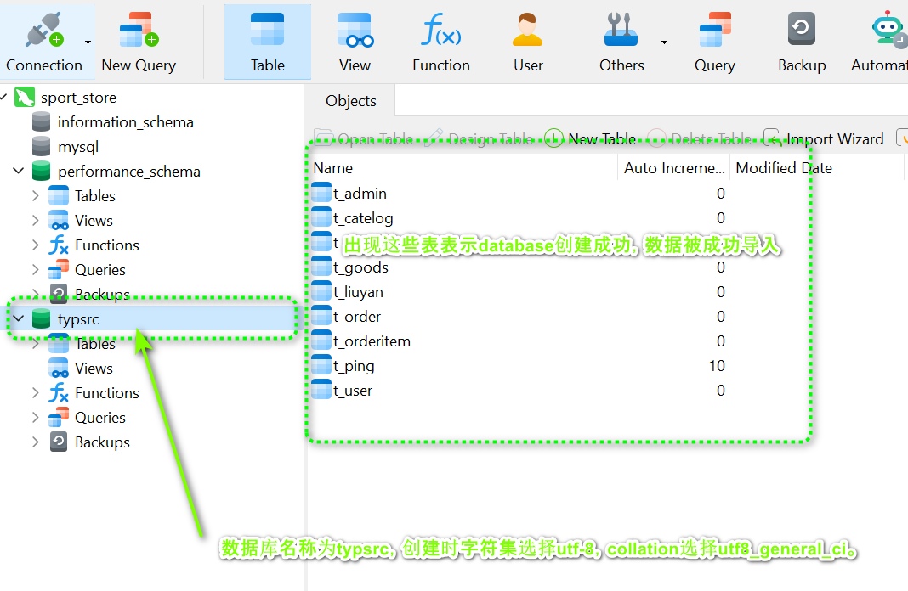

## 导入IDEA

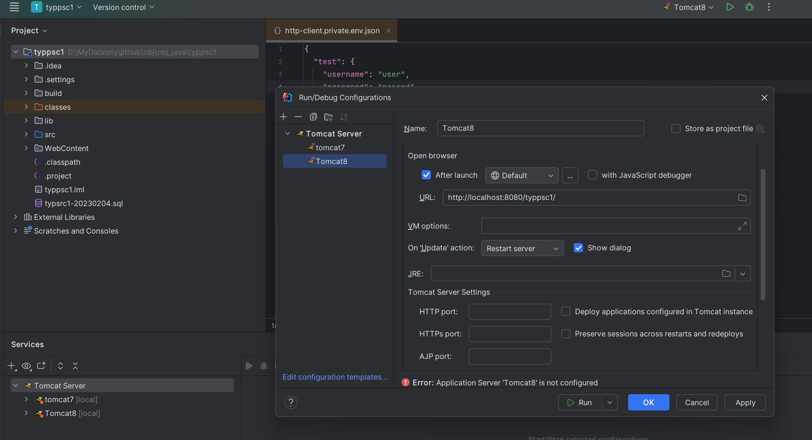

## 解决冲突

### 修复tomcat路径

由于我们本地tomcat7，tomcat8路径与项目配置tomcat78路径不一致导致错误。

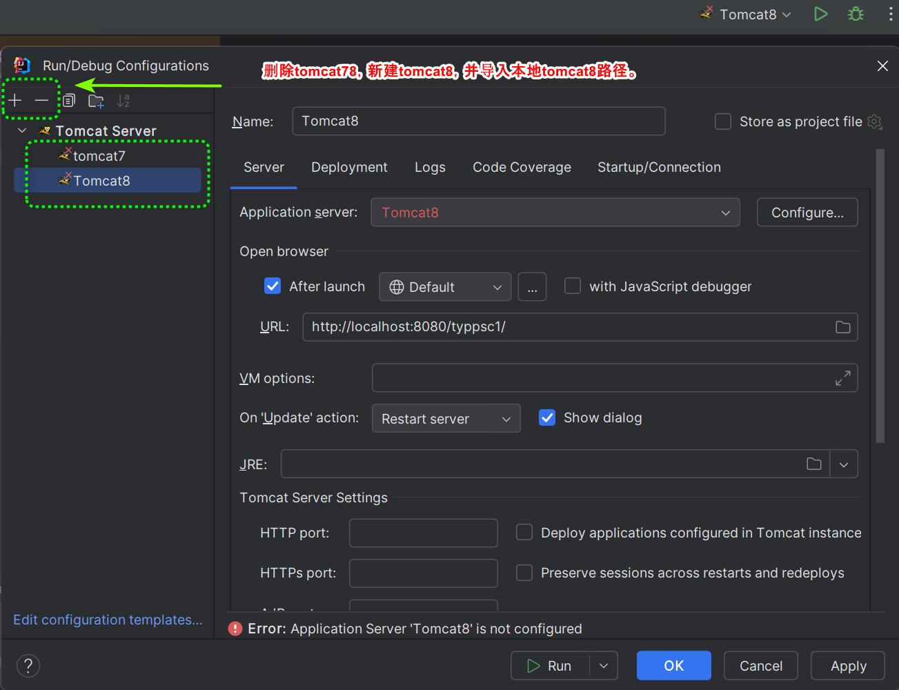

修复部署问题

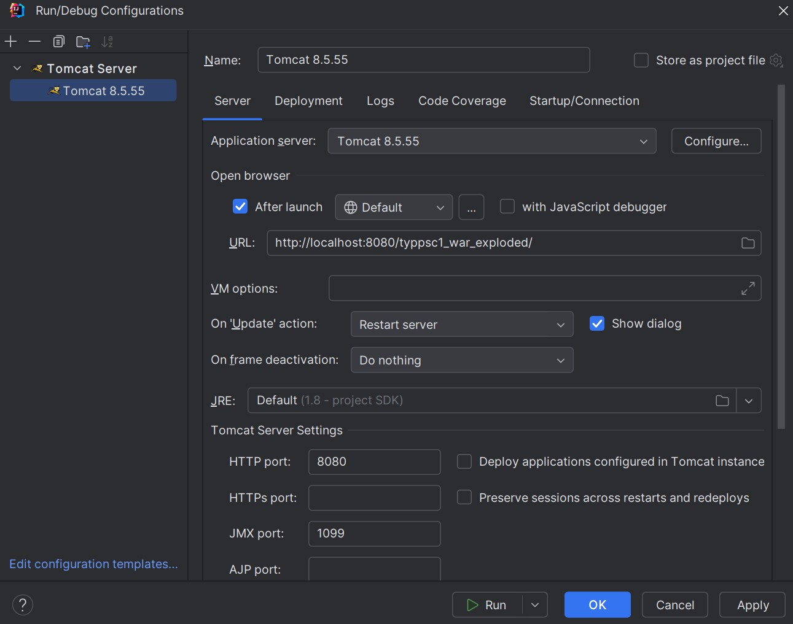

### 修复ApplicationContext

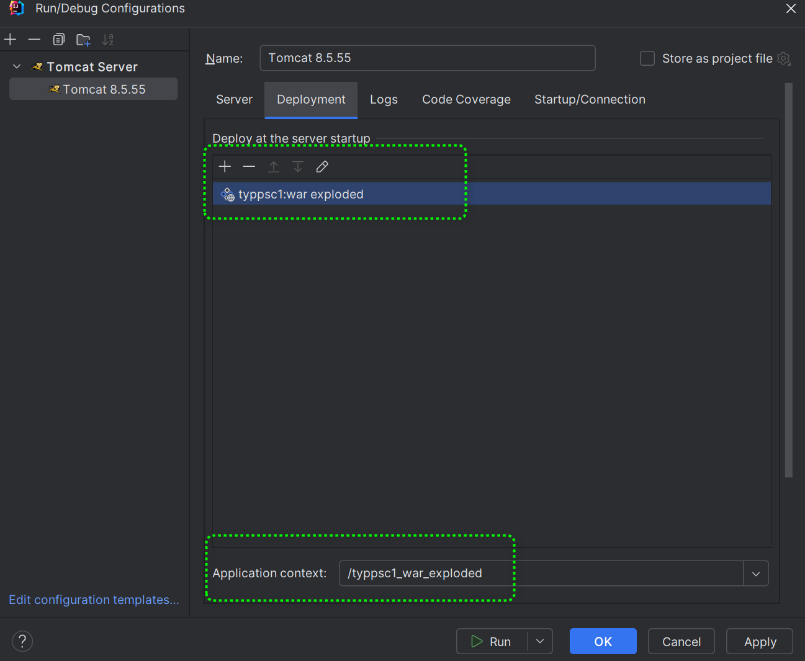

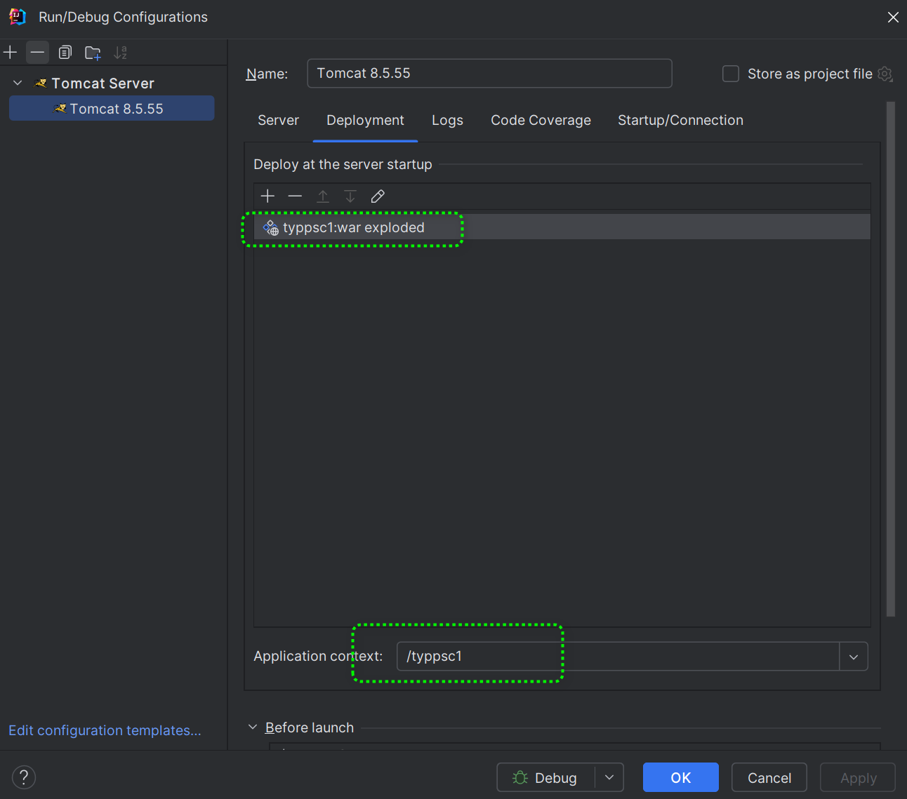

### 修复tomcat lib路径

由于我们更换了本地tomcat，因此项目tomcat lib路径需要更改。

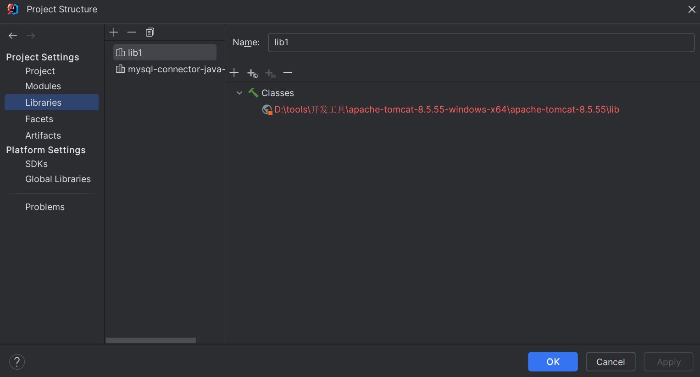

更改后tomcat lib路径如图下图所示

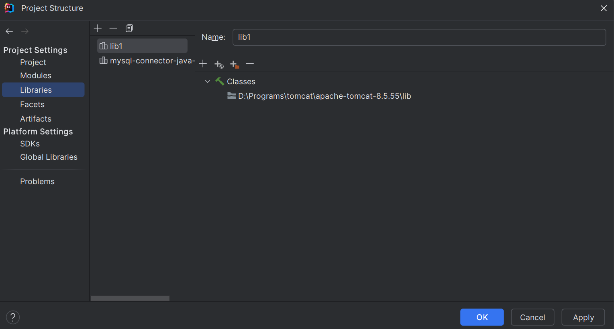

### 修改数据库登录信息

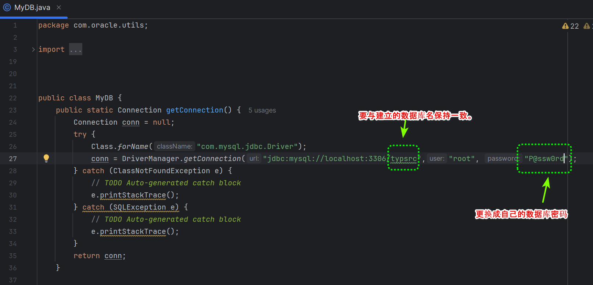

## 成功登录

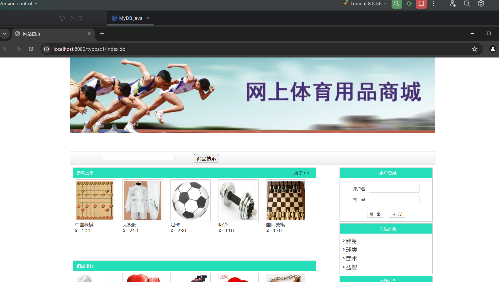

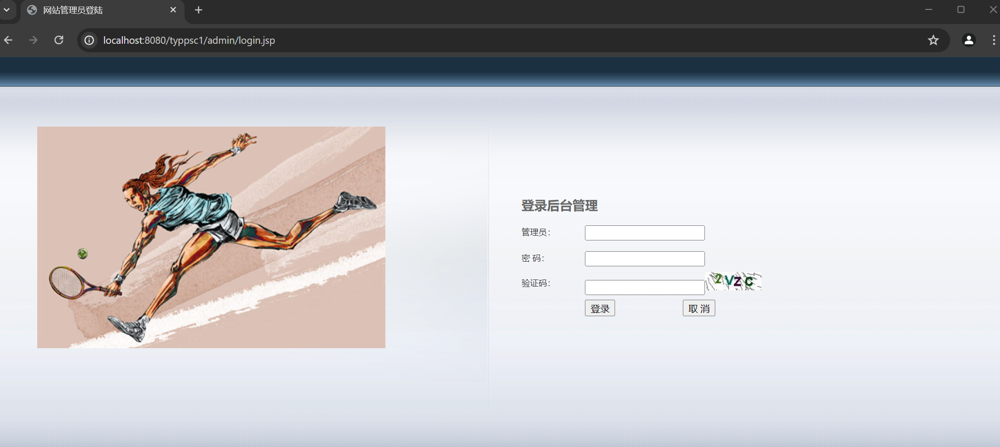