# Webgoat与IDEA代码审计环境搭建

[TOC]

## 环境介绍

```
操作系统 win11
java 17
Webgoat 2023.8
IDEA 2024.1
```

## 获取资源

clone Webgoat源码

```
git clone https://github.com/WebGoat/WebGoat.git
```

[jdk-17.0.11](https://download.oracle.com/java/17/latest/jdk-17_windows-x64_bin.zip)

## 搭建过程

这里省略的Java环境配置。

### Maven版本以及配置

apache-maven-3.9.6

setting.xml配置如下

```xml
<proxies>
    <!-- proxy
     | Specification for one proxy, to be used in connecting to the network.
     |
    <proxy>
      <id>optional</id>
      <active>true</active>
      <protocol>http</protocol>
      <username>proxyuser</username>
      <password>proxypass</password>
      <host>proxy.host.net</host>
      <port>80</port>
      <nonProxyHosts>local.net|some.host.com</nonProxyHosts>
    </proxy>
    -->
    <proxy>
      <id>proxy_http</id>
      <active>true</active>
      <protocol>http</protocol>
      <host>127.0.0.1</host>
      <port>10809</port>
      <nonProxyHosts>localhost|127.0.0.1|maven.aliyun.com</nonProxyHosts>
    </proxy>
    <proxy>
      <id>proxy_https</id>
      <active>true</active>
      <protocol>https</protocol>
      <host>127.0.0.1</host>
      <port>10809</port>
      <nonProxyHosts>localhost|127.0.0.1|maven.aliyun.com</nonProxyHosts>
    </proxy>
  </proxies>
  
  <mirrors>
    <!-- mirror
     | Specifies a repository mirror site to use instead of a given repository. The repository that
     | this mirror serves has an ID that matches the mirrorOf element of this mirror. IDs are used
     | for inheritance and direct lookup purposes, and must be unique across the set of mirrors.
     |
    <mirror>
      <id>mirrorId</id>
      <mirrorOf>repositoryId</mirrorOf>
      <name>Human Readable Name for this Mirror.</name>
      <url>http://my.repository.com/repo/path</url>
    </mirror>
     -->
    <mirror>
        <id>alimaven</id>
        <name>aliyun maven</name>
        <url>http://maven.aliyun.com/nexus/content/groups/public/</url>
        <mirrorOf>central</mirrorOf>
    </mirror>
    <mirror>
        <id>repo2</id>
        <name>repo2 maven</name>
        <url>http://repo2.maven.org/maven2</url>
        <mirrorOf>central</mirrorOf>
    </mirror>
  </mirrors>
```

## IDEA构建环境

1. 用IDEA打开Webgoat项目

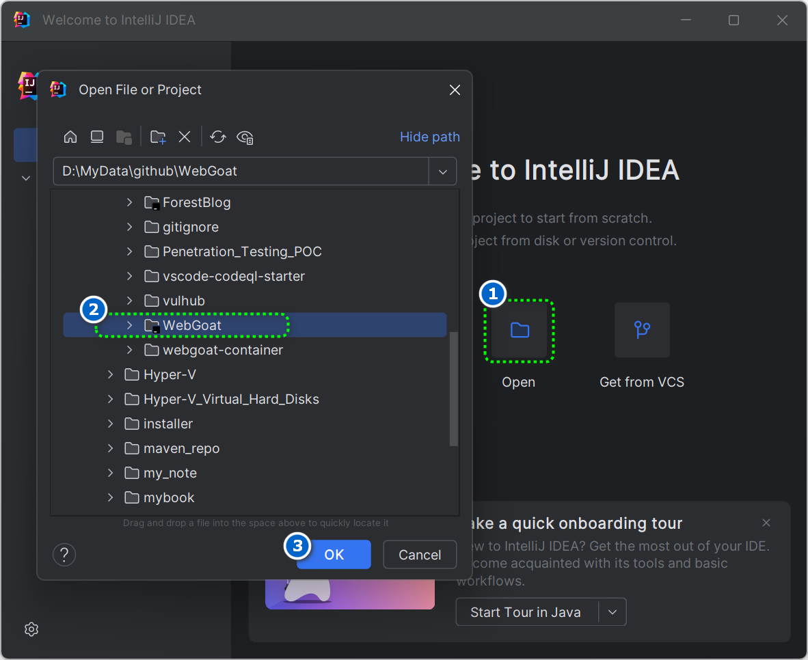

2. Enable annotation Process

   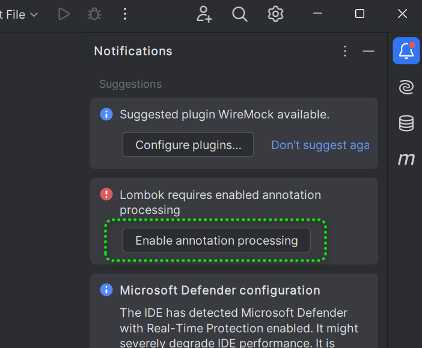

3. 将项目的pom.xml文件中的源也改为阿里云的，把默认的[http://maven.apache.org](https://link.zhihu.com/?target=http%3A//maven.apache.org)给注释掉；

   ```xml
     <repositories>
   <!--    <repository>-->
   <!--      <snapshots>-->
   <!--        <enabled>false</enabled>-->
   <!--      </snapshots>-->
   <!--      <id>central</id>-->
   <!--      <url>https://repo.maven.apache.org/maven2</url>-->
   <!--    </repository>-->
         <repository>
             <id>alimaven</id>
             <name>aliyun maven</name>
             <url>http://maven.aliyun.com/nexus/content/groups/public/</url>
             <releases>
                 <enabled>true</enabled>
             </releases>
             <snapshots>
                 <enabled>false</enabled>
             </snapshots>
         </repository>
     </repositories>
   ```

   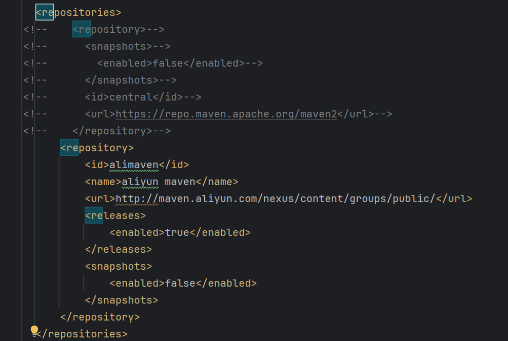

4. 鼠标右键pom.xml，通过Maven加载依赖。

   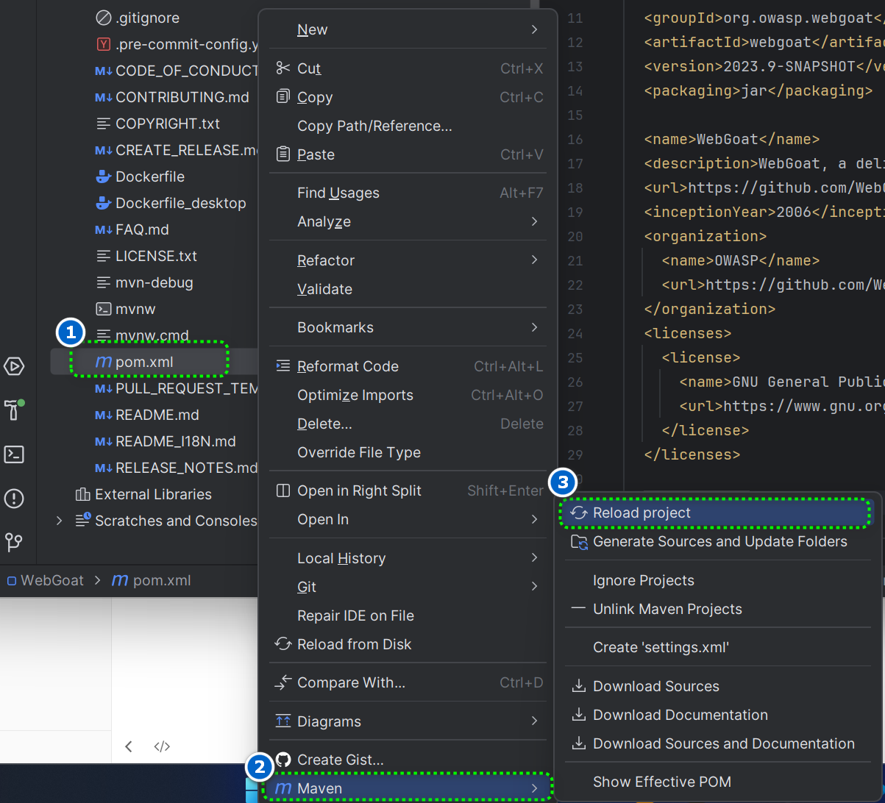

4. 耐心等待依赖加载完成。

   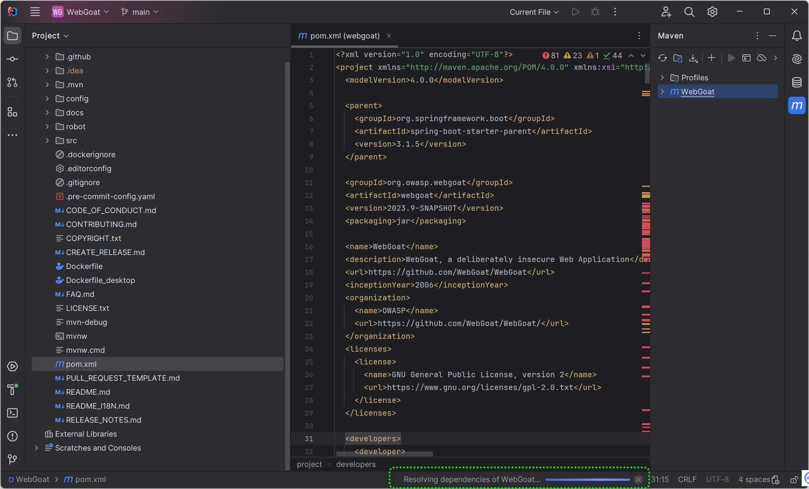

### 解决错误

错误如图所示

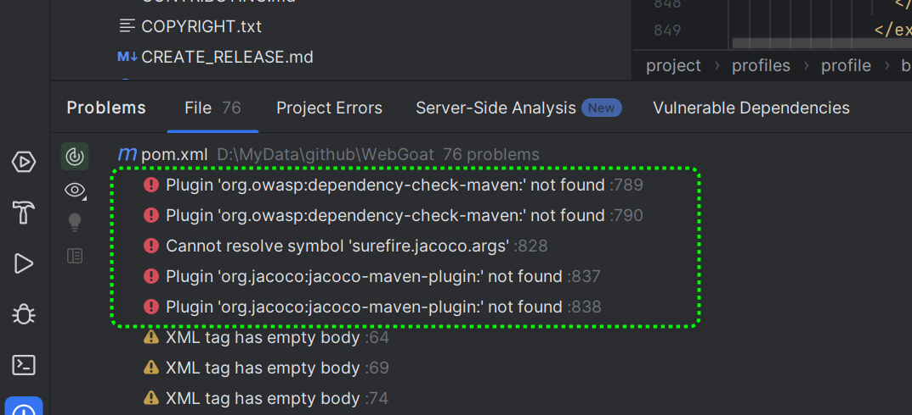

CMD命令输入

```
mvn dependency:get -Dartifact=org.jacoco:jacoco-maven-plugin:LATEST:jar
```

```
mvn dependency:get -Dartifact=org.owasp:dependency-check-maven:LATEST:jar
```

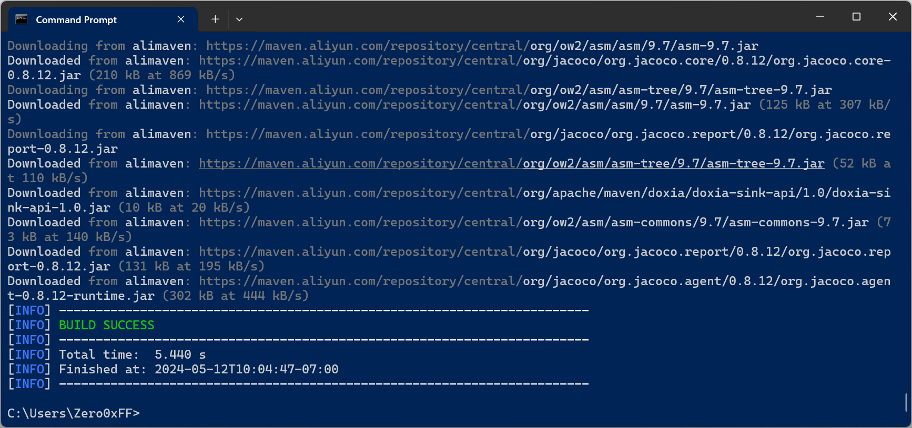

关闭IDEA重新打开，错误减少到一个。

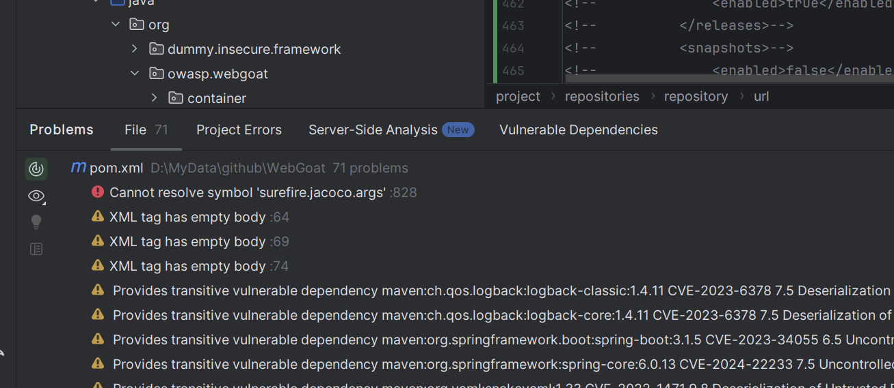

忽略错误。

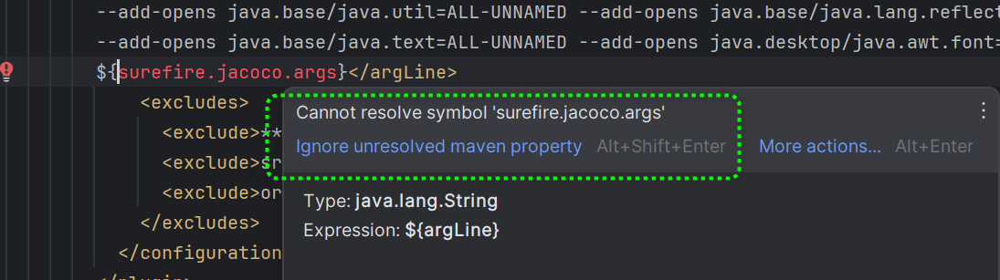

## 配置Spring Boot运行环境

操作步骤如图所示。

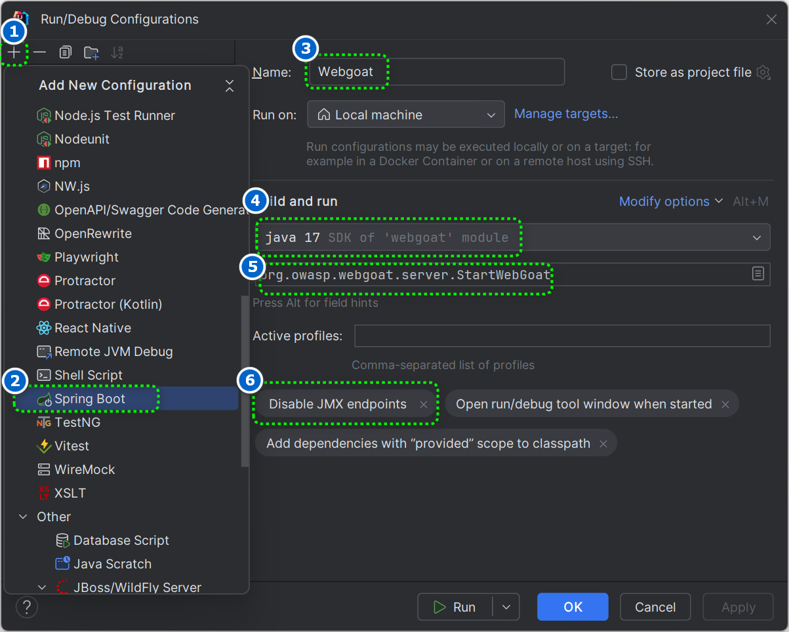

### 第6步详细实现方法

点击Modify options

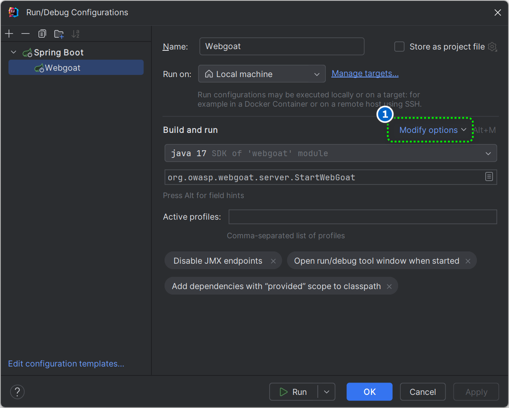

勾选Disable JMX endpoints

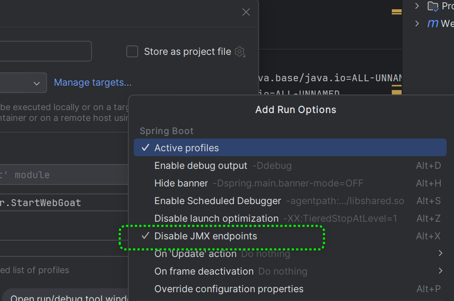

## 警告解决

警告如图所示

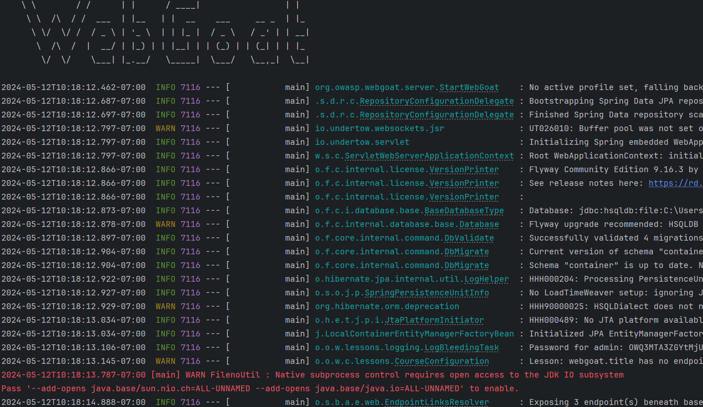

1. 点击Modify options

   

2. 勾选Add VM options

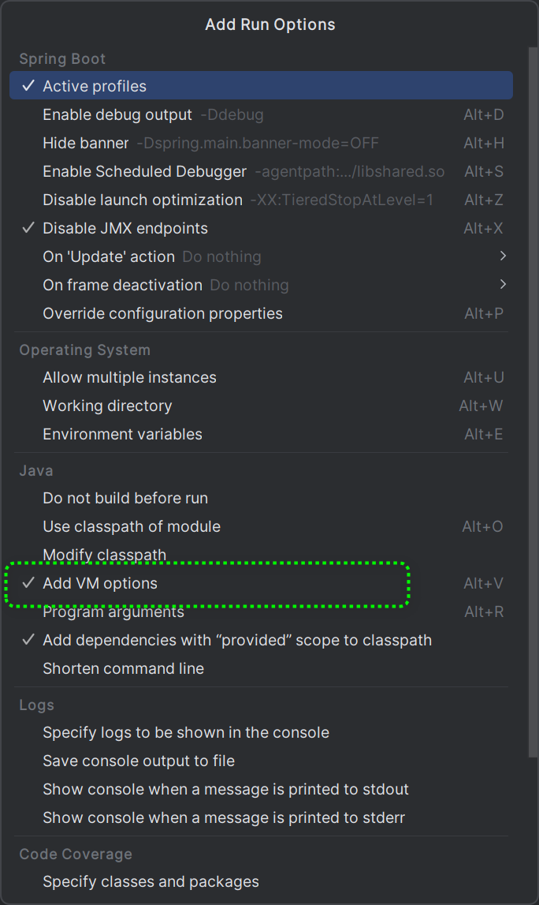

3. 按要求添加`--add-opens java.base/sun.nio.ch=ALL-UNNAMED --add-opens java.base/java.io=ALL-UNNAMED`

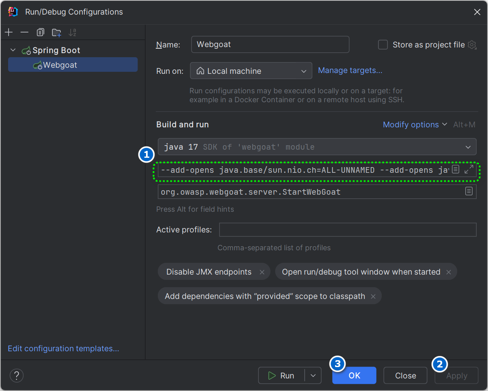