# Insecure Direct Object Refere

[TOC]

## 登录

很多容易受攻击的访问控制问题大多数来自于已经认证过的用户。因此教程也从一个认证过的用户开始。

非常容易按照教程给出账户密码登录。

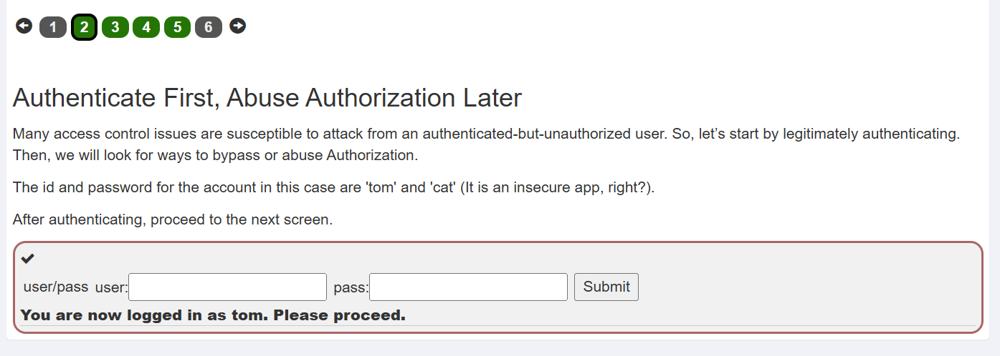

## 观察分析

在原始响应中往往有些数据不会显示在屏幕或页面上。对于红方来说这些信息可能十分有用。

下图是通过按钮点击显示的用户信息。

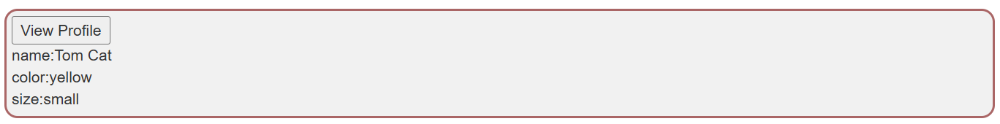

下图是Burpsuit抓包获取的信息。

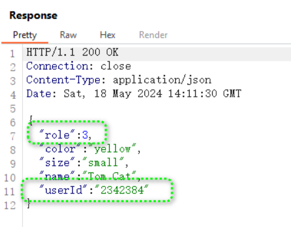

两相对比很明显，role和userId的信息并没有被浏览器显示出来。因此第二关答案为`role,userID`

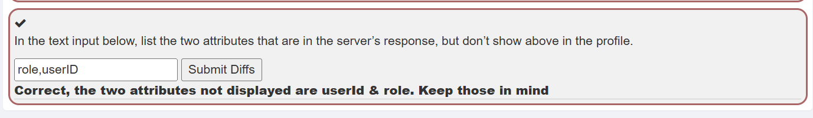

## 猜测Url路径

根据提示采用的RESTful 风格，因此参数应该被放在路径中。由于要查看用户信息因此，userID一定被用作参数。结合之前抓包信息。不难猜测出路径为`/WebGoat/IDOR/profile/2342384`

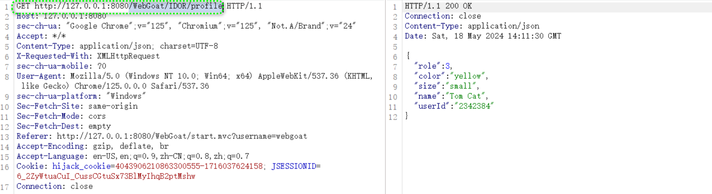

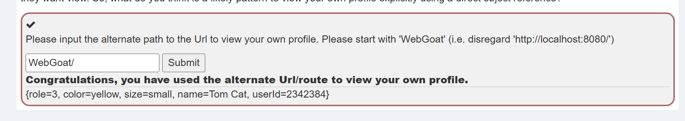

## 尝试使用猜测路径发起攻击

### 尝试读取其他用户配置文件

我们此时已经知道读取方法，但是缺少其他用户id，因此我们需要暴力猜测用户id。这里采用burpsuit的Intruder模块。

1. 设置Payload位点

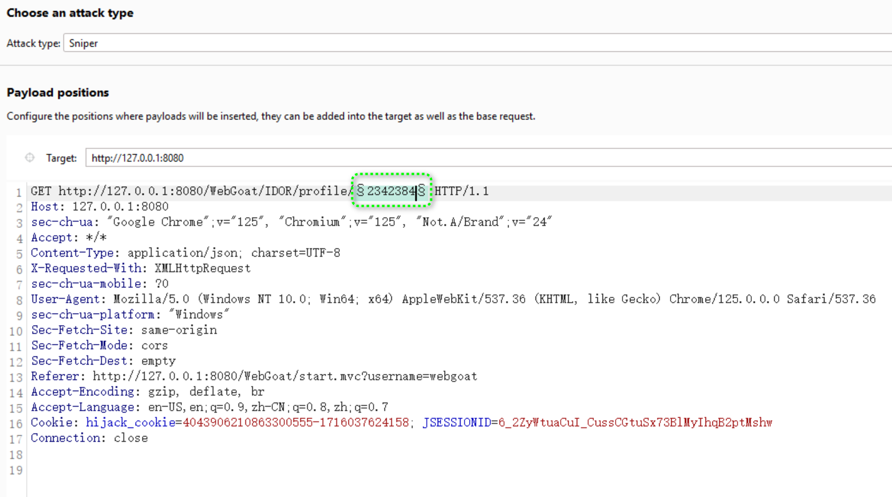

2. 设置Payload类型为数字，在2342384附近猜测user id

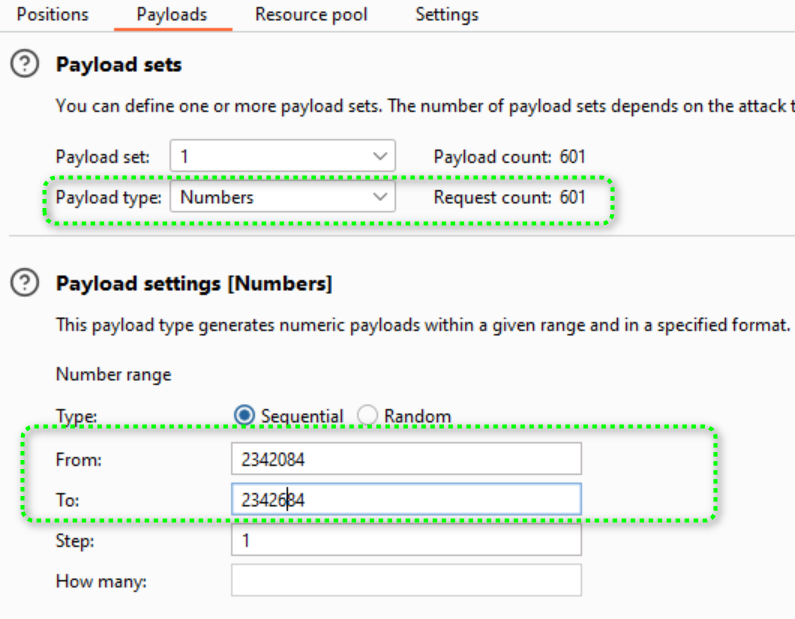

3. 获取结果，安返回内容长度排序，能够很轻易定位结果

   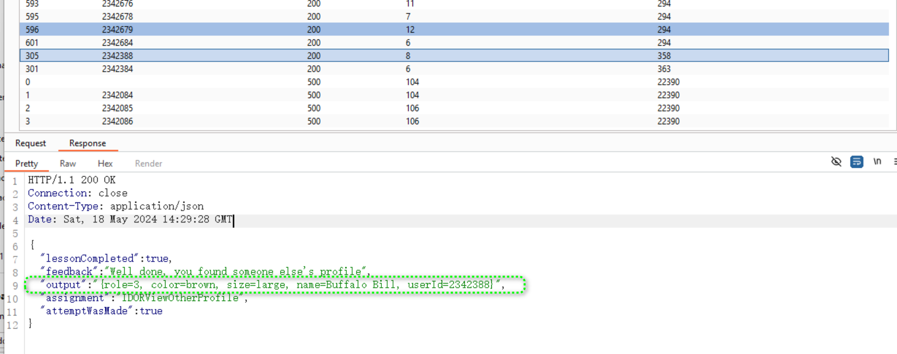

4. 用burpsuit拦截请求补上之前获得用户id，点击放行即可过关。

   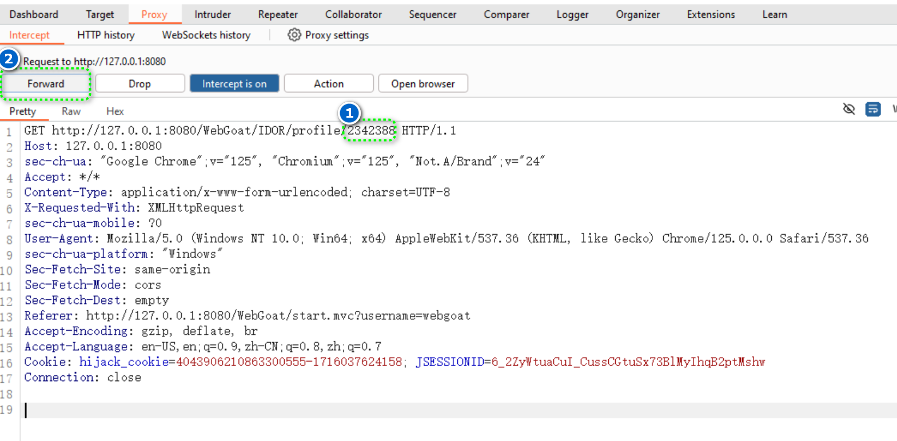

5. 过关截图

   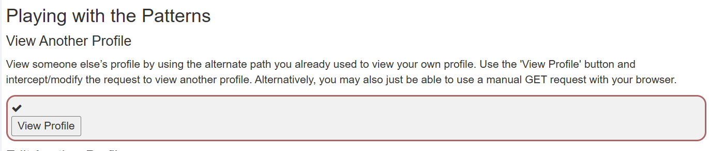

### 尝试修改其他用户配置文件

根据Restful风格可以猜测出path不变，只用修改请求方法要么是POST，要么是PUT。同时采用json上传要数据。

1. burpsuit拦截请求并修改。注意要修改Content-Type: application/json，否则一直报错。

   ```
   PUT http://127.0.0.1:8080/WebGoat/IDOR/profile/2342388 HTTP/1.1
   Host: 127.0.0.1:8080
   sec-ch-ua: "Google Chrome";v="125", "Chromium";v="125", "Not.A/Brand";v="24"
   Accept: */*
   Content-Type: application/json
   X-Requested-With: XMLHttpRequest
   sec-ch-ua-mobile: ?0
   User-Agent: Mozilla/5.0 (Windows NT 10.0; Win64; x64) AppleWebKit/537.36 (KHTML, like Gecko) Chrome/125.0.0.0 Safari/537.36
   sec-ch-ua-platform: "Windows"
   Sec-Fetch-Site: same-origin
   Sec-Fetch-Mode: cors
   Sec-Fetch-Dest: empty
   Referer: http://127.0.0.1:8080/WebGoat/start.mvc?username=webgoat
   Accept-Encoding: gzip, deflate, br
   Accept-Language: en-US,en;q=0.9,zh-CN;q=0.8,zh;q=0.7
   Cookie: hijack_cookie=4043906210863300555-1716037624158; JSESSIONID=fKIBqqU32vcTWt4CVu24duOQNRIjZ4hIt6EOlTCa
   Connection: close
   Content-Length: 91
   
   {"role":1, "color":"red", "size":"large", "name":"Buffalo Bill", "userId" :"2342388"}
   
   ```

   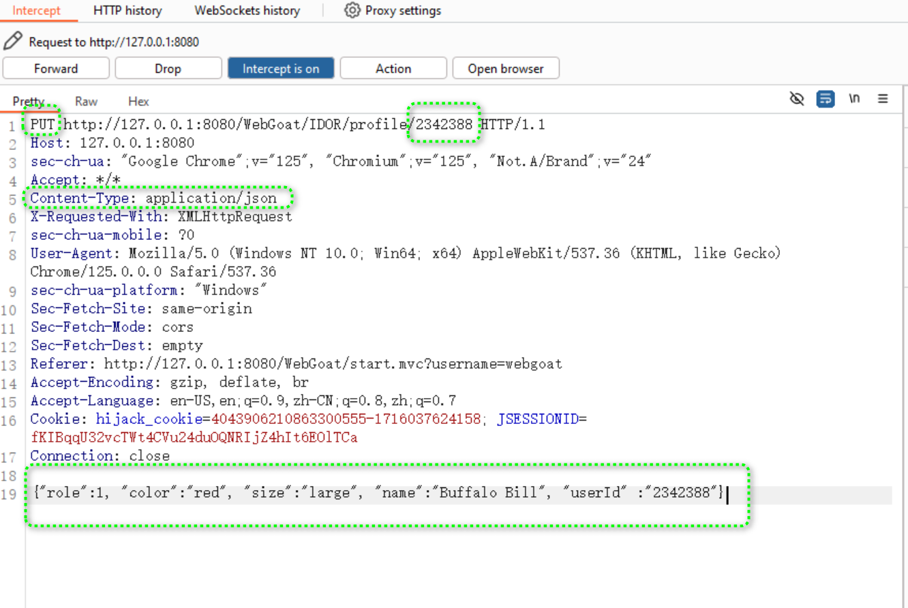

2. 成功截图

   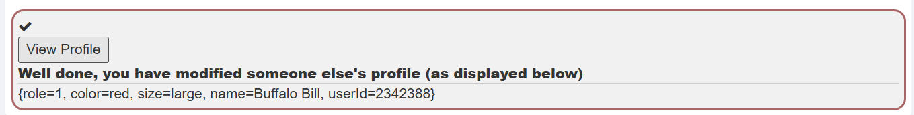

## 源码分析

### login

```java
/*
 * This file is part of WebGoat, an Open Web Application Security Project utility. For details, please see http://www.owasp.org/
 *
 * Copyright (c) 2002 - 2019 Bruce Mayhew
 *
 * This program is free software; you can redistribute it and/or modify it under the terms of the
 * GNU General Public License as published by the Free Software Foundation; either version 2 of the
 * License, or (at your option) any later version.
 *
 * This program is distributed in the hope that it will be useful, but WITHOUT ANY WARRANTY; without
 * even the implied warranty of MERCHANTABILITY or FITNESS FOR A PARTICULAR PURPOSE. See the GNU
 * General Public License for more details.
 *
 * You should have received a copy of the GNU General Public License along with this program; if
 * not, write to the Free Software Foundation, Inc., 59 Temple Place - Suite 330, Boston, MA
 * 02111-1307, USA.
 *
 * Getting Source
 * ==============
 *
 * Source for this application is maintained at https://github.com/WebGoat/WebGoat, a repository for free software projects.
 */

package org.owasp.webgoat.lessons.idor;

import java.util.HashMap;
import java.util.Map;
import org.owasp.webgoat.container.assignments.AssignmentEndpoint;
import org.owasp.webgoat.container.assignments.AssignmentHints;
import org.owasp.webgoat.container.assignments.AttackResult;
import org.owasp.webgoat.container.session.UserSessionData;
import org.springframework.web.bind.annotation.PostMapping;
import org.springframework.web.bind.annotation.RequestParam;
import org.springframework.web.bind.annotation.ResponseBody;
import org.springframework.web.bind.annotation.RestController;

@RestController
@AssignmentHints({"idor.hints.idor_login"})
public class IDORLogin extends AssignmentEndpoint {

  private Map<String, Map<String, String>> idorUserInfo = new HashMap<>();

  public void initIDORInfo() {

    idorUserInfo.put("tom", new HashMap<String, String>());
    idorUserInfo.get("tom").put("password", "cat");
    idorUserInfo.get("tom").put("id", "2342384");
    idorUserInfo.get("tom").put("color", "yellow");
    idorUserInfo.get("tom").put("size", "small");

    idorUserInfo.put("bill", new HashMap<String, String>());
    idorUserInfo.get("bill").put("password", "buffalo");
    idorUserInfo.get("bill").put("id", "2342388");
    idorUserInfo.get("bill").put("color", "brown");
    idorUserInfo.get("bill").put("size", "large");
  }

  @PostMapping("/IDOR/login")
  @ResponseBody
  public AttackResult completed(@RequestParam String username, @RequestParam String password) {
    initIDORInfo(); // 初始化数据库(用一个小map模拟)，向数据库添加相关用户，用于实验
    UserSessionData userSessionData = getUserSessionData();

    if (idorUserInfo.containsKey(username)) { 
      if ("tom".equals(username) && idorUserInfo.get("tom").get("password").equals(password)) {
          // 校验账户密码完成后，将用户信息保存在session中。session中保存的信息有username， userid
        userSessionData.setValue("idor-authenticated-as", username);
        userSessionData.setValue(
            "idor-authenticated-user-id", idorUserInfo.get(username).get("id"));
        return success(this).feedback("idor.login.success").feedbackArgs(username).build();
      } else {
        return failed(this).feedback("idor.login.failure").build();
      }
    } else {
      return failed(this).feedback("idor.login.failure").build();
    }
  }
}

```

```java
/*
 * This file is part of WebGoat, an Open Web Application Security Project utility. For details, please see http://www.owasp.org/
 *
 * Copyright (c) 2002 - 2019 Bruce Mayhew
 *
 * This program is free software; you can redistribute it and/or modify it under the terms of the
 * GNU General Public License as published by the Free Software Foundation; either version 2 of the
 * License, or (at your option) any later version.
 *
 * This program is distributed in the hope that it will be useful, but WITHOUT ANY WARRANTY; without
 * even the implied warranty of MERCHANTABILITY or FITNESS FOR A PARTICULAR PURPOSE. See the GNU
 * General Public License for more details.
 *
 * You should have received a copy of the GNU General Public License along with this program; if
 * not, write to the Free Software Foundation, Inc., 59 Temple Place - Suite 330, Boston, MA
 * 02111-1307, USA.
 *
 * Getting Source
 * ==============
 *
 * Source for this application is maintained at https://github.com/WebGoat/WebGoat, a repository for free software projects.
 */

package org.owasp.webgoat.lessons.idor;

import java.util.HashMap;
import java.util.Map;
import lombok.extern.slf4j.Slf4j;
import org.owasp.webgoat.container.session.UserSessionData;
import org.springframework.beans.factory.annotation.Autowired;
import org.springframework.web.bind.annotation.GetMapping;
import org.springframework.web.bind.annotation.ResponseBody;
import org.springframework.web.bind.annotation.RestController;

@RestController
@Slf4j
public class IDORViewOwnProfile {

  @Autowired UserSessionData userSessionData;

  @GetMapping(
      path = {"/IDOR/own", "/IDOR/profile"},
      produces = {"application/json"}) // 返回的数据以json格式
  @ResponseBody
  public Map<String, Object> invoke() {
    Map<String, Object> details = new HashMap<>();
    try {
        // 从session获取数据，验证是否是tom用户
      if (userSessionData.getValue("idor-authenticated-as").equals("tom")) {
        // going to use session auth to view this one
        // 从userProfile中获取数据返回
        // 这里发现Webgot到这里拿用户信息的方法和，login模块中并不一样，也就是有两份用户信息副本，我此刻也不知道如何评价。
        String authUserId = (String) userSessionData.getValue("idor-authenticated-user-id");
        UserProfile userProfile = new UserProfile(authUserId);
        details.put("userId", userProfile.getUserId());
        details.put("name", userProfile.getName());
        details.put("color", userProfile.getColor());
        details.put("size", userProfile.getSize());
        details.put("role", userProfile.getRole());
      } else {
        details.put(
            "error",
            "You do not have privileges to view the profile. Authenticate as tom first please.");
      }
    } catch (Exception ex) {
      log.error("something went wrong", ex.getMessage());
    }
    return details;
  }
}
```

```java
/*
 * This file is part of WebGoat, an Open Web Application Security Project utility. For details, please see http://www.owasp.org/
 *
 * Copyright (c) 2002 - 2019 Bruce Mayhew
 *
 * This program is free software; you can redistribute it and/or modify it under the terms of the
 * GNU General Public License as published by the Free Software Foundation; either version 2 of the
 * License, or (at your option) any later version.
 *
 * This program is distributed in the hope that it will be useful, but WITHOUT ANY WARRANTY; without
 * even the implied warranty of MERCHANTABILITY or FITNESS FOR A PARTICULAR PURPOSE. See the GNU
 * General Public License for more details.
 *
 * You should have received a copy of the GNU General Public License along with this program; if
 * not, write to the Free Software Foundation, Inc., 59 Temple Place - Suite 330, Boston, MA
 * 02111-1307, USA.
 *
 * Getting Source
 * ==============
 *
 * Source for this application is maintained at https://github.com/WebGoat/WebGoat, a repository for free software projects.
 */

package org.owasp.webgoat.lessons.idor;

import org.owasp.webgoat.container.assignments.AssignmentEndpoint;
import org.owasp.webgoat.container.assignments.AssignmentHints;
import org.owasp.webgoat.container.assignments.AttackResult;
import org.owasp.webgoat.container.session.UserSessionData;
import org.springframework.beans.factory.annotation.Autowired;
import org.springframework.web.bind.annotation.PathVariable;
import org.springframework.web.bind.annotation.PutMapping;
import org.springframework.web.bind.annotation.RequestBody;
import org.springframework.web.bind.annotation.ResponseBody;
import org.springframework.web.bind.annotation.RestController;

@RestController
@AssignmentHints({
  "idor.hints.otherProfile1",
  "idor.hints.otherProfile2",
  "idor.hints.otherProfile3",
  "idor.hints.otherProfile4",
  "idor.hints.otherProfile5",
  "idor.hints.otherProfile6",
  "idor.hints.otherProfile7",
  "idor.hints.otherProfile8",
  "idor.hints.otherProfile9"
})
public class IDOREditOtherProfile extends AssignmentEndpoint {

  @Autowired private UserSessionData userSessionData;

  @PutMapping(path = "/IDOR/profile/{userId}", consumes = "application/json") // 只接受PUT请求，消费json格式数据
  @ResponseBody
  public AttackResult completed(
      @PathVariable("userId") String userId, @RequestBody UserProfile userSubmittedProfile) {

    String authUserId = (String) userSessionData.getValue("idor-authenticated-user-id");
    // this is where it starts ... accepting the user submitted ID and assuming it will be the same
    // as the logged in userId and not checking for proper authorization
    // Certain roles can sometimes edit others' profiles, but we shouldn't just assume that and let
    // everyone, right?
    // Except that this is a vulnerable app ... so we will
    UserProfile currentUserProfile = new UserProfile(userId);
    if (userSubmittedProfile.getUserId() != null
        && !userSubmittedProfile.getUserId().equals(authUserId)) {
      // json数据中UserId不为空，且userid不等于当前用户id
      currentUserProfile.setColor(userSubmittedProfile.getColor());
      currentUserProfile.setRole(userSubmittedProfile.getRole());
      // we will persist in the session object for now in case we want to refer back or use it later
      userSessionData.setValue("idor-updated-other-profile", currentUserProfile);
      if (currentUserProfile.getRole() <= 1
          && currentUserProfile.getColor().equalsIgnoreCase("red")) {
          // 判断任务是否完成
        return success(this)
            .feedback("idor.edit.profile.success1")
            .output(currentUserProfile.profileToMap().toString())
            .build();
      }

      if (currentUserProfile.getRole() > 1
          && currentUserProfile.getColor().equalsIgnoreCase("red")) {
        return failed(this)
            .feedback("idor.edit.profile.failure1")
            .output(currentUserProfile.profileToMap().toString())
            .build();
      }

      if (currentUserProfile.getRole() <= 1
          && !currentUserProfile.getColor().equalsIgnoreCase("red")) {
        return failed(this)
            .feedback("idor.edit.profile.failure2")
            .output(currentUserProfile.profileToMap().toString())
            .build();
      }

      // else
      return failed(this)
          .feedback("idor.edit.profile.failure3")
          .output(currentUserProfile.profileToMap().toString())
          .build();
    } else if (userSubmittedProfile.getUserId() != null
        && userSubmittedProfile.getUserId().equals(authUserId)) {
      return failed(this).feedback("idor.edit.profile.failure4").build();
    }

    if (currentUserProfile.getColor().equals("black") && currentUserProfile.getRole() <= 1) {
      return success(this)
          .feedback("idor.edit.profile.success2")
          .output(userSessionData.getValue("idor-updated-own-profile").toString())
          .build();
    } else {
      return failed(this).feedback("idor.edit.profile.failure3").build();
    }
  }
}

```

