# 缺失功能级访问控制

缺失功能级访问控制（Missing Function Level Access Control）是指应用程序未能正确地限制用户对某些功能的访问权限，导致未经授权的用户能够访问、修改或执行原本只有授权用户才能使用的功能。

[toc]

## 实验记录

### 找到隐藏的下拉菜单

鼠标右键查看元素，会找到隐藏的下拉菜单。

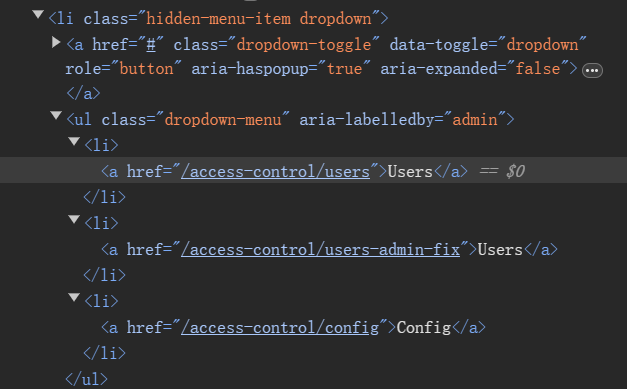

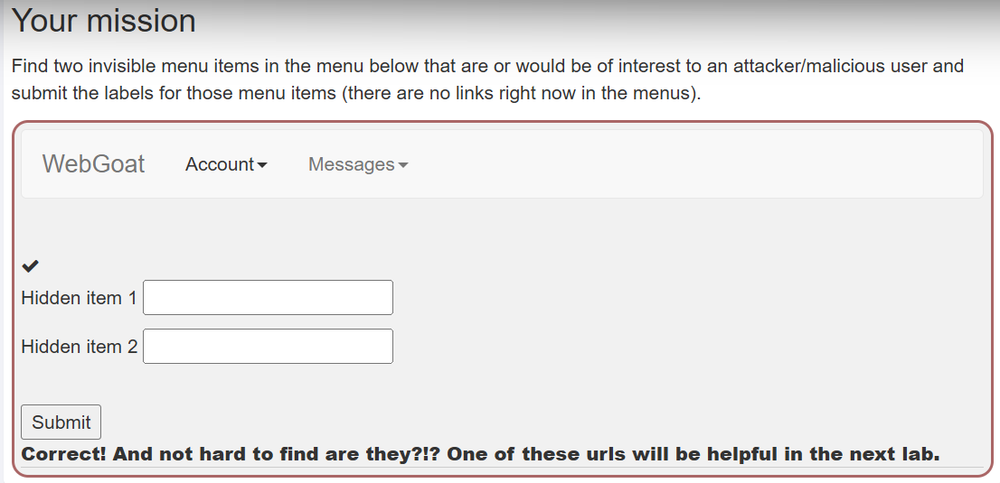

### 搜集用户信息

根据隐藏的下拉菜单能够提取出如下三个路径。

```
/access-control/users
/access-control/users-admin-fix 
/access-control/config
```

如通过浏览器按下f12，修改html。将`hidden-menu-item dropdown`中的hidden-menu-item去掉，让原本隐藏的下拉菜单变得可见。随后依次点击发现都是无效路径。

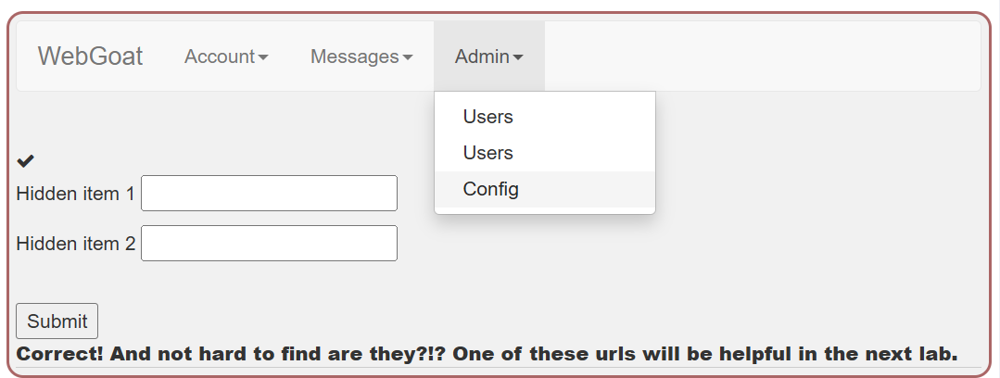

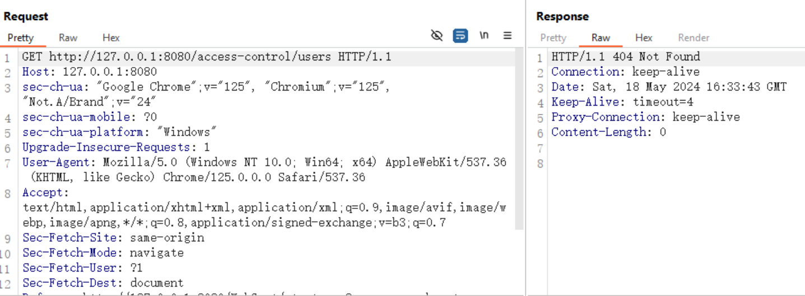

结合之前的经验推测出正确的路径应该为。

```
Webgoat/access-control/users
Webgoat/access-control/users-admin-fix 
Webgoat/access-control/config
```

简单请求一下先发这三个请求不在显示404，因此可以判断路径推测正确。但是问题出现了，通过这三条请求，我并没搜集到用户的信息。于是我卡在这里了很长时间，最后不得不最后不得不通过代码审计找到原因。

Webgoat/access-control/users这个路径对应的方法中@GetMapping注解有如下描述，consumes = "application/json"致使请求头中必须包含`Content-Type: application/json`，只有这样请求才能被正确解析。个人感觉这样写挺离谱的，consumes = "application/json"表示请求需要提供一个json数据，但是我们是一个get的请求，并不能提供监json数据。

```
  @GetMapping(
      path = {"access-control/users"},
      consumes = "application/json") 
  @ResponseBody
  public ResponseEntity<List<DisplayUser>> usersService() {
    return ResponseEntity.ok(
        userRepository.findAllUsers().stream()
            .map(user -> new DisplayUser(user, PASSWORD_SALT_SIMPLE))
            .collect(Collectors.toList()));
  }

```

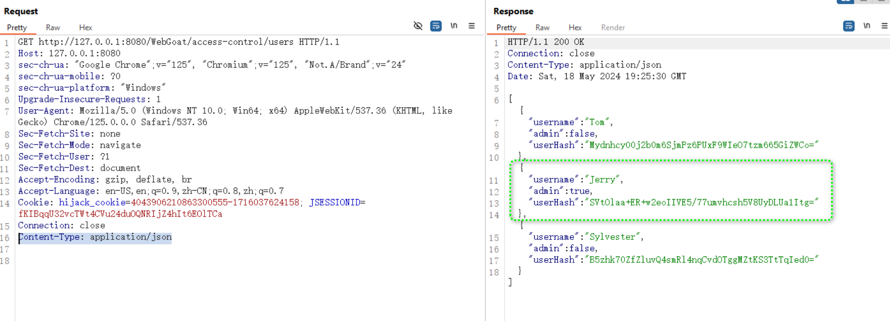

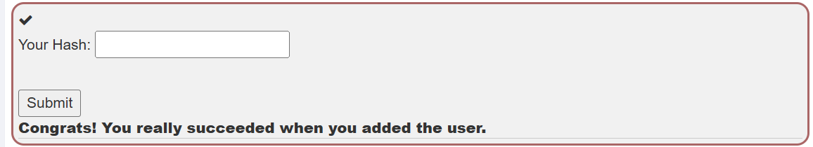

## 对抗修复

黑盒尝试访问修复后的路径，返回403，说明需要管理员权限。

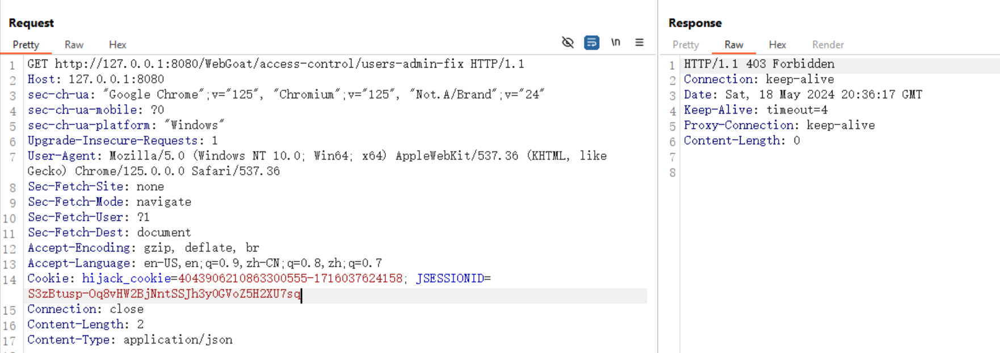

到这里我已经想到了，需要创建一个管理员用户去访问。但是我一直以为我自身是tom用户，因此我尝试将自身权限修改成admin。结果我发现这个想法是不行，反而创建了一个新的tom用户，到这里我的思路就卡住了。

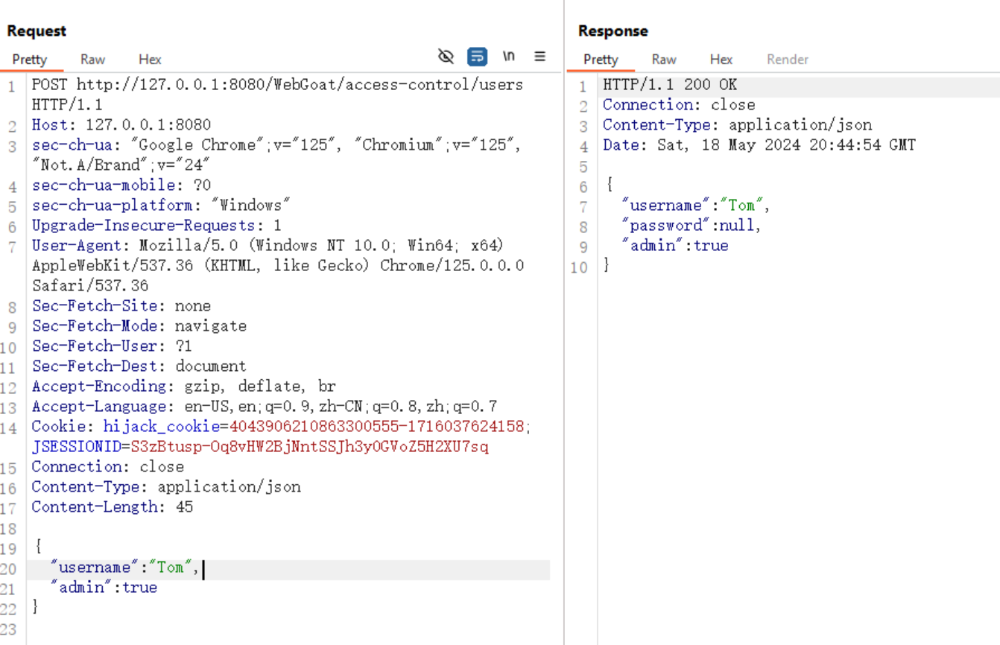

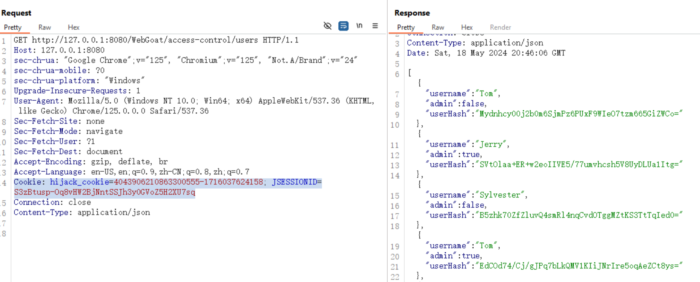

最后不得不代码审计，发现自身原来使用登录Webgoat的账户取访问的，由于我的账户名是webgoat。因此我只要新建一个webgoat管理员账户就行了。

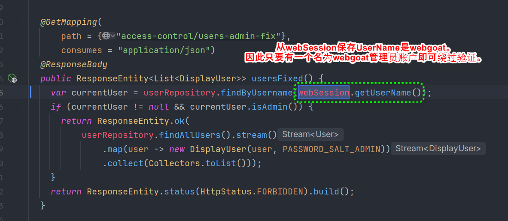

通过POS` http://127.0.0.1:8080/WebGoat/access-control/users`，新建webgoat管理员账户

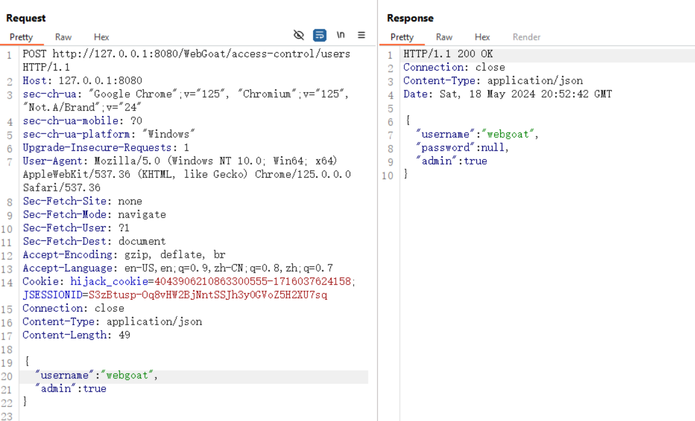

尝试访问`http://127.0.0.1:8080/WebGoat/access-control/users-admin-fix`,获取hash。

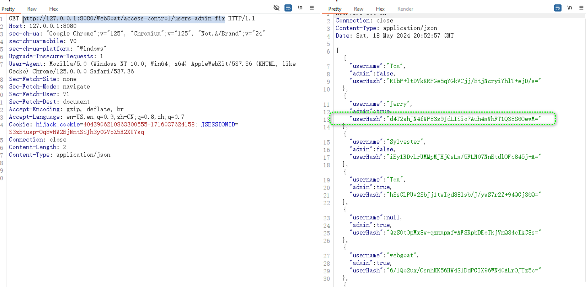

通关

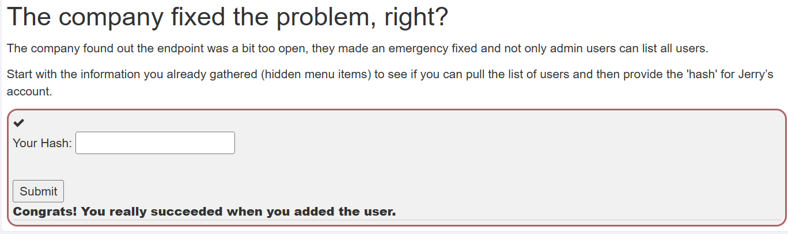