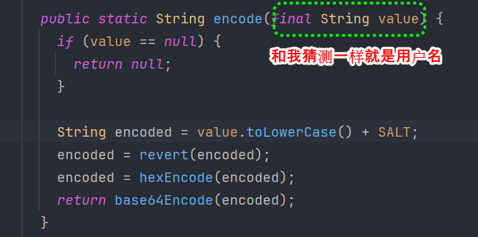
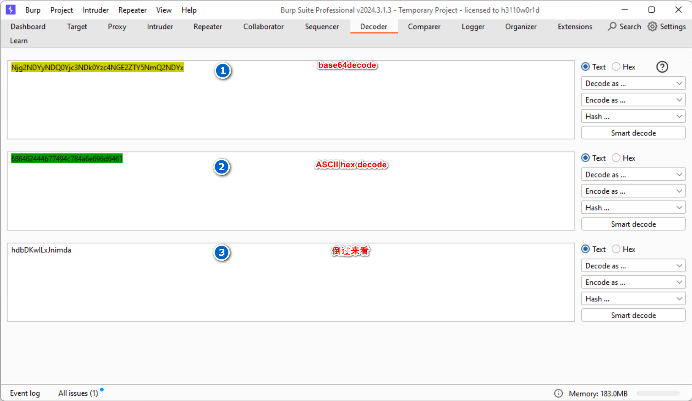
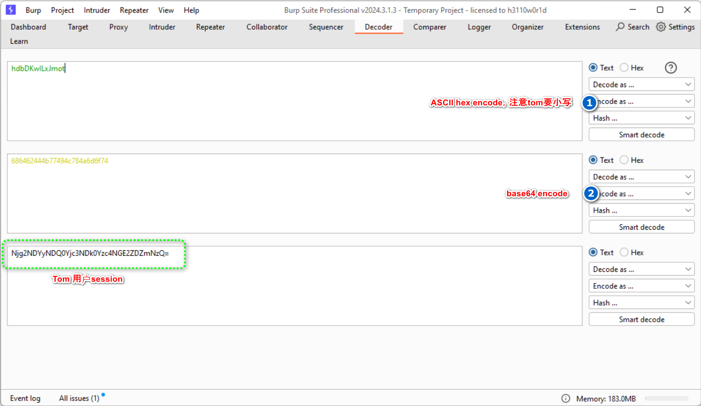
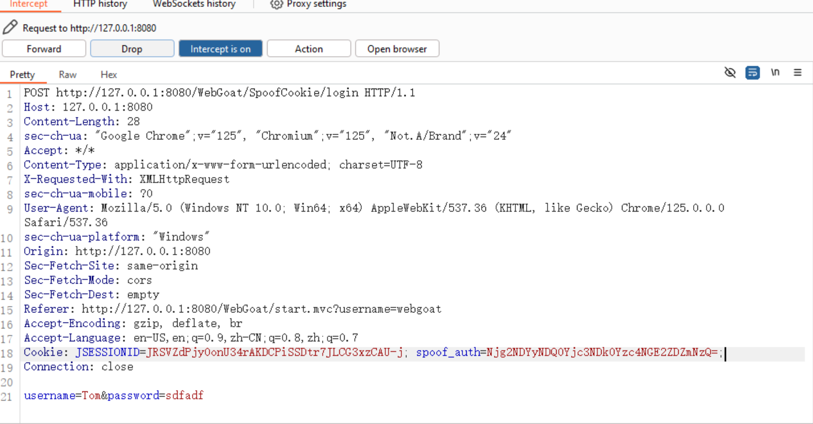
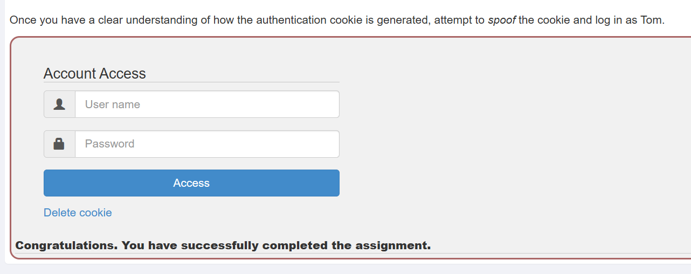

# 欺骗身份验证Cookie

用户不应该能够猜测 cookie 生成算法并通过以不同用户身份登录来绕过身份验证机制。


## 解题思路

题目给出了两个账户。

```
webgoat
webgoat

admin
admin
```

我们用这两个账户登录然后猜测Cookie算法，通过暴力猜测以TomCookie。

## 分析cookie算法

用两个账户登录拿到的Cookie如下

```
Njg2NDYyNDQ0Yjc3NDk0Yzc4NGE3NDYxNmY2NzYyNjU3Nw==
Njg2NDYyNDQ0Yjc3NDk0Yzc4NGE2ZTY5NmQ2NDYx
```

整理一下

```
Njg2NDYyNDQ0Yjc3NDk0Yzc4NGE----------------3NDYxNmY2NzYyNjU3Nw==
Njg2NDYyNDQ0Yjc3NDk0Yzc4NGE----------------2ZTY5NmQ2NDYx

Njg2NDYyNDQ0Yjc3NDk0Yzc4NGE3NDYxNmY2NzYyNjU3Nw== 686462444b77494c784a74616f67626577
Njg2NDYyNDQ0Yjc3NDk0Yzc4NGE2ZTY5NmQ2NDYx         686462444b77494c784a6e696d6461
```

并且多登录发现session不变，因此推测session是根据用户信息直接生成的，根据长短推测session产生可能和用户名有关。因此名为tom session可能更短。想尝试暴力破解，发现有点慢不可取。

最后没什么思路开始代码审计。下面就是session生成的算法。






自此可以开始解题了。






成功展示。

