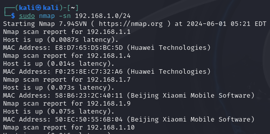

# nmap扫描

[TOC]

## 主机发现

* sudo nmap -sn 10.10.10.0/24


### sudo nmap -sn

example:

```shell
sudo nmap -sn x.x.x.x/24
```



默认这条命令会发送icmp回显请求，443的syn，80 ack，icmp 时间戳请求。


如果传入的地址是本地网络地址，则会使用Arp请求去探测。


## 端口探测

### tcp端口探测

```shell
sudo nmap -sT --min-rate 10000 -p- x.x.x.x -oA ports
```


### udp端口探测

```
sudo nmap -sU --top-ports 20 10.10.10.21 -oA udp
```

## 详细信息扫描

```
sudo nmap -sT -sV -sC -O -p22,21,80 -oA  detail
```

## 漏洞脚本扫描

```
sudo nmap --script=vuln -p22,21,80 10.10.10.1 -oA  vul
```

